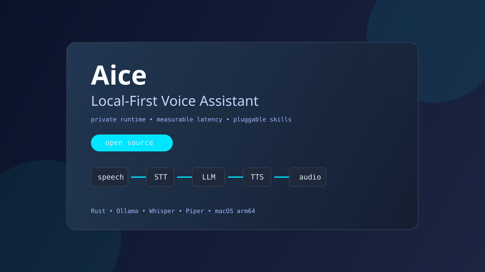
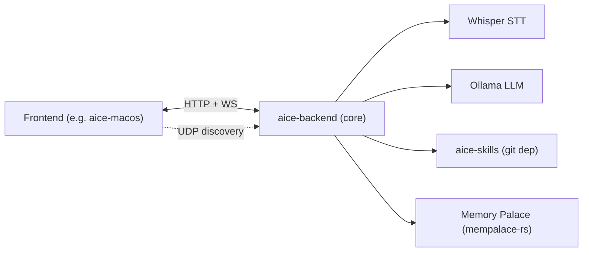

# Aice: Local-First Voice AI Core
[](https://github.com/AncientiCe/aice/actions/workflows/ci.yml) [](https://github.com/AncientiCe/aice/actions/workflows/release-build-check.yml) [](https://github.com/AncientiCe/aice/releases) [](LICENSE)


Aice is a private, local voice AI system. **`aice-backend`** is the cross-platform (Windows, macOS, Linux) core that runs STT, LLM orchestration, memory, and backend-owned skills. Platform frontends (e.g. [`aice-macos`](https://github.com/AncientiCe/aice-macos)) talk to it over the local network.

No cloud lock-in is required for the runtime loop. You run it on your own machine.

License: Apache-2.0 (see [LICENSE](LICENSE)).

## What is `aice-backend`

`aice-backend` (see [apps/aice-backend](apps/aice-backend)) is a single cross-platform Rust service that exposes HTTP and WebSocket endpoints for frontends plus a UDP discovery responder so frontends can find it automatically on the local network. The discovery layer is deliberately broadcast-based (no mDNS/multicast) and [works on macOS, Linux, and Windows](apps/aice-backend/src/discovery_broadcast.rs) on the same broadcast domain.

It owns:

- **STT** via Whisper (`core-stt`, `whisper-cli` model files).
- **LLM orchestration** via Ollama (`core-llm`, `core-orchestrator`).
- **Memory Palace** persistent memory (`mempalace-rs`) with aice-tagged drawers, per-turn recall + KG facts in answer composition, and Journal mirroring.
- **Backend-owned skills** (weather, time, distance, smart-home, news, holidays, sports, horoscope, fuel prices) pulled from the external [`aice-skills`](https://github.com/AncientiCe/aice-skills) repo as a pinned Cargo git dependency.
- **UDP broadcast discovery** so frontends find the backend with zero manual configuration.
- **Prometheus metrics** for every code path (`core-observability`).



## Repositories in the ecosystem

| Repo | Role | Link |
|------|------|------|
| `aice` (this repo) | Cross-platform core backend workspace (`apps/aice-backend`, `crates/core-*`). | you are here |
| `aice-skills` | All skill crates and implementations. Consumed by `aice-backend` as a pinned Cargo git dependency. Point here for the **full skills list and implementation details**. | [AncientiCe/aice-skills](https://github.com/AncientiCe/aice-skills) |
| `aice-macos` | Fully functional macOS frontend: mic capture, VAD, TTS, and deep macOS-ecosystem skills (timers, reminders, messages, screenshots, app switching, volume, media, shopping list). Auto-discovers the backend via UDP. | [AncientiCe/aice-macos](https://github.com/AncientiCe/aice-macos) |

## Supported platforms

- **Backend (`aice-backend`)**: Windows, macOS, and Linux. Pure Rust; no platform-specific build steps for the core service.
- **Frontends**: macOS today via [`aice-macos`](https://github.com/AncientiCe/aice-macos). Windows and Linux frontends are not in scope for this repo.

## Quick start (backend)

Prerequisites (all platforms):

- Rust toolchain (`cargo`).
- [Ollama](https://ollama.com) running locally for the LLM.
- `whisper-cli` + a Whisper model file for STT.
- SSH access to `git@github.com:AncientiCe/aice-skills.git` (the skills crate is consumed as a pinned git dependency).

Steps:

1. Create config:

   ```bash
   cp config.example.json config.json
   ```

2. Download required models:

   ```bash
   ./scripts/download-required-models.sh
   ```

   The script is a POSIX shell script. On Windows, run it from Git Bash or WSL, or download the models manually using the URLs inside the script. See [docs/setup/local-dev.md](docs/setup/local-dev.md) for platform-specific prerequisites.

3. Run quality gates:

   ```bash
   cargo aice-fmt
   cargo aice-clippy
   cargo aice-audit
   cargo aice-test
   ```

4. Start the backend:

   ```bash
   cargo aice-backend
   ```

   The service binds `0.0.0.0:8781` by default (override with `AICE_BACKEND_BIND`). See [apps/aice-backend/src/main.rs](apps/aice-backend/src/main.rs).

### Pair with a frontend

Once the backend is healthy, start a frontend so you have a voice loop. The reference frontend is the macOS app in [`AncientiCe/aice-macos`](https://github.com/AncientiCe/aice-macos) — it auto-discovers the backend via UDP and registers its macOS-local skills on activation. Follow that repo's README for frontend setup; do not duplicate it here.

## Canonical cargo commands

Defined in `.cargo/config.toml`:

- `cargo aice-backend` &rarr; run the cross-platform core backend service.
- `cargo aice-fmt` &rarr; `cargo fmt --all -- --check`.
- `cargo aice-clippy` &rarr; `cargo clippy --workspace --all-targets -- -D warnings -D clippy::unwrap_used -D clippy::expect_used`.
- `cargo aice-audit` &rarr; dependency audit.
- `cargo aice-test` &rarr; full workspace test suite.

The standalone pod transport (`cargo aice-gateway`) is documented under [Legacy / experimental](#legacy--experimental).

## Skills

Skills are defined and implemented in the external [`aice-skills`](https://github.com/AncientiCe/aice-skills) repository and consumed by `aice-backend` via a pinned Cargo git dependency in [apps/aice-backend/Cargo.toml](apps/aice-backend/Cargo.toml). Backend-owned skills (e.g. weather, time, distance, smart-home) execute inside `aice-backend`; frontend-owned skills (e.g. timers, reminders, messages) execute in the connected frontend and are declared at activation time.

- **Full skills list & status**: [docs/skills/README.md](docs/skills/README.md).
- **Authoritative implementation**: [AncientiCe/aice-skills](https://github.com/AncientiCe/aice-skills).

## Repository layout

- `apps/aice-backend`: cross-platform core backend service (primary).
- `crates/core-*`: runtime building blocks (`core-config`, `core-llm`, `core-stt`, `core-orchestrator`, `core-observability`, `core-runtime-protocol`).
- `apps/pod-gateway`, `pod-firmware`: legacy / experimental components — see below.

## Public repository safety

- Never commit local runtime state or credentials (`config.json`, `.env*`, `memory.json`, `memory.sqlite`, `*.pem`, `*.key`).
- Start from `config.example.json` and keep machine-local overrides out of git.
- If a secret is committed by mistake, rotate it and remove it from git history before publishing tags/releases.

## Observability

Use metrics dashboards for latency tracking and SLO checks:

- `timing-deep-dive`
- `backend-timings`
- `frontend-timings`

Start a local Prometheus + Grafana stack on demand:

```bash
./scripts/observability.sh up
```

- Grafana: `http://127.0.0.1:3000`
- Prometheus: `http://127.0.0.1:9090`

Runbook: [docs/runbooks/local-observability.md](docs/runbooks/local-observability.md).

## Ops and docs

- Local setup: [docs/setup/local-dev.md](docs/setup/local-dev.md) (currently macOS-focused; Windows and Linux users should follow the equivalent prereqs — Rust, Ollama, Whisper, optionally Piper — for their platform).
- Architecture: [docs/architecture/README.md](docs/architecture/README.md).
- Local observability: [docs/runbooks/local-observability.md](docs/runbooks/local-observability.md).
- Changelog: [CHANGELOG.md](CHANGELOG.md).
- Security policy: [SECURITY.md](SECURITY.md).
- Contribution guide: [CONTRIBUTING.md](CONTRIBUTING.md).
- Code of conduct: [CODE_OF_CONDUCT.md](CODE_OF_CONDUCT.md).

## Legacy / experimental

These components predate the split-runtime design and are retained for continuity. New deployments should use `aice-backend` with a platform frontend.

- **`apps/pod-gateway`**: standalone WebSocket ingest/egress transport for advanced/internal deployments. Invoke via `cargo aice-gateway`.
- **`pod-firmware` + M5Stack ATOM Echo**: experimental hardware path, not covered by binary release guarantees. See [docs/deployment/m5stack-pod.md](docs/deployment/m5stack-pod.md) and [docs/network/wifi-configuration.md](docs/network/wifi-configuration.md).

### Release v0.1.0 (legacy)

The `v0.1.0` binary release predates the cross-platform backend story and ships `pod-voice` artifacts only.

- Distribution channel: GitHub Releases (no crates.io publishing for this release).
- Official binary support matrix: macOS arm64.
- Runtime compatibility target for `0.1.x`: preserve current `config.example.json` defaults unless a change is explicitly called out in release notes.
- Firmware status: `pod-firmware` remains experimental in `v0.1.0` and is shipped as source + docs only (no firmware artifact).

Install from release assets:

1. Download `aice-v0.1.0-macos-arm64.tar.gz` and `aice-v0.1.0-macos-arm64.tar.gz.sha256` from the GitHub release page.
2. Verify checksum:

   ```bash
   shasum -a 256 -c aice-v0.1.0-macos-arm64.tar.gz.sha256
   ```

3. Extract and run:

   ```bash
   tar -xzf aice-v0.1.0-macos-arm64.tar.gz
   ./pod-voice
   ```

Release runbook: [docs/runbooks/release-v0.1.0.md](docs/runbooks/release-v0.1.0.md).
