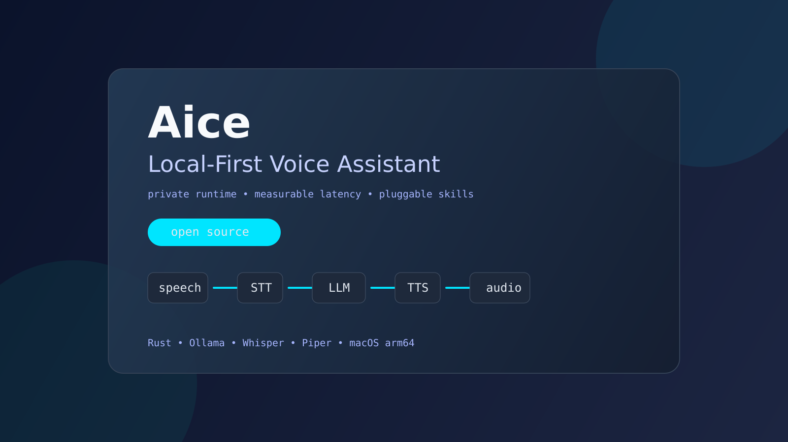

# Aice: Local-First Streaming Jarvis
[](https://github.com/AncientiCe/aice/actions/workflows/ci.yml) [](https://github.com/AncientiCe/aice/actions/workflows/release-build-check.yml) [](https://github.com/AncientiCe/aice/releases) [](LICENSE)


Aice is a private, local voice runtime for home automation and media control.

Core flow is built for low latency:
`speech -> STT -> model -> TTS` with streaming where possible.

## Turn timing logs (desktop-runner)

Detailed timing logs and dated benchmark tables are maintained in:
[docs/benchmarks/turn-timings.md](docs/benchmarks/turn-timings.md)

Latest benchmark snapshot (2026-03-19 UTC):

| Timestamp (UTC) | Query | mic_to_stt_ms | speech_voiced_ms | stt_ms | endpointing_wait_ms | llm_ms | journey_ms |
| --- | --- | ---: | ---: | ---: | ---: | ---: | ---: |
| 2026-03-19T07:45:35.308592Z | what's the weather? | 2133 | 865 | 170 | 1098 | 1891 | 5208 |
| 2026-03-19T07:45:54.466796Z | what's the weather in Rome? | 2630 | 1261 | 144 | 1225 | 1555 | 5429 |

## Local metrics dashboard (desktop-runner)

Start local Prometheus + Grafana stack on demand:

```bash
./scripts/observability.sh up
```

- Grafana: `http://127.0.0.1:3000`
- Prometheus: `http://127.0.0.1:9090`

Runbook: [docs/runbooks/local-observability.md](docs/runbooks/local-observability.md)

No cloud lock-in is required for the runtime loop. You run it on your own machine.

License: Apache-2.0 (see [LICENSE](LICENSE)).

## Product direction

- Primary runtime: `pod-voice` (single process, voice loop + pod transport).
- `pod-gateway` remains available as an advanced/internal transport service.
- Hardware direction: Signal Pod is the target device.
- M5Stack ATOM Echo is supported as an experimental test device.
- Skills are pluggable by design (`core-skills`); see the [skills catalog](docs/skills/README.md).
- Recommended host for home deployments: Mac mini on macOS.

## Stability and support matrix

- Stable runtime path: `apps/desktop-runner` via `pod-voice` on macOS arm64.
- Advanced path: `apps/pod-gateway` is available for transport-focused deployments and experimentation.
- Experimental hardware path: `pod-firmware` and M5Stack ATOM Echo integration are not covered by binary release guarantees.
- Compatibility policy: `0.1.x` preserves current `config.example.json` defaults unless release notes state otherwise.

## Public repository safety

- Never commit local runtime state or credentials (`config.json`, `.env*`, `memory.json`, `memory.sqlite`, `*.pem`, `*.key`).
- Start from `config.example.json` and keep machine-local overrides out of git.
- If a secret is committed by mistake, rotate it and remove it from git history before publishing tags/releases.

## For public consumers

- Best effort stability is focused on `pod-voice` and the documented macOS setup flow.
- Experimental components may change faster and can break between releases.
- Prefer release-tagged assets/runbooks over arbitrary `main` snapshots for production-like usage.

## Quick start

First-time setup on macOS (install + verification, step by step):
[docs/setup/local-dev.md#0-first-time-macos-setup-checklist](docs/setup/local-dev.md#0-first-time-macos-setup-checklist)

Download all required models in one command:

```bash
./scripts/download-required-models.sh
```

Override model selections (example):

```bash
OLLAMA_MODEL=llama3.2 \
WHISPER_URL=https://huggingface.co/ggerganov/whisper.cpp/resolve/main/ggml-small.en.bin \
PIPER_ONNX_URL=https://huggingface.co/rhasspy/piper-voices/resolve/main/en/en_GB/alba/medium/en_GB-alba-medium.onnx \
PIPER_JSON_URL=https://huggingface.co/rhasspy/piper-voices/resolve/main/en/en_GB/alba/medium/en_GB-alba-medium.onnx.json \
./scripts/download-required-models.sh
```

1. Create config:

```bash
cp config.example.json config.json
```

2. Run quality gates:

```bash
cargo aice-fmt
cargo aice-clippy
cargo aice-audit
cargo aice-test
```

3. Start the primary runtime:

```bash
cargo aice-desktop
```

## Canonical cargo commands

Defined in `.cargo/config.toml`:

- `cargo aice-pod-voice` -> run local Jarvis runtime (primary path)
- `cargo aice-desktop` -> desktop-only runtime
- `cargo aice-gateway` -> standalone pod transport service
- `cargo aice-fmt` -> `cargo fmt --all -- --check`
- `cargo aice-clippy` -> `cargo clippy --all-targets -- -D warnings -D clippy::unwrap_used -D clippy::expect_used`
- `cargo aice-audit` -> dependency audit
- `cargo aice-test` -> full test suite

## Releases (v0.1.0)

- Distribution channel for `v0.1.0`: GitHub Releases (no crates.io publishing for this release).
- Official binary support matrix: macOS arm64.
- Runtime compatibility target for `0.1.x`: preserve current `config.example.json` defaults unless a change is explicitly called out in release notes.
- Firmware status: `pod-firmware` remains experimental in `v0.1.0` and is shipped as source + docs only (no firmware artifact).

Install from release assets:

1. Download `aice-v0.1.0-macos-arm64.tar.gz` and `aice-v0.1.0-macos-arm64.tar.gz.sha256` from the GitHub release page.
2. Verify checksum:

```bash
shasum -a 256 -c aice-v0.1.0-macos-arm64.tar.gz.sha256
```

3. Extract and run binaries:

```bash
tar -xzf aice-v0.1.0-macos-arm64.tar.gz
./pod-voice
```

## Skills

Aice is designed for plug-and-play skills. See [docs/skills/README.md](docs/skills/README.md).

Current notable integrations:

- Smart-home lighting via Hue
- Weather, time, distance, assistant, memory, and computer control skill interfaces

**Host recommendation:** Run this project on a home Mac mini.

## Repository layout

- `apps/desktop-runner`: local voice runtime binaries (`desktop-runner`, `pod-voice`)
- `apps/pod-gateway`: standalone WebSocket ingest/egress transport
- `crates/core-*`: core pipeline and platform modules
- `crates/core-skills`: pluggable skills
- `pod-firmware`: embedded firmware for experimental M5Stack testing

## Ops and hardware docs

- Local setup: [docs/setup/local-dev.md](docs/setup/local-dev.md)
- Local observability: [docs/runbooks/local-observability.md](docs/runbooks/local-observability.md)
- Architecture: [docs/architecture/README.md](docs/architecture/README.md)
- Release runbook: [docs/runbooks/release-v0.1.0.md](docs/runbooks/release-v0.1.0.md)
- Experimental M5Stack deployment: [docs/deployment/m5stack-pod.md](docs/deployment/m5stack-pod.md)
- Pod networking: [docs/network/wifi-configuration.md](docs/network/wifi-configuration.md)
- Changelog: [CHANGELOG.md](CHANGELOG.md)
- Security policy: [SECURITY.md](SECURITY.md)
- Contribution guide: [CONTRIBUTING.md](CONTRIBUTING.md)
- Code of conduct: [CODE_OF_CONDUCT.md](CODE_OF_CONDUCT.md)
