# Architecture

User-facing behaviour and pipeline flows for the local voice AI assistant.

---

## 1. Voice pipeline (end-to-end turn)

**Purpose:** One conversation turn: user speech → transcript → LLM → TTS → playback. Defines the core flow and ownership of each stage.

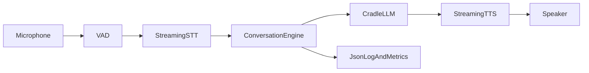

**Notes:**
- **Inputs:** Raw PCM from desktop mic or pod gateway; conversation history.
- **Outputs:** TTS audio to desktop or pod; structured logs and metrics (e.g. `voice_sessions_total`, `voice_stage_duration_seconds`).
- **Failure paths:** STT/LLM/TTS errors are recorded via `voice_errors_total{kind}` and propagated; empty transcript yields `TurnOutcome::EmptyInput` without calling LLM.

---

## 2. Barge-in (interruptibility)

**Purpose:** When the user starts speaking while the assistant is speaking, cancel TTS and LLM and start a new turn.

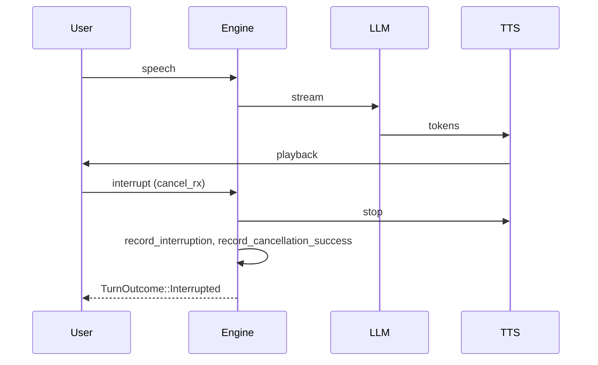

**Notes:**
- **Inputs:** `run_turn_with_cancel` takes a `broadcast::Receiver<()>`; the caller sends when user speech is detected (e.g. VAD).
- **Outputs:** `TurnOutcome::Interrupted`; metrics `voice_interruptions_total`, `voice_cancellation_success_total`.
- **Failure paths:** If cancel is never sent, turn completes as normal.

---

## 3. Fallback web search (user confirmation)

**Purpose:** If the model is uncertain, it appends `[NEED_SEARCH: query]`. The assistant speaks the local answer and asks "Would you like to search the internet? Yes/No." Search runs only if the user confirms.

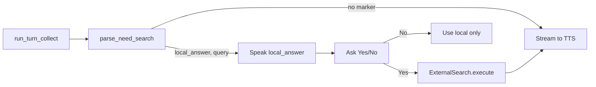

**Notes:**
- **Inputs:** Full LLM response string; user confirmation (voice or UI).
- **Outputs:** Local answer always spoken; search result only after explicit Yes. `TurnOutcome::NeedsSearch { local_answer, query }` is represented by parse_need_search + caller flow.
- **Failure paths:** Empty query in marker yields `None`; search backend errors are returned to caller.

---

## 4. Pod gateway (Signal Pod target, M5Stack experimental ingress/egress)

**Purpose:** Pod devices capture mic audio, stream it as 16 kHz mono 16-bit PCM frames over WebSocket to the gateway, and receive TTS audio + LED state back. Signal Pod is the target runtime device; M5Stack ATOM Echo remains an experimental test path.

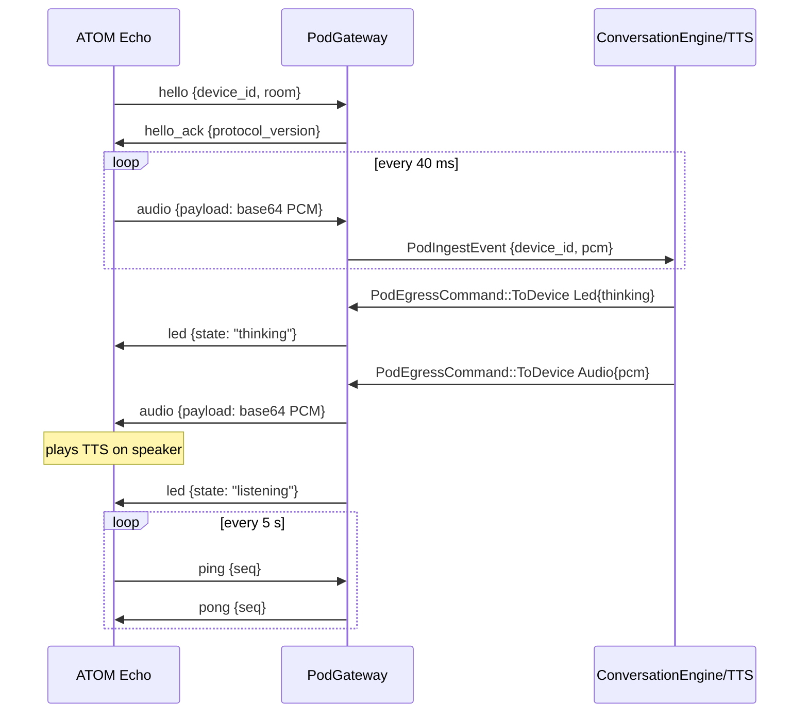

**Notes:**
- **Inputs:** WebSocket messages `hello`, `identify`, `audio`, `ping`, `tap_activate`.
- **Outputs:** `PodIngestEvent { device_id, pcm }` to ingest channel; egress messages (`hello_ack`, `audio`, `stop_audio`, `led`, `pong`, `error`) to target sessions.
- **Pod LED states:** blue blink = connecting, green = listening, amber = thinking, blue solid = speaking, red blink = error.
- **Stop playback:** Say "Computer stop" (or "stop", "stop the music", etc.) when the mic is listening; it stops TTS and clears the pod queue. During playback the pod mic is off (I2S0 mode-switched to speaker; GPIO33 shared), so use the **pod button** to send `TapActivate` and stop mid-play.
- **Failure paths:** Invalid JSON/binary frames emit `error` responses; oversized payloads (>64 KB) are rejected; session is removed on disconnect.

---

## 5. Desktop runtime (wake word and continuous loop)

**Purpose:** The desktop-runner composes config, wake-word gate, microphone capture, Whisper STT, Ollama LLM, and streaming Piper TTS routing. It continuously captures audio windows and streams LLM tokens directly to TTS with cancellation support. The `desktop-runner` binary is deprecated; `pod-voice` and split runtime are the supported paths.

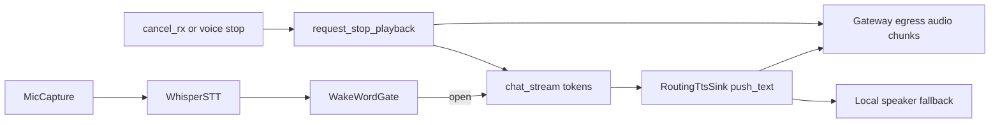

**Notes:**
- **Inputs:** Config (`audio`, `stt`, `tts`, `wake_word`, `ollama_url`, `model`, `llm`); capture/STT/LLM/TTS instances; `cancel_rx` for barge-in.
- **Outputs:** Continuous `RuntimeLoopStats` and per-turn `RuntimeTurnOutcome`; chunked pod audio egress or local playback.
- **Failure paths:** Missing whisper/piper binaries or model files fail startup/preflight; wake-closed windows are ignored until phrase activation; pod egress queue pressure is logged/metriced.

---

## 6. Intent classification and skills (weather, time, distance, sports, holidays, fuel, horoscope, news, smart home, assistant, media, computer, screenshot, app switcher, volume)

**Purpose:** User requests are classified by the LLM into known skills or chat. No keyword-based routing; the LLM returns a JSON intent. For weather, when the classifier provides a place, runtime performs an LLM location-contract normalization step (strict `City, Country` JSON contract) before skill execution. The weather skill fetches data and the LLM turns it into a short spoken answer, streamed to TTS.

All skill crates live in the shared **[`aice-skills`](https://github.com/AncientiCe/aice-skills)** repository, consumed by both backend and frontend apps as a Cargo git dependency. The backend executes skills it is configured for (weather, time, distance, sports-live, holiday-lookup, fuel-price-lookup, horoscope-daily, news-headlines, smart home); platform-specific skills (media, computer, screenshot, app switcher, etc.) are forwarded as `FrontendSkillIntent` to the connected frontend. Memory is handled as core infrastructure (see §7), not as a skill. See [`docs/skills/README.md`](../skills/README.md) for the full per-skill execution ownership table.

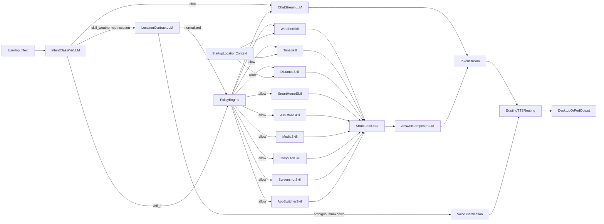

**Notes:**
- **Inputs:** User transcript; optional intent classifier, skill implementations (weather, time, distance, sports_live, holiday_lookup, fuel_price_lookup, horoscope_daily, news_headlines, smart_home, assistant, media, computer, screenshot, app_switcher), resolved location, and optional `PolicyEngine`.
- **Outputs:** Streamed TTS to desktop or pod; metrics `voice_intent_classifier_total`, `voice_intent_routed_total{intent}`, `voice_*_skill_total` per skill, `voice_policy_denied_total`, `voice_location_contract_total{intent,result}`, `voice_location_contract_duration_seconds{intent}`; audit log events `skill_executed` and policy denial warnings.
- **Failure paths:** Classification parse failure or skill error fall back to chat path; policy denial (emergency stop or budget exhausted) falls back to chat; weather location contract ambiguity returns a short clarification and does not execute the weather skill.

Core-common live-info skill docs:
[sports-live](../skills/sports-live.md) · [holiday-lookup](../skills/holiday-lookup.md) · [fuel-price-lookup](../skills/fuel-price-lookup.md) · [horoscope-daily](../skills/horoscope-daily.md) · [news-headlines](../skills/news-headlines.md)

### 6.1 Autonomy policy engine

**Purpose:** Gate all side-effecting skill executions so that full autonomy can be constrained by risk tiers, emergency stop, and action budgets.

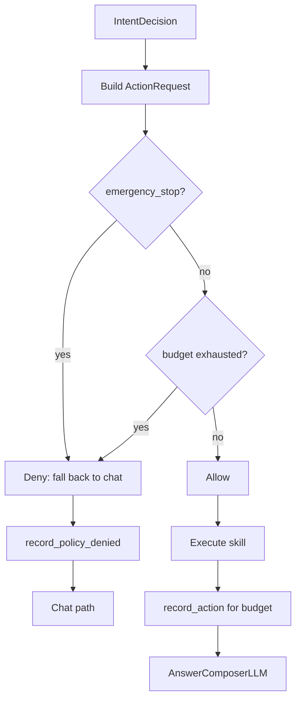

**Notes:**
- **Inputs:** Optional `PolicyEngine` in `SkillRunContext`; when absent, all actions are allowed. `StandardPolicyEngine` supports `set_emergency_stop(bool)`, optional `budget_max`, and `reset_budget()`.
- **Outputs:** `Allow` then skill runs and `record_action()` is called; `Deny` then `record_policy_denied(reason)` and turn continues as chat.
- **Failure paths:** Emergency stop blocks every skill; budget exhaustion blocks until `reset_budget()` or new window.

---

## 7. Memory Palace (core persistent memory)

**Purpose:** The Memory Palace (`mempalace-rs`) is embedded as core infrastructure inside `aice-backend`. It provides a 4-layer structured, persistent, semantic memory system inspired by the memory palace concept. Every chat turn automatically enriches the LLM system prompt with contextual memory (wake-up) and ingests the conversation for long-term recall. An explicit store/search path handles user requests like "remember this" or "what do you know about X" via the `SkillMemory` intent — handled directly by the backend, not as an external skill.

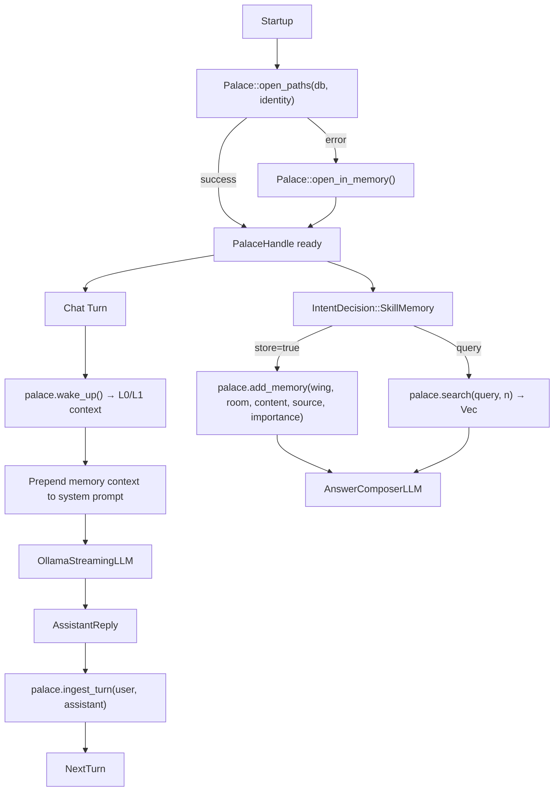

**Notes:**
- **Inputs:** Config `memory.palace_db_path` and `memory.palace_identity_path`; `mempalace` crate embedded via git dependency (`default-features = false`, no CLI). Palace facade wraps `rusqlite` + `fastembed` for 384-dim local embeddings.
- **Outputs:** Per-turn wake-up context (L0 working + L1 episodic layers) injected into LLM system prompt; semantic search results; persistent SQLite-backed memory across sessions. Metrics: `palace_open_total`, `palace_wake_up_total/duration`, `palace_search_total/duration`, `palace_ingest_total/duration`, `palace_add_memory_total/duration`, `palace_errors_total{operation}`.
- **Failure paths:** Palace open failure falls back to in-memory instance (logged + metered). Wake-up or ingest errors are logged and metered but do not fail the turn. Search/store errors propagate to the answer composer as error text.
- **Threading:** All Palace calls are synchronous (`rusqlite`); wrapped in `tokio::task::spawn_blocking` to avoid blocking the async runtime.

---

## 8. Split Runtime Services (`aice-backend` + external macOS frontend)

**Purpose:** Run desktop voice behavior as two services. An external macOS frontend service ([`AncientiCe/aice-macos`](https://github.com/AncientiCe/aice-macos)) owns mic capture, VAD endpointing, audio uplink, and TTS playback, while `aice-backend` owns STT, wake-word gating, LLM orchestration (Cradle provider), intent classification, and non-OS skills. The entire voice journey runs over a single WebSocket connection at `/turns/stream`; HTTP is retained only for operational endpoints (`/healthz`, `/metrics`).

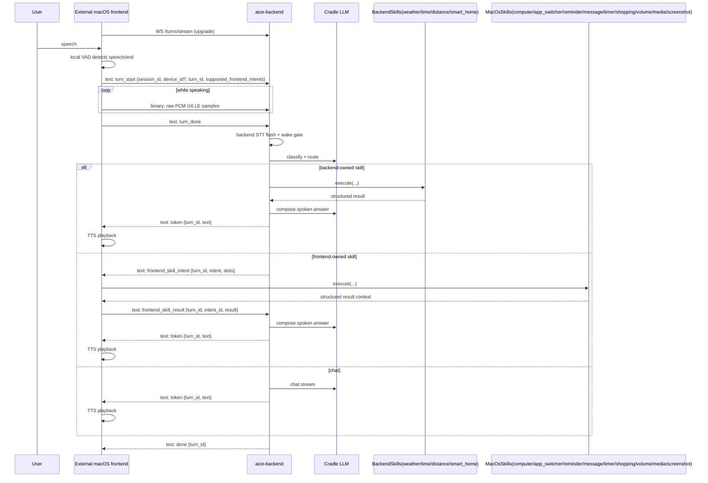

**Notes:**
- **Dual-frame model:** Binary WebSocket frames carry raw PCM audio (i16 LE, 16 kHz mono). Text WebSocket frames carry JSON control messages (`TurnStreamClientMessage`) and server events (`TurnStreamServerEvent`).
- **Session lifecycle:** Backend tracks sessions on WebSocket connect/disconnect; `turn_start` carries `supported_frontend_intents` for per-turn capability-scoped routing.
- **Inputs:** `TurnStreamClientMessage::TurnStart { session_id, device_id?, turn_id, supported_frontend_intents, schema_version? }`, binary PCM frames, `TurnDone`, `TurnCancel`, `FrontendSkillResult { turn_id, intent_id, result }`.
- **Outputs:** `TurnStreamServerEvent` events: `partial_transcript`, `intent_update`, `token`, `frontend_skill_intent`, `done`, `error`.
- **Failure paths:** Odd-byte binary frames are rejected with an error event; unsupported frontend intents emit a fallback token; frontend skill execution failures are reported via `FrontendSkillResult` with `status=error`; WebSocket disconnect removes the session.
- **Capability gating:** Each `TurnStart` carries `supported_frontend_intents`. The backend checks this list before routing `FrontendSkillIntent`; if the intent is unsupported, a fallback text token is emitted instead.

---

## 9. Cross-platform and quality

- **Desktop:** `core-audio` uses cpal for capture (16 kHz mono i16); Aice home deployments are macOS-first (Mac mini recommended).
- **Pod gateway:** WebSocket server; reconnect is supported (new connection = new session); `Identify` message sets device_id for subsequent audio from that connection. Parse errors skip the message and continue.
- **Quality gates:** Every change must pass `cargo fmt`, `cargo clippy`, `cargo audit`, `cargo test`.
- **Observability:** JSON logs (tracing), metrics (voice_* counters/histograms), correlation IDs in logs for sessions/turns.

---

## 10. Operational runbooks

**Purpose:** Links to setup, deployment, and network docs so operators can run the system and push code to pods.

| Task | Doc |
|------|-----|
| Prerequisites, config, how to start everything | [Local development setup](../setup/local-dev.md) |
| Local Prometheus/Grafana dashboards and metrics scrape ops | [Local observability runbook](../runbooks/local-observability.md) |
| Build and flash M5Stack pod (push code to pod) | [M5Stack pod deployment](../deployment/m5stack-pod.md) |
| Wi‑Fi and gateway host/port for pods | [Wi‑Fi configuration](../network/wifi-configuration.md) |
| Plan and implementation status | [Local voice AI plan](../local_voice_ai_plan.md) |

Canonical commands (run from repo root): `cargo aice-fmt`, `cargo aice-clippy`, `cargo aice-audit`, `cargo aice-test`, `cargo aice-pod-voice`.

---

## 10. Real skill integrations (Hue, macOS Music.app)

**Purpose:** Production integrations for smart-home and media are wired as concrete skills in runtime (desktop + pod-voice), not `None`. Memory is handled as core infrastructure (see §7 Memory Palace), not as a skill.

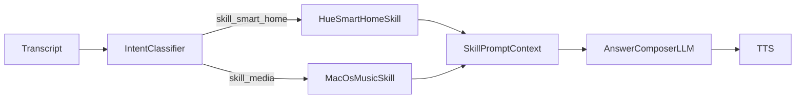

**Notes:**
- **Inputs:** `smart_home.hue.*`, `media.macos_music.*` from config.
- **Outputs:** Skill payload context for voice answer generation.
- **Failure paths:** Missing provider config keeps a skill disabled; skill execution errors fall back to chat path with existing metrics/error logs.

Full per-skill journeys, inputs, outputs, failure paths, and metrics are in [`docs/skills/`](../skills/README.md):
[smart-home](../skills/smart-home.md) · [media](../skills/media.md)

---

## 11. STT phrase segmentation (silence-based flush)

**Purpose:** Improve speech pickup quality by avoiding early transcript flush on brief capture gaps. The runtime now waits for sustained silence before flushing buffered speech to Whisper.

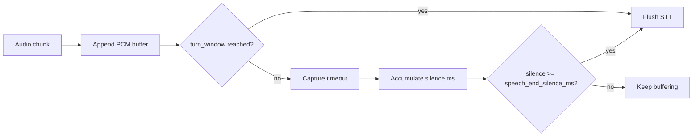

**Notes:**
- **Inputs:** `audio.chunk_timeout_ms`, `audio.speech_end_silence_ms` (default `180` ms), and `audio.speech_rms_threshold` (default `0.008`).
- **Outputs:** Fewer truncated transcripts for headset speech; flush waits for pause/silence (not active-speech chunk windows).
- **Failure paths:** If `speech_end_silence_ms` is configured too high, perceived response latency increases; if too low, partial phrase truncation can reappear.

### 11.1 Deterministic media command parsing

**Purpose:** Keep user speech text unmodified. Runtime executes media commands only when direct parsing matches explicit command phrases.

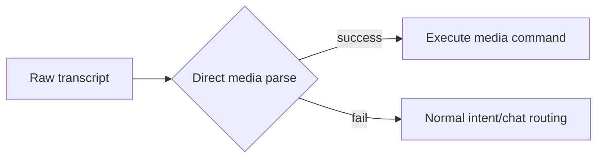

**Notes:**
- **Inputs:** Raw STT transcript only (no transcript rewrite step).
- **Outputs:** No semantic remapping of user speech; reduced false-positive command execution.

---

## 12. Reminder, Timer, and Shopping List Skills

**Purpose:** These skills are part of the standard intent → policy → skill → answer-composer flow and are documented in their dedicated skill docs.

Full per-skill journeys, inputs, outputs, failure paths, and metrics are in [`docs/skills/`](../skills/README.md):
[reminder](../skills/reminder.md) · [timer](../skills/timer.md) · [shopping-list](../skills/shopping-list.md)

---

## 13. Message Skill (Contacts Cache + iMessage)

**Purpose:** Message sending is handled by a dedicated skill and documented in its own skill doc.

Full skill journey, inputs, outputs, failure paths, and metrics are documented at [message](../skills/message.md).

---

## 14. Computer Skill (Open Apps, Files, URLs)

**Purpose:** Computer-use actions are handled by a dedicated skill and documented in its own skill doc.

Full skill journey, inputs, outputs, failure paths, and metrics are documented at [computer](../skills/computer.md).

---

## 15. Volume Skill (System Output Volume)

**Purpose:** System output volume control is handled by a dedicated skill and documented in its own skill doc.

Full skill journey, inputs, outputs, failure paths, and metrics are documented at [volume](../skills/volume.md).

---

## 16. Screenshot Skill (Local macOS Capture)

**Purpose:** Screenshot capture is handled by a dedicated skill and documented in its own skill doc.

Full skill journey, inputs, outputs, failure paths, and metrics are documented at [screenshot](../skills/screenshot.md).

---

## 17. App Switcher Skill (macOS App Focus and Control)

**Purpose:** App switching actions are handled by a dedicated skill and documented in its own skill doc.

Full skill journey, inputs, outputs, failure paths, and metrics are documented at [app-switcher](../skills/app-switcher.md).

---

## 18. Local observability stack (backend-only metrics dashboards)

**Purpose:** Provide local, on-demand operational visibility for backend runtime metrics with Prometheus + Grafana.

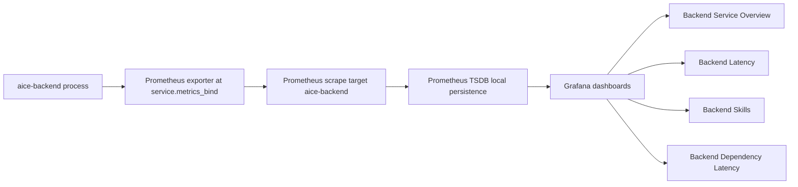

**Notes:**
- **Inputs:** Runtime metrics emitted via `core-observability`; `service.metrics_enabled` and `service.metrics_bind` config.
- **Outputs:** Local dashboards at Grafana (`127.0.0.1:3000`) and raw Prometheus query UI (`127.0.0.1:9090`).
- **Failure paths:** If exporter bind is invalid or unavailable, runtime logs a warning and continues; Prometheus target shows down until endpoint is reachable.
- **Operations:** Bring-up/tear-down is via `./scripts/observability.sh` and `ops/observability/docker-compose.yml`.

---

## 19. Backend latency attribution and optimization gates

**Purpose:** Attribute each backend turn to concrete latency stages and apply optimization passes behind config flags with explicit SLO budgets.

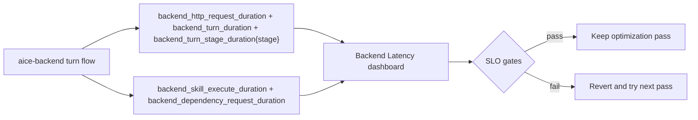

**Notes:**
- **Inputs:** Per-turn flow on `/turns/stream` WebSocket; backend skill and dependency timings.
- **Outputs:** Route-level, stage-level, skill-level, and dependency-level latency views for backend optimization passes. The turn stage breakdown includes `stt_incremental`, `speculative_classify`, `speculative_generate`, `classifier_prompt_build`, `classifier_llm_roundtrip`, `intent_parse_validate`, and `frontend_skill_finalize`.
- **SLO Gates:** For optimization passes, continuously track p50/p95 for `classifier_llm_roundtrip` from `backend_turn_stage_duration_seconds{stage="classifier_llm_roundtrip"}` and `backend_turn_first_token_duration_seconds`.
- **Failure paths:** If a pass increases p95 latency or errors, disable its flag and continue with the next pass.

---

## 20. Backend UDP broadcast discovery for frontend

**Purpose:** Make `aice-backend` discoverable on the **local broadcast domain** (same subnet) on macOS, Linux, and Windows without mDNS, Bonjour, or Avahi. No extra OS services or native dependencies beyond UDP.

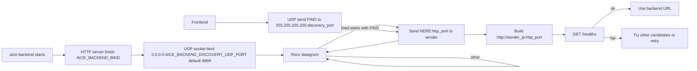

**Notes:**
- **Protocol:** Request body exactly `FIND` (4 bytes). Response UTF-8 `HERE:<port>` where `<port>` is the HTTP listen port parsed from `AICE_BACKEND_BIND` (e.g. `HERE:8781`).
- **Inputs:** `AICE_BACKEND_BIND` (default `0.0.0.0:8781`), optional `AICE_BACKEND_DISCOVERY_UDP_PORT` (default `9999`). Frontend uses the same discovery port env for the probe destination.
- **Scope:** Broadcast reaches the **local subnet only** (same as typical LAN discovery). Routers do not forward `255.255.255.255`.
- **Outputs:** Frontend collects one or more candidate URLs, then selects a healthy backend via existing `/healthz` probing.
- **Failure paths:** If the UDP bind fails, backend exits at startup; metrics record `backend_udp_discovery_listen_total{result="error"}`. Each `FIND` increments `backend_udp_discovery_requests_total`; each reply increments `backend_udp_discovery_responses_total`.

---

## 21. Duplex turn streaming (`/turns/stream`) with speculative backend execution

**Purpose:** Minimize backend latency by turning audio ingest into a duplex WebSocket turn session that emits partial transcript and early routing/output before `turn_done`. This is the **sole** transport for the voice journey; no HTTP routes are used for audio or turn management.

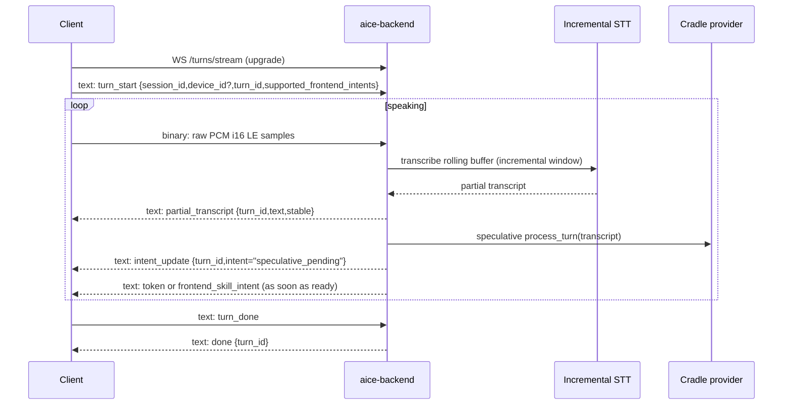

**Notes:**
- **Dual-frame model:** Binary WebSocket frames carry raw PCM audio (i16 little-endian, 16 kHz mono). Text WebSocket frames carry JSON control messages (`TurnStreamClientMessage`) and server events (`TurnStreamServerEvent`). Odd-byte binary frames are rejected with an error event.
- **Inputs:** WebSocket client messages `turn_start`, binary PCM frames, `turn_done`, `turn_cancel`, `frontend_skill_result`.
- **Outputs:** WebSocket server events `partial_transcript`, `intent_update`, `token`, `frontend_skill_intent`, `done`, `error`.
- **Latency instrumentation:** `backend_turn_partial_transcript_duration_seconds`, `backend_turn_first_token_duration_seconds`, `backend_turn_speculative_restarts_total`, `backend_turn_cancellations_total{reason}`, `backend_llm_provider_duration_seconds{provider}` plus stage labels `stt_incremental`, `speculative_classify`, `speculative_generate`.
- **Failure paths:** Invalid message format/sequence or unsupported audio format emits `error`; transcript divergence aborts prior speculative run and increments cancellation/restart metrics; `turn_cancel` aborts active work and emits `done`; WebSocket disconnect cleans up the session.
