# Architecture

User-facing behaviour and pipeline flows for the local voice AI assistant.

---

## 1. Voice pipeline (end-to-end turn)

**Purpose:** One conversation turn: user speech → transcript → LLM → TTS → playback. Defines the core flow and ownership of each stage.

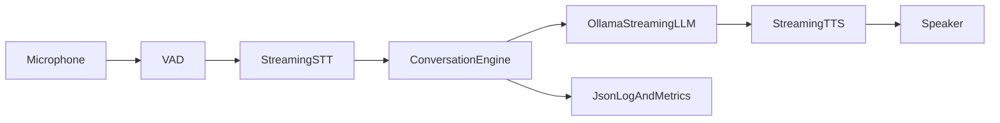

**Notes:**
- **Inputs:** Raw PCM from desktop mic or pod gateway; conversation history.
- **Outputs:** TTS audio to desktop or pod; structured logs and metrics (e.g. `voice_sessions_total`, `voice_stage_duration_seconds`).
- **Failure paths:** STT/LLM/TTS errors are recorded via `voice_errors_total{kind}` and propagated; empty transcript yields `TurnOutcome::EmptyInput` without calling LLM.

---

## 2. Barge-in (interruptibility)

**Purpose:** When the user starts speaking while the assistant is speaking, cancel TTS and LLM and start a new turn.

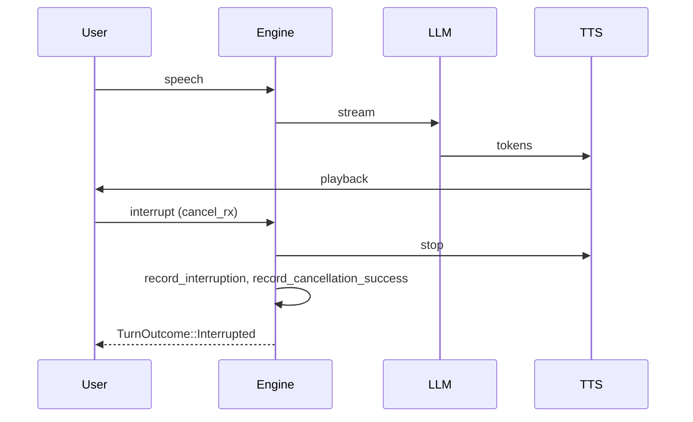

**Notes:**
- **Inputs:** `run_turn_with_cancel` takes a `broadcast::Receiver<()>`; the caller sends when user speech is detected (e.g. VAD).
- **Outputs:** `TurnOutcome::Interrupted`; metrics `voice_interruptions_total`, `voice_cancellation_success_total`.
- **Failure paths:** If cancel is never sent, turn completes as normal.

---

## 3. Fallback web search (user confirmation)

**Purpose:** If the model is uncertain, it appends `[NEED_SEARCH: query]`. The assistant speaks the local answer and asks "Would you like to search the internet? Yes/No." Search runs only if the user confirms.

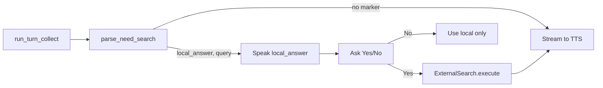

**Notes:**
- **Inputs:** Full LLM response string; user confirmation (voice or UI).
- **Outputs:** Local answer always spoken; search result only after explicit Yes. `TurnOutcome::NeedsSearch { local_answer, query }` is represented by parse_need_search + caller flow.
- **Failure paths:** Empty query in marker yields `None`; search backend errors are returned to caller.

---

## 4. Pod gateway (Signal Pod target, M5Stack experimental ingress/egress)

**Purpose:** Pod devices capture mic audio, stream it as 16 kHz mono 16-bit PCM frames over WebSocket to the gateway, and receive TTS audio + LED state back. Signal Pod is the target runtime device; M5Stack ATOM Echo remains an experimental test path.

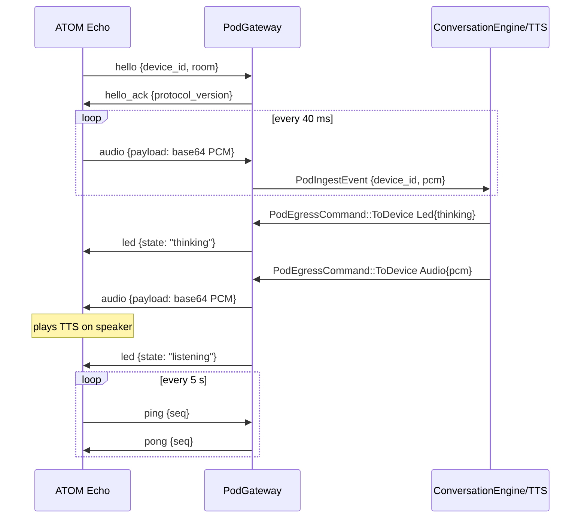

**Notes:**
- **Inputs:** WebSocket messages `hello`, `identify`, `audio`, `ping`, `tap_activate`.
- **Outputs:** `PodIngestEvent { device_id, pcm }` to ingest channel; egress messages (`hello_ack`, `audio`, `stop_audio`, `led`, `pong`, `error`) to target sessions.
- **Pod LED states:** blue blink = connecting, green = listening, amber = thinking, blue solid = speaking, red blink = error.
- **Stop playback:** Say "Computer stop" (or "stop", "stop the music", etc.) when the mic is listening; it stops TTS and clears the pod queue. During playback the pod mic is off (I2S0 mode-switched to speaker; GPIO33 shared), so use the **pod button** to send `TapActivate` and stop mid-play.
- **Failure paths:** Invalid JSON/binary frames emit `error` responses; oversized payloads (>64 KB) are rejected; session is removed on disconnect.

---

## 5. Desktop runtime (wake word and continuous loop)

**Purpose:** The desktop-runner composes config, wake-word gate, microphone capture, Whisper STT, Ollama LLM, and streaming Piper TTS routing. It continuously captures audio windows and streams LLM tokens directly to TTS with cancellation support.

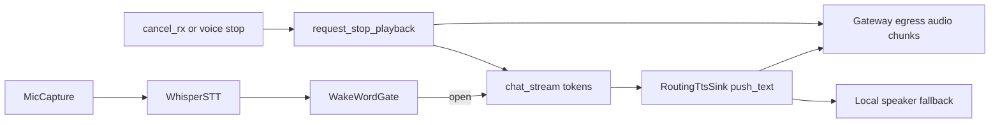

**Notes:**
- **Inputs:** Config (`audio`, `stt`, `tts`, `wake_word`, `ollama_url`, `model`, `llm`); capture/STT/LLM/TTS instances; `cancel_rx` for barge-in.
- **Outputs:** Continuous `RuntimeLoopStats` and per-turn `RuntimeTurnOutcome`; chunked pod audio egress or local playback.
- **Failure paths:** Missing whisper/piper binaries or model files fail startup/preflight; wake-closed windows are ignored until phrase activation; pod egress queue pressure is logged/metriced.

---

## 6. Intent classification and skills (weather, time, distance, smart home, assistant, media, memory, computer)

**Purpose:** User requests are classified by the LLM into known skills or chat. No keyword-based routing; the LLM returns a JSON intent. For weather, location is resolved at startup (IP geolocation or config default) or from the user’s request (e.g. “weather in Rome”). The weather skill fetches data and the LLM turns it into a short spoken answer, streamed to TTS.

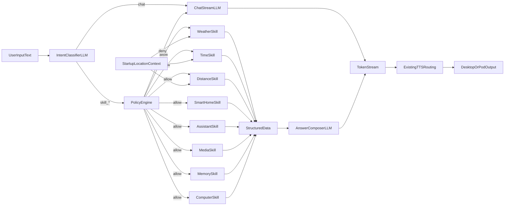

**Notes:**
- **Inputs:** User transcript; optional intent classifier, skill implementations (weather, time, distance, smart_home, assistant, media, memory, computer), resolved location, and optional `PolicyEngine`.
- **Outputs:** Streamed TTS to desktop or pod; metrics `voice_intent_classifier_total`, `voice_intent_routed_total{intent}`, `voice_*_skill_total` per skill, `voice_policy_denied_total`; audit log events `skill_executed` and policy denial warnings.
- **Failure paths:** Classification parse failure or skill error fall back to chat path; policy denial (emergency stop or budget exhausted) falls back to chat; missing location/places when required uses startup/default or falls back to chat.

### 6.1 Autonomy policy engine

**Purpose:** Gate all side-effecting skill executions so that full autonomy can be constrained by risk tiers, emergency stop, and action budgets.

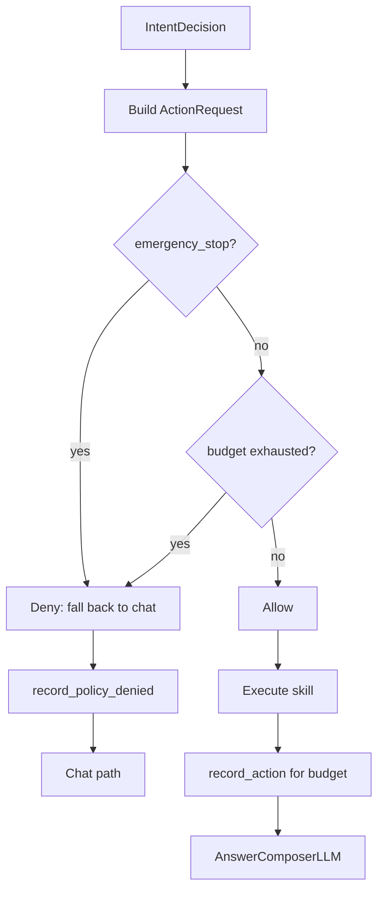

**Notes:**
- **Inputs:** Optional `PolicyEngine` in `SkillRunContext`; when absent, all actions are allowed. `StandardPolicyEngine` supports `set_emergency_stop(bool)`, optional `budget_max`, and `reset_budget()`.
- **Outputs:** `Allow` then skill runs and `record_action()` is called; `Deny` then `record_policy_denied(reason)` and turn continues as chat.
- **Failure paths:** Emergency stop blocks every skill; budget exhaustion blocks until `reset_budget()` or new window.

---

## 7. Assistant profile and persistent memory

**Purpose:** At startup the runner loads an optional memory store from disk (JSON), builds an effective system prompt from config (`assistant_profile`: name, persona, unit_system, time_format, user_name) plus location and memory profile/facts, and passes recent conversation turns as history into the chat LLM. After each completed chat turn the runtime appends the turn to memory and optionally saves to disk (atomic write). This gives a Jarvis-style experience: the assistant starts with your identity, units, and remembered preferences and maintains short-term conversation context.

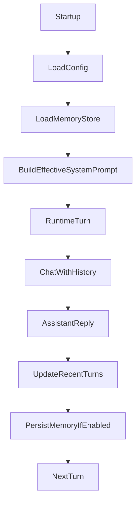

**Notes:**
- **Inputs:** Config `assistant_profile`, `memory` (enabled, path, max_recent_turns, max_facts, autosave); memory file at `memory.path` (missing or invalid → empty store, no hard-fail).
- **Outputs:** Effective system prompt fed into Ollama; chat path uses `memory.history()` for `chat_stream(..., history, ...)`; after turn, `push_turn` and optional `save`; metrics `memory_load_total`, `memory_save_total`, `memory_load_errors_total`, `memory_save_errors_total`, `memory_load_duration_seconds`, `memory_save_duration_seconds`.
- **Failure paths:** Load/save errors are logged and metered; save failure does not fail the turn.

---

## 8. Cross-platform and quality

- **Desktop:** `core-audio` uses cpal for capture (16 kHz mono i16); Aice home deployments are macOS-first (Mac mini recommended).
- **Pod gateway:** WebSocket server; reconnect is supported (new connection = new session); `Identify` message sets device_id for subsequent audio from that connection. Parse errors skip the message and continue.
- **Quality gates:** Every change must pass `cargo fmt`, `cargo clippy`, `cargo audit`, `cargo test`.
- **Observability:** JSON logs (tracing), metrics (voice_* counters/histograms), correlation IDs in logs for sessions/turns.

---

## 9. Operational runbooks

**Purpose:** Links to setup, deployment, and network docs so operators can run the system and push code to pods.

| Task | Doc |
|------|-----|
| Prerequisites, config, how to start everything | [Local development setup](../setup/local-dev.md) |
| Build and flash M5Stack pod (push code to pod) | [M5Stack pod deployment](../deployment/m5stack-pod.md) |
| Wi‑Fi and gateway host/port for pods | [Wi‑Fi configuration](../network/wifi-configuration.md) |
| Plan and implementation status | [Local voice AI plan](../local_voice_ai_plan.md) |

Canonical commands (run from repo root): `cargo aice-fmt`, `cargo aice-clippy`, `cargo aice-audit`, `cargo aice-test`, `cargo aice-pod-voice`.

---

## 10. Real skill integrations (Hue, macOS Music.app, SQLite memory)

**Purpose:** Production integrations for smart-home, media, and memory are wired as concrete skills in runtime (desktop + pod-voice), not `None`.

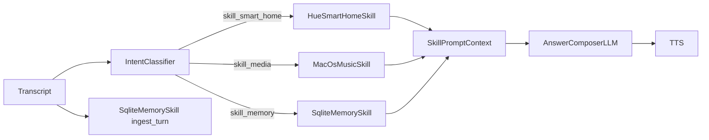

**Notes:**
- **Inputs:** `smart_home.hue.*`, `media.macos_music.*`, `memory.sqlite_path` from config.
- **Outputs:** Skill payload context for voice answer generation; SQLite-backed memory facts and turn ingestion.
- **Failure paths:** Missing provider config keeps a skill disabled; skill execution errors fall back to chat path with existing metrics/error logs.

Full per-skill journeys, inputs, outputs, failure paths, and metrics are in [`docs/skills/`](../skills/README.md):
[smart-home](../skills/smart-home.md) · [media](../skills/media.md) · [memory](../skills/memory.md)

---

## 11. STT phrase segmentation (silence-based flush)

**Purpose:** Improve speech pickup quality by avoiding early transcript flush on brief capture gaps. The runtime now waits for sustained silence before flushing buffered speech to Whisper.

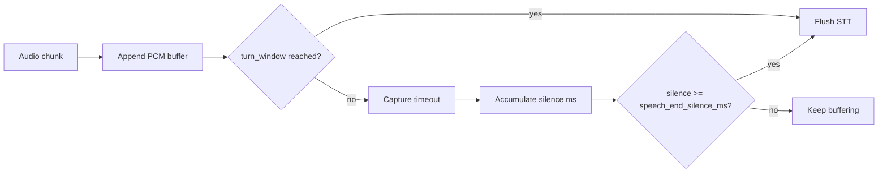

**Notes:**
- **Inputs:** `audio.chunk_timeout_ms`, `audio.speech_end_silence_ms` (default `180` ms), and `audio.speech_rms_threshold` (default `0.008`).
- **Outputs:** Fewer truncated transcripts for headset speech; flush waits for pause/silence (not active-speech chunk windows).
- **Failure paths:** If `speech_end_silence_ms` is configured too high, perceived response latency increases; if too low, partial phrase truncation can reappear.

### 11.1 Deterministic media command parsing

**Purpose:** Keep user speech text unmodified. Runtime executes media commands only when direct parsing matches explicit command phrases.

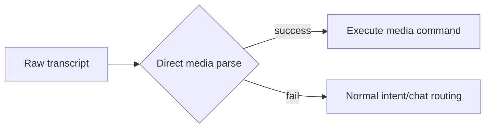

**Notes:**
- **Inputs:** Raw STT transcript only (no transcript rewrite step).
- **Outputs:** No semantic remapping of user speech; reduced false-positive command execution.

---

## 12. Reminder, Timer, and Shopping List Skills

**Purpose:** These skills are part of the standard intent → policy → skill → answer-composer flow and are documented in their dedicated skill docs.

Full per-skill journeys, inputs, outputs, failure paths, and metrics are in [`docs/skills/`](../skills/README.md):
[reminder](../skills/reminder.md) · [timer](../skills/timer.md) · [shopping-list](../skills/shopping-list.md)

---

## 13. Message Skill (Contacts Cache + iMessage)

**Purpose:** Message sending is handled by a dedicated skill and documented in its own skill doc.

Full skill journey, inputs, outputs, failure paths, and metrics are documented at [message](../skills/message.md).
