# Architecture

User-facing behaviour and pipeline flows for the local voice AI assistant.

---

## 1. Voice pipeline (end-to-end turn)

**Purpose:** One conversation turn: user speech → transcript → LLM → TTS → playback. Defines the core flow and ownership of each stage.

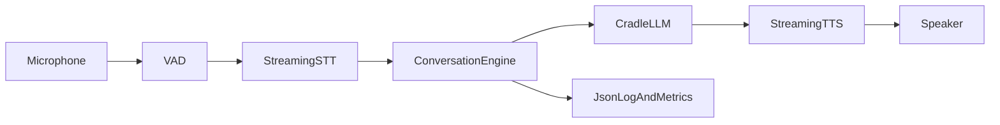

**Notes:**
- **Inputs:** Raw PCM from desktop mic or pod gateway; conversation history.
- **Outputs:** TTS audio to desktop or pod; structured logs and metrics (e.g. `voice_sessions_total`, `voice_stage_duration_seconds`).
- **Failure paths:** STT/LLM/TTS errors are recorded via `voice_errors_total{kind}` and propagated; empty transcript yields `TurnOutcome::EmptyInput` without calling LLM.

---

## 2. Barge-in (interruptibility)

**Purpose:** When the user starts speaking while the assistant is speaking, cancel TTS and LLM and start a new turn.

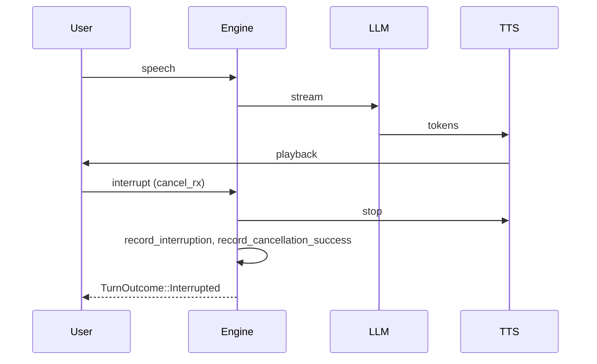

**Notes:**
- **Inputs:** `run_turn_with_cancel` takes a `broadcast::Receiver<()>`; the caller sends when user speech is detected (e.g. VAD).
- **Outputs:** `TurnOutcome::Interrupted`; metrics `voice_interruptions_total`, `voice_cancellation_success_total`.
- **Failure paths:** If cancel is never sent, turn completes as normal.

---

## 3. Fallback web search (user confirmation)

**Purpose:** If the model is uncertain, it appends `[NEED_SEARCH: query]`. The assistant speaks the local answer and asks "Would you like to search the internet? Yes/No." Search runs only if the user confirms.

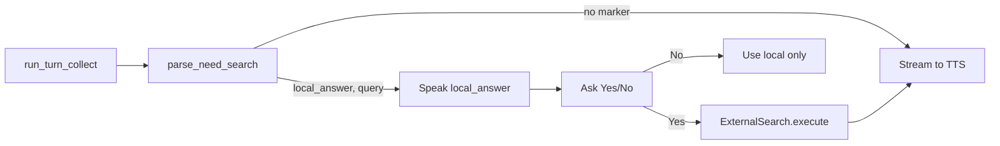

**Notes:**
- **Inputs:** Full LLM response string; user confirmation (voice or UI).
- **Outputs:** Local answer always spoken; search result only after explicit Yes. `TurnOutcome::NeedsSearch { local_answer, query }` is represented by parse_need_search + caller flow.
- **Failure paths:** Empty query in marker yields `None`; search backend errors are returned to caller.

---

## 4. Room bridge (pods ⇄ backend)

**Purpose:** A pod in each room captures microphone audio and plays spoken answers. The room bridge (`pod-gateway`, `cargo aice-gateway`) decides where speech starts and ends, runs each utterance as one turn on the backend with the pod's device token, and speaks the answer back through the pod. The bridge never interprets what was said; the backend's LLM does.

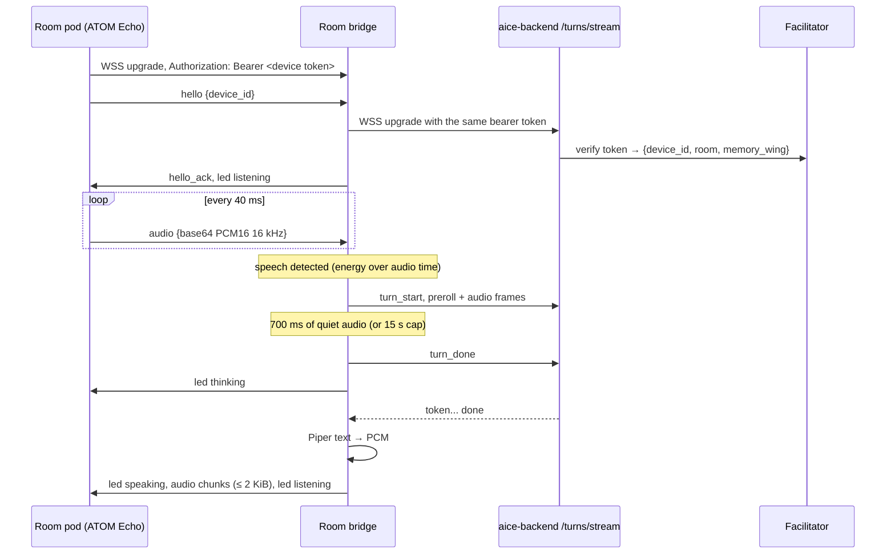

**Notes:**
- **Inputs:** pod messages `hello`, `identify`, `audio`, `ping`, `tap_activate`; config `pod_bind`, `pod_gateway.backend_url` (`ws://` or `wss://`), `pod_gateway.backend_ca_file`, `pod_gateway.tls` (serve pods over TLS), `pod_gateway.vad_start_level`, `pod_gateway.vad_end_silence_ms`, and `tts.piper_model_path`.
- **Turn detection:** a turn opens after three frames above `vad_start_level` (mean absolute sample value) and includes the eight frames before it, so the first word is kept. It closes after `vad_end_silence_ms` of quiet audio or 15 s. Time is measured in audio samples, so buffered bursts are judged like live audio. The pod mic is off while it plays, so the bridge ignores audio until the answer has been sent.
- **Outputs:** `hello_ack`, `led` (`listening`, `thinking`, `speaking`), `audio` chunks of at most 2 KiB, `stop_audio`, `pong`, `error`. Audio is paced at playback speed with three chunks of lead, because the pod queues only six 2 KiB chunks (about 0.4 s); the pod returns to listening by itself when playback ends.
- **Button:** `tap_activate` stops playback and cancels an open turn (`turn_cancel`); `help_button` (long press) calls staff without speech (section 29).
- **Playback:** the bridge sends `playback_started` to the backend before it sends an answer to the pod, and `playback_finished` when the answer has been sent or a tap stops it, so the wake-word awake window runs from the end of playback (section 31).
- **Half-duplex limit:** the ATOM Echo cannot capture while it plays, so section 2 barge-in never fires on this path; the button is the only interrupt. The ATOM Echo is a transport test bed. Guest rooms need a full-duplex pod with echo cancellation, where any speech during playback interrupts the answer: see [Signal Pod requirements](../hardware/signal-pod.md).
- **Local skills:** pods have none; a `frontend_skill_intent` is answered with an error result so the backend replies instead of waiting.
- **Failure paths:** the backend refuses the token → `error {code: unauthorized}` and the pod connection closes; backend unreachable → `error {code: backend_unavailable}`; invalid JSON → `invalid_message`; audio over 64 KiB → `payload_too_large`; binary frames → `binary_not_supported`; Piper failure → the turn ends without audio (`pod_bridge_turns_total{result="speech_failed"}`). A property deployment refuses plain WebSocket pods on a network bind unless `service.allow_plaintext_lan` is set.
- **Metrics:** `pod_bridge_turns_total{result}` (`answered`, `no_answer`, `cancelled`, `backend_error`, `speech_failed`, `unauthorized`, `backend_unavailable`), `pod_bridge_turn_duration_seconds`, `pod_connections_total`, `pod_disconnects_total`, `pod_audio_frames_total`, `pod_tts_chunks_total`, `pod_egress_queue_drops_total`, `pod_egress_send_errors_total`.

---

## 6. Intent classification and skills

**Purpose:** User requests are classified by the LLM into known skills or chat. No keyword-based routing; the LLM returns a JSON intent. For weather, when the classifier provides a place, runtime performs an LLM location-contract normalization step (strict `City, Country` JSON contract) before skill execution. Each skill fetches data (or dispatches to the frontend) and the LLM turns the structured result into a short spoken answer, streamed to TTS.

All skill crates live in the shared **[`aice-skills`](https://github.com/AncientiCe/aice-skills)** repository, consumed by both backend and frontend apps as a Cargo git dependency. The backend executes skills that are stateless utilities, HTTP-backed lookups, or LLM-heavy processing — `weather`, `time`, `distance`, `sports_live`, `holiday_lookup`, `fuel_price_lookup`, `horoscope_daily`, `news_headlines`, `smart_home`, `calculator`, `unit_conversion`, `currency`, `air_quality`, `dictionary`, `translate`, `meeting_notes`, `briefing`, `journal`. Platform-specific skills with per-frontend providers or device state — `media`, `computer`, `screenshot`, `app_switcher`, `volume`, `reminder`, `timer`, `shopping_list`, `message`, `calendar`, `email` — are dispatched as `FrontendSkillIntent` to the connected `aice-macos` frontend. `screen_ocr` is hybrid: the frontend captures + OCRs, then sends the text back via `FrontendSkillResultRequest.structured_result_context` for the backend's vision LLM to answer. Memory is handled as core infrastructure (see §7), not as a skill. See [`docs/skills/README.md`](../skills/README.md) for the full per-skill execution ownership table.

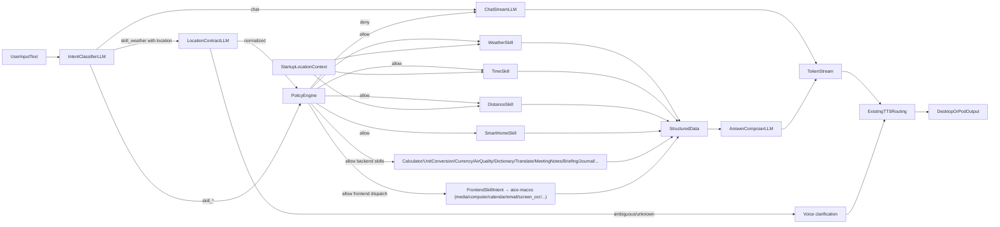

**Notes:**
- **Inputs:** User transcript; optional intent classifier, skill implementations (weather, time, distance, sports_live, holiday_lookup, fuel_price_lookup, horoscope_daily, news_headlines, smart_home, calculator, unit_conversion, currency, air_quality, dictionary, translate, meeting_notes, briefing, journal, plus frontend-dispatched media/computer/calendar/email/screen_ocr/...), resolved location, and optional `PolicyEngine`.
- **Outputs:** Streamed TTS to desktop or pod; metrics `voice_intent_classifier_total`, `voice_intent_routed_total{intent}`, `voice_*_skill_total` per skill, `voice_policy_denied_total`, `voice_location_contract_total{intent,result}`, `voice_location_contract_duration_seconds{intent}`; audit log events `skill_executed` and policy denial warnings.
- **Failure paths:** Classification parse failure or skill error fall back to chat path; policy denial (emergency stop or budget exhausted) falls back to chat; weather location contract ambiguity returns a short clarification and does not execute the weather skill.
- **Classifier optimizations:** The system prompt and output schema are dynamically pruned to only enabled skills. Grammar-constrained decoding via Ollama JSON Schema structured output prevents invalid intent strings. Prompt artifacts and compact few-shots are cached for KV-cache-friendly prefix stability. Classification always uses non-streaming calls and has no retry path (structured output eliminates invalid JSON). A context window cap (`classifier_num_ctx`) reduces VRAM use and prefill time. An optional `classifier_ollama_url` allows a dedicated Ollama instance for classification to prevent chat from evicting the classifier KV cache. The 7B model is kept for classification to preserve reasoning (e.g. mapping "I'd like to eat some strawberries" to `skill_shopping_list`).

Core-common live-info skill docs:
[sports-live](../skills/sports-live.md) · [holiday-lookup](../skills/holiday-lookup.md) · [fuel-price-lookup](../skills/fuel-price-lookup.md) · [horoscope-daily](../skills/horoscope-daily.md) · [news-headlines](../skills/news-headlines.md)

### 6.1 Autonomy policy engine

**Purpose:** Gate all side-effecting skill executions so that full autonomy can be constrained by risk tiers, emergency stop, and action budgets.

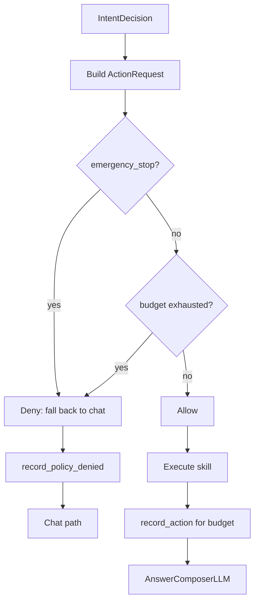

**Notes:**
- **Inputs:** Optional `PolicyEngine` in `SkillRunContext`; when absent, all actions are allowed. `StandardPolicyEngine` supports `set_emergency_stop(bool)`, optional `budget_max`, and `reset_budget()`.
- **Outputs:** `Allow` then skill runs and `record_action()` is called; `Deny` then `record_policy_denied(reason)` and turn continues as chat.
- **Failure paths:** Emergency stop blocks every skill; budget exhaustion blocks until `reset_budget()` or new window.

---

## 7. Memory Palace (core persistent memory)

**Purpose:** The Memory Palace (`palace-rs`) is embedded as core infrastructure inside `aice-backend`. It provides structured, persistent, semantic memory for the voice journey. Every non-empty voice turn can enrich answer composition with wake-up context, semantic recall, and knowledge-graph facts; every spoken outcome is ingested for long-term recall. There is no `SkillMemory` intent — memory is infrastructure, while explicit user-controlled note-taking remains the [Journal](../skills/journal.md) skill.

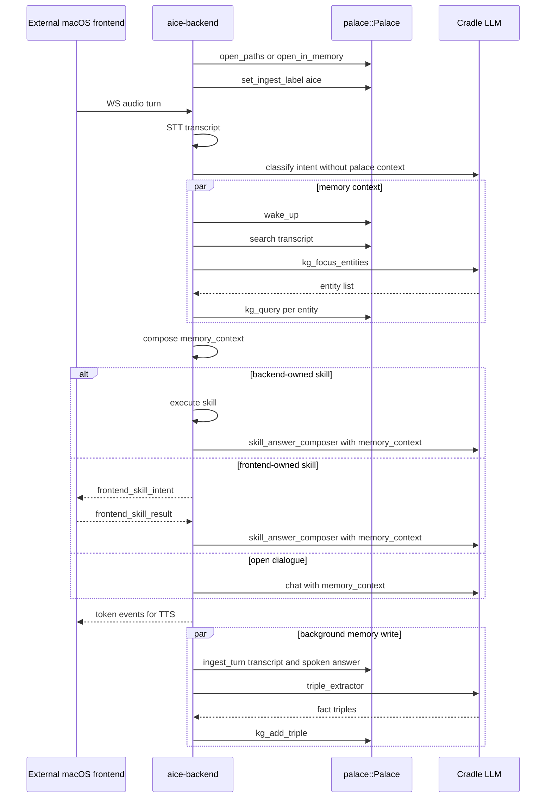

**Notes:**
- **Inputs:** Config `memory.palace_db_path`, `memory.palace_identity_path`, `memory.palace_recall_results`, `memory.palace_recall_min_similarity`, `memory.palace_recall_max_chars`, `memory.palace_journal_mirror_enabled`, and `memory.palace_kg_enabled`; `palace-rs` crate (library `palace`, tag `v0.14.2`) embedded via git dependency (`default-features = false`, no CLI). Default data directory `~/.palace`; an install that only has the pre-rename `~/.mempalace` keeps using it.
- **Outputs:** Per-turn memory context injected into answer composition for open dialogue, backend-owned skills, and frontend skill finalization; persistent SQLite-backed drawers tagged `added_by = "aice"`; optional Journal add mirroring into `wing = "journal"`; knowledge-graph triples extracted from spoken outcomes. Metrics: `palace_open_total`, `palace_wake_up_total/duration`, `palace_search_total/duration`, `palace_ingest_total/duration`, `palace_add_memory_total/duration`, `palace_kg_query_total/duration`, `palace_kg_add_total/duration`, `palace_errors_total{operation}`.
- **Failure paths:** Palace open failure falls back to in-memory instance (logged + metered). Wake-up, recall, KG query, ingest, Journal mirroring, or KG extraction errors are logged and metered but do not fail the voice turn.
- **Threading:** All Palace calls are synchronous (`rusqlite`); wrapped in `tokio::task::spawn_blocking` to avoid blocking the async runtime.

---

## 8. Split Runtime Services (`aice-backend` + external macOS frontend)

**Purpose:** Run desktop voice behavior as two services. An external macOS frontend service ([`AncientiCe/aice-macos`](https://github.com/AncientiCe/aice-macos)) owns mic capture, VAD endpointing, audio uplink, and TTS playback, while `aice-backend` owns STT, wake-word gating, LLM orchestration (Cradle provider), intent classification, and non-OS skills. The entire voice journey runs over a single WebSocket connection at `/turns/stream`; HTTP is retained only for operational endpoints (`/healthz`, `/metrics`).

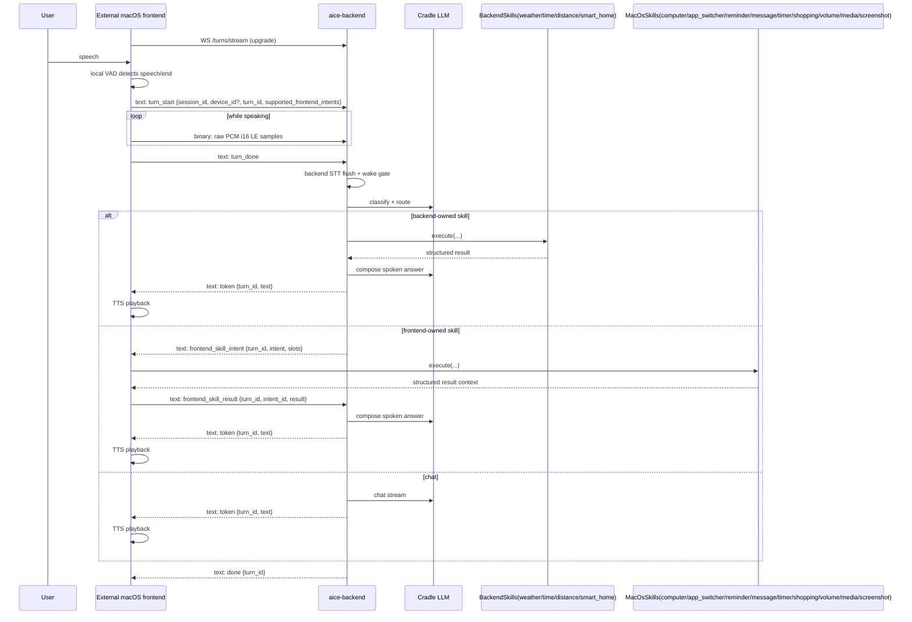

**Notes:**
- **Dual-frame model:** Binary WebSocket frames carry raw PCM audio (i16 LE, 16 kHz mono). Text WebSocket frames carry JSON control messages (`TurnStreamClientMessage`) and server events (`TurnStreamServerEvent`).
- **Session lifecycle:** Backend tracks sessions on WebSocket connect/disconnect; `turn_start` carries `supported_frontend_intents` for per-turn capability-scoped routing.
- **Inputs:** `TurnStreamClientMessage::TurnStart { session_id, device_id?, turn_id, supported_frontend_intents, schema_version? }`, binary PCM frames, `TurnDone`, `TurnCancel`, `FrontendSkillResult { turn_id, intent_id, result }`.
- **Outputs:** `TurnStreamServerEvent` events: `partial_transcript`, `intent_update`, `token`, `frontend_skill_intent`, `done`, `error`.
- **Failure paths:** Odd-byte binary frames are rejected with an error event; unsupported frontend intents emit a fallback token; frontend skill execution failures are reported via `FrontendSkillResult` with `status=error`; WebSocket disconnect removes the session.
- **Capability gating:** Each `TurnStart` carries `supported_frontend_intents`. The backend checks this list before routing `FrontendSkillIntent`; if the intent is unsupported, a fallback text token is emitted instead.

---

## 9. Cross-platform and quality

- **Desktop:** `core-audio` uses cpal for capture (16 kHz mono i16); Aice home deployments are macOS-first (Mac mini recommended).
- **Pod gateway:** WebSocket server; reconnect is supported (new connection = new session); `Identify` message sets device_id for subsequent audio from that connection. Parse errors skip the message and continue.
- **Quality gates:** Every change must pass `cargo fmt`, `cargo clippy`, `cargo audit`, `cargo test`.
- **Observability:** JSON logs (tracing), metrics (voice_* counters/histograms), correlation IDs in logs for sessions/turns.

---

## 10. Operational runbooks

**Purpose:** Links to setup, deployment, and network docs so operators can run the system and push code to pods.

| Task | Doc |
|------|-----|
| Prerequisites, config, how to start everything | [Local development setup](../setup/local-dev.md) |
| Local Prometheus/Grafana dashboards and metrics scrape ops | [Local observability runbook](../runbooks/local-observability.md) |
| Build and flash M5Stack pod (push code to pod) | [M5Stack pod deployment](../deployment/m5stack-pod.md) |
| Wi‑Fi and gateway host/port for pods | [Wi‑Fi configuration](../network/wifi-configuration.md) |
| Plan and implementation status | [Local voice AI plan](../local_voice_ai_plan.md) |
| Cut and publish `v0.3.0` | [v0.3.0 release runbook](../runbooks/release-v0.3.0.md) |

Canonical commands (run from repo root): `cargo aice-fmt`, `cargo aice-clippy`, `cargo aice-audit`, `cargo aice-test`, `cargo aice-backend`.

---

## 10. Real skill integrations (Hue smart-home in backend; media in frontend)

**Purpose:** Smart-home is a real backend integration via Philips Hue. Media (Apple Music, Spotify, etc.) is a per-frontend integration owned by `aice-macos`; the backend only dispatches `skill_media`. Memory is handled as core infrastructure (see §7 Memory Palace), not as a skill.

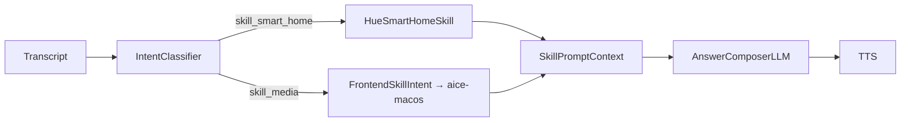

**Notes:**
- **Inputs:** `smart_home.hue.*` from backend config; per-frontend media provider configuration lives in `aice-macos`.
- **Outputs:** Skill payload context for voice answer generation.
- **Failure paths:** Missing provider config keeps a skill disabled; skill execution errors fall back to chat path with existing metrics/error logs.

Full per-skill journeys, inputs, outputs, failure paths, and metrics are in [`docs/skills/`](../skills/README.md):
[smart-home](../skills/smart-home.md) · [media](../skills/media.md)

---

## 11. STT phrase segmentation (silence-based flush)

**Purpose:** Improve speech pickup quality by avoiding early transcript flush on brief capture gaps. The runtime now waits for sustained silence before flushing buffered speech to Whisper.

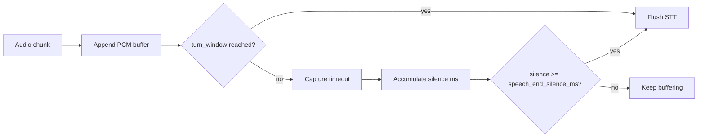

**Notes:**
- **Inputs:** `audio.chunk_timeout_ms`, `audio.speech_end_silence_ms` (default `180` ms), and `audio.speech_rms_threshold` (default `0.008`).
- **Outputs:** Fewer truncated transcripts for headset speech; flush waits for pause/silence (not active-speech chunk windows).
- **Failure paths:** If `speech_end_silence_ms` is configured too high, perceived response latency increases; if too low, partial phrase truncation can reappear.

### 11.1 Deterministic media command parsing

**Purpose:** Keep user speech text unmodified. Runtime executes media commands only when direct parsing matches explicit command phrases.

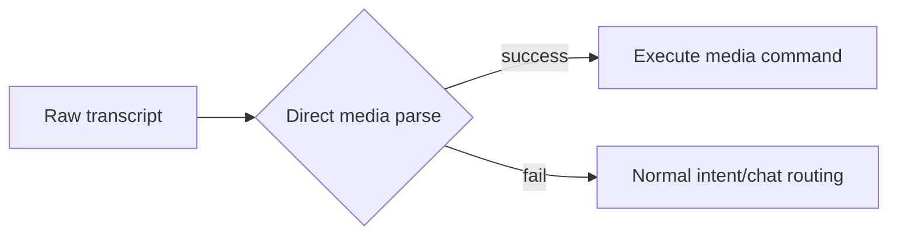

**Notes:**
- **Inputs:** Raw STT transcript only (no transcript rewrite step).
- **Outputs:** No semantic remapping of user speech; reduced false-positive command execution.

---

## 12. Reminder, Timer, and Shopping List Skills

**Purpose:** These skills are part of the standard intent → policy → skill → answer-composer flow and are documented in their dedicated skill docs.

Full per-skill journeys, inputs, outputs, failure paths, and metrics are in [`docs/skills/`](../skills/README.md):
[reminder](../skills/reminder.md) · [timer](../skills/timer.md) · [shopping-list](../skills/shopping-list.md)

---

## 13. Message Skill (Contacts Cache + iMessage)

**Purpose:** Message sending is handled by a dedicated skill and documented in its own skill doc.

Full skill journey, inputs, outputs, failure paths, and metrics are documented at [message](../skills/message.md).

---

## 14. Computer Skill (Open Apps, Files, URLs)

**Purpose:** Computer-use actions are handled by a dedicated skill and documented in its own skill doc.

Full skill journey, inputs, outputs, failure paths, and metrics are documented at [computer](../skills/computer.md).

---

## 15. Volume Skill (System Output Volume)

**Purpose:** System output volume control is handled by a dedicated skill and documented in its own skill doc.

Full skill journey, inputs, outputs, failure paths, and metrics are documented at [volume](../skills/volume.md).

---

## 16. Screenshot Skill (Local macOS Capture)

**Purpose:** Screenshot capture is handled by a dedicated skill and documented in its own skill doc.

Full skill journey, inputs, outputs, failure paths, and metrics are documented at [screenshot](../skills/screenshot.md).

---

## 17. App Switcher Skill (macOS App Focus and Control)

**Purpose:** App switching actions are handled by a dedicated skill and documented in its own skill doc.

Full skill journey, inputs, outputs, failure paths, and metrics are documented at [app-switcher](../skills/app-switcher.md).

---

## 18. Local observability stack (backend-only metrics dashboards)

**Purpose:** Provide local, on-demand operational visibility for backend runtime metrics with Prometheus + Grafana.

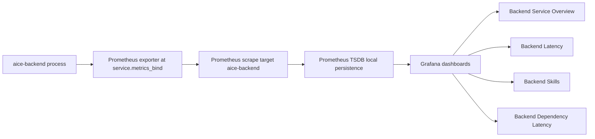

**Notes:**
- **Inputs:** Runtime metrics emitted via `core-observability`; `service.metrics_enabled` and `service.metrics_bind` config.
- **Outputs:** Local dashboards at Grafana (`127.0.0.1:3000`) and raw Prometheus query UI (`127.0.0.1:9090`).
- **Failure paths:** If exporter bind is invalid or unavailable, runtime logs a warning and continues; Prometheus target shows down until endpoint is reachable.
- **Operations:** Bring-up/tear-down is via `./scripts/observability.sh` and `ops/observability/docker-compose.yml`.

---

## 19. Backend latency attribution and optimization gates

**Purpose:** Attribute each backend turn to concrete latency stages and apply optimization passes behind config flags with explicit SLO budgets.

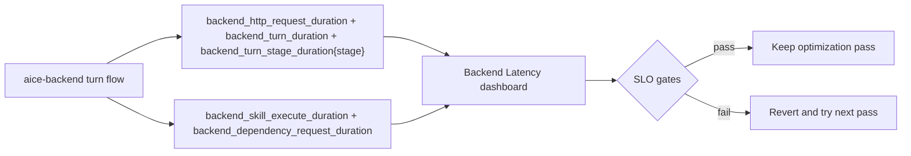

**Notes:**
- **Inputs:** Per-turn flow on `/turns/stream` WebSocket; backend skill and dependency timings.
- **Outputs:** Route-level, stage-level, skill-level, and dependency-level latency views for backend optimization passes. The turn stage breakdown includes `stt_incremental`, `speculative_classify`, `speculative_generate`, `classifier_prompt_build`, `classifier_llm_roundtrip`, `intent_parse_validate`, and `frontend_skill_finalize`.
- **SLO Gates:** For optimization passes, continuously track p50/p95 for `classifier_llm_roundtrip` from `backend_turn_stage_duration_seconds{stage="classifier_llm_roundtrip"}` and `backend_turn_first_token_duration_seconds`.
- **Failure paths:** If a pass increases p95 latency or errors, disable its flag and continue with the next pass.

---

## 20. Backend UDP broadcast discovery for frontend

**Purpose:** Make `aice-backend` discoverable on the **local broadcast domain** (same subnet) on macOS, Linux, and Windows without mDNS, Bonjour, or Avahi. No extra OS services or native dependencies beyond UDP.

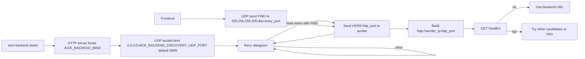

**Notes:**
- **Protocol:** Request body exactly `FIND` (4 bytes). Response UTF-8 `HERE:<port>` where `<port>` is the HTTP listen port parsed from `AICE_BACKEND_BIND` (e.g. `HERE:8781`).
- **Inputs:** `AICE_BACKEND_BIND` (default `0.0.0.0:8781`), optional `AICE_BACKEND_DISCOVERY_UDP_PORT` (default `9999`). Frontend uses the same discovery port env for the probe destination.
- **Scope:** Broadcast reaches the **local subnet only** (same as typical LAN discovery). Routers do not forward `255.255.255.255`.
- **Outputs:** Frontend collects one or more candidate URLs, then selects a healthy backend via existing `/healthz` probing.
- **Failure paths:** If the UDP bind fails, backend exits at startup; metrics record `backend_udp_discovery_listen_total{result="error"}`. Each `FIND` increments `backend_udp_discovery_requests_total`; each reply increments `backend_udp_discovery_responses_total`.

---

## 21. Duplex turn streaming (`/turns/stream`) with speculative backend execution

**Purpose:** Minimize backend latency by turning audio ingest into a duplex WebSocket turn session that emits partial transcript and early routing/output before `turn_done`. This is the **sole** transport for the voice journey; no HTTP routes are used for audio or turn management.

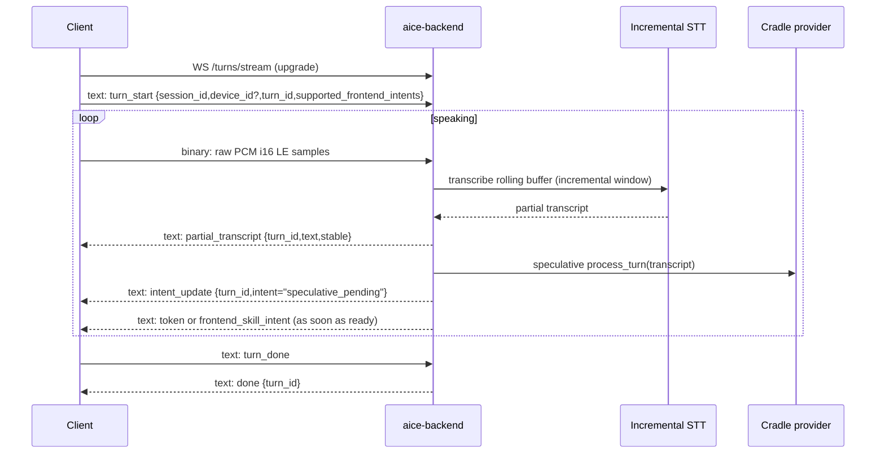

**Notes:**
- **Dual-frame model:** Binary WebSocket frames carry raw PCM audio (i16 little-endian, 16 kHz mono). Text WebSocket frames carry JSON control messages (`TurnStreamClientMessage`) and server events (`TurnStreamServerEvent`). Odd-byte binary frames are rejected with an error event.
- **Inputs:** WebSocket client messages `turn_start`, binary PCM frames, `turn_done`, `turn_cancel`, `frontend_skill_result`, `playback_started`, `playback_finished` (wake-word conversation window, section 31).
- **Outputs:** WebSocket server events `partial_transcript`, `intent_update`, `token`, `frontend_skill_intent`, `done`, `error`.
- **Latency instrumentation:** `backend_turn_partial_transcript_duration_seconds`, `backend_turn_first_token_duration_seconds`, `backend_turn_speculative_restarts_total`, `backend_turn_cancellations_total{reason}`, `backend_llm_provider_duration_seconds{provider}` plus stage labels `stt_incremental`, `speculative_classify`, `speculative_generate`.
- **Failure paths:** Invalid message format/sequence or unsupported audio format emits `error`; transcript divergence aborts prior speculative run and increments cancellation/restart metrics; `turn_cancel` aborts active work and emits `done`; WebSocket disconnect cleans up the session.

---

## 22. Startup model preload (STT + LLM warm path)

**Purpose:** Reduce first-turn round-trip latency by preloading Whisper STT and local LLM models at process startup, then keeping LLM model residency alive between turns.

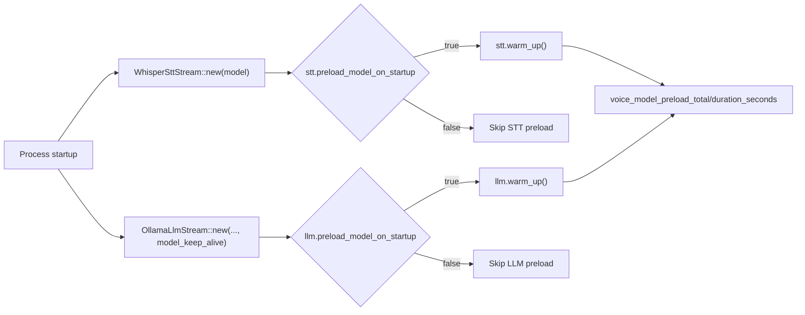

**Notes:**
- **Inputs:** `stt.preload_model_on_startup`, `llm.preload_model_on_startup`, and `llm.model_keep_alive`.
- **Outputs:** Lower first-turn latency and reduced model cold-start churn; telemetry `voice_model_preload_total{component,result}` and `voice_model_preload_duration_seconds{component}`.
- **Failure paths:** Preload failures are non-fatal, logged as warnings, metered as `result="error"`, and runtime continues with lazy model loading.

---

## 23. Property facilitator (hotels, care, ward)

**Purpose:** A property runs one on-prem MCP. The voice runtime classifies a request and calls a tool. Staff see every request. A property can delegate named tools to its own MCP.

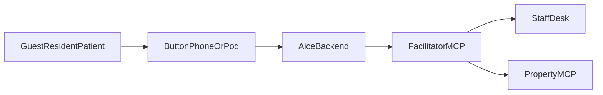

**Notes:**
- **Inputs:** Spoken request classified as `skill_hotel` with `hik` and `hsl`. Room comes from the pod's device token (section 25), or a phone `extension` mapped in the property file. `config.property.facilitator_url` points at `https://<host>:<port>/mcp`; the backend authenticates with the service token (section 24).
- **Outputs:** A ticket on the local staff desk (`open`, `acknowledged`, `done`, `escalated`) and a short spoken confirmation. Delegated tools also call the property MCP once.
- **Packs:** `aice-hotels` (rooms and serviced apartments), `aice-care` (distress and fall always escalate), `aice-ward` (non-clinical tools only; anything else is denied by `core-policy` and escalated).
- **Live tools:** `tools/list` is the classifier `hik` enum. Extra tools from the property MCP are included. Built-in hotel kinds remain when the facilitator is not connected.
- **Failure paths:** Property MCP down, unknown extension, or a denied ward tool still leaves an escalated ticket. See [aice-hotels](../skills/aice-hotels.md), [aice-care](../skills/aice-care.md), and [aice-ward](../skills/aice-ward.md).
- **Metrics:** `property_requests_total{pack,tool,status}`, `property_mcp_errors_total{kind}`, `property_mcp_duration_seconds{operation}`.
- **Pipeline:** `cargo test --workspace` starts each pack binary and checks a live ticket (`apps/aice-hotels/tests/smoke.rs`, `apps/aice-care/tests/smoke.rs`, `apps/aice-ward/tests/smoke.rs`). The OS build matrix and the macOS release smoke build `aice-hotels`, `aice-care`, and `aice-ward` beside `aice-backend`. The release archive includes those three binaries.

---

## 24. Property security (desk login, service token, TLS)

**Purpose:** Nothing on a property network can read requests, change tickets, or open a room's turn stream without credentials, and nothing crosses the network in the clear.

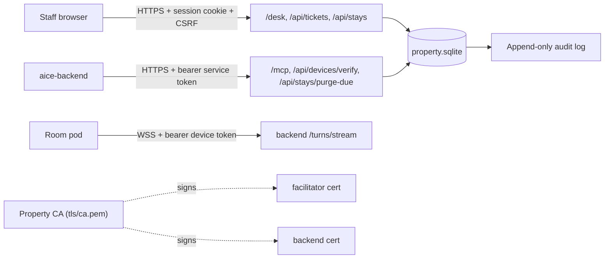

**Notes:**
- **Staff accounts:** `aice-<pack> property.json user add <name> staff|supervisor` (password from `AICE_PROPERTY_PASSWORD` or a prompt, 12+ characters, argon2). Staff acknowledge, finish, and escalate tickets and check stays in and out; supervisors also reopen done tickets, manage pods, and read the audit log. Sessions last 12 hours in an `HttpOnly; SameSite=Strict` cookie (`Secure` over TLS). Five wrong passwords lock the account for five minutes.
- **CSRF:** desk forms carry a per-session `csrf` field; API calls send `X-CSRF-Token`.
- **Service token:** the pack writes a random `service.token` beside `property.json` on first start (or reads `AICE_PROPERTY_SERVICE_TOKEN`). The backend reads it through `property.service_token_file`. It unlocks `/mcp`, device verification, stay purge, and read-only `GET /api/tickets` for integrations; it cannot change tickets.
- **TLS:** `tls.mode` is `auto` (default on any non-loopback bind: a property CA in `tls/` signs the facilitator certificate), `files` (operator-supplied `cert_file`/`key_file`/`ca_file`), or `off` (loopback only). `tls fingerprint` prints the CA pin for pods; `tls issue <cert> <key> <host>...` signs the backend's certificate, configured under `service.tls`. `GET /api/tls/ca` serves the CA certificate.
- **Refusals:** the facilitator will not serve plain HTTP off loopback. A property backend (`property.facilitator_url` set) will not serve plain HTTP on a network bind unless `service.allow_plaintext_lan` is true.
- **Audit:** every ticket creation and status change, login, logout, lockout, user change, pod enrolment/assignment/revocation, and stay transition is appended to `audit_events`; SQLite triggers reject updates and deletes.
- **Failure paths:** bad or missing credentials → 401; wrong role → 403; bad CSRF → 403; locked account → 429; body over 256 KiB → 413; TLS handshake failure → connection dropped and `property_mcp_errors_total{kind="tls_handshake"}` / `backend_auth_rejections_total{reason="tls_handshake"}`.
- **Metrics:** `property_auth_attempts_total{method,result}`, `property_audit_events_total{action}`, `backend_auth_rejections_total{reason}`.

---

## 25. Room pod provisioning and device tokens

**Purpose:** A pod's room is set by a supervisor, not by the pod, and the backend trusts only facilitator-issued device tokens.

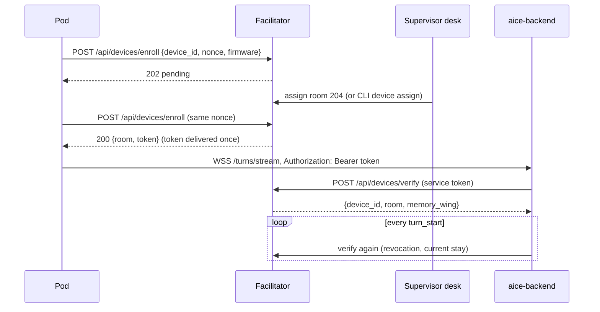

**Notes:**
- **Inputs:** `device_id` (1-64 of `A-Za-z0-9._:-`), a pod-generated `nonce` of 16+ characters kept by the pod, `firmware` version.
- **Outputs:** A pending pod shows on the supervisor desk; after assignment the next enrol with the same nonce returns the device token once. A later enrol with a different nonce is refused (409) and audited.
- **Backend:** `property.require_device_token` defaults to on whenever `property.facilitator_url` is set. The turn's `device_id` and `room` come from the token, overriding whatever the client sends.
- **Lost token:** a pod that no longer has its token enrols with `lost_token: true`; the stored nonce proves it, the facilitator issues a new token, and the old one stops verifying (`device_token_rotated` in the audit log).
- **Signed updates:** `firmware publish` signs an image with the property's ECDSA P-256 key and offers it to `rollout_percent` of pods by a stable hash of device id and version; `firmware rollout` raises the percentage. Pods fetch `GET /api/firmware/manifest?current=<version>` and `GET /api/firmware/<version>.bin` with their device token and install only a signature-verified image ([pod deployment](../deployment/m5stack-pod.md)).
- **Failure paths:** missing/unknown token → 401; facilitator unreachable at connect with no recent verification → 503; facilitator unreachable mid-connection → the turn runs with memory off; revoked mid-connection → error event and the socket closes; more than 256 pods pending → 429; a rotation attempt with the wrong nonce → 409.
- **Heartbeats:** every 30 s the backend reports the pods with an open turn stream (`POST /api/devices/heartbeat`). An active pod silent for `device_offline_after_secs` (default 120) gets an escalated `device_offline` ticket for its room (paged like any ticket) and shows `OFFLINE` on the desk; the next sign of life clears it and is audited as `device_online`.
- **Metrics:** `fleet_provisioning_total{result}`, `fleet_devices{status}` (`pending`, `online`, `offline`, `revoked`), `fleet_heartbeat_missed_total`, `fleet_firmware_manifest_total{result}`, `fleet_firmware_downloads_total{version}`, `backend_device_auth_duration_seconds{result}`, `backend_auth_rejections_total{reason}`.

---

## 26. Stays and stay-scoped memory

**Purpose:** Each guest or resident has private memory for their stay. The next person in the room never hears the last person's memories. What happens at checkout is configurable.

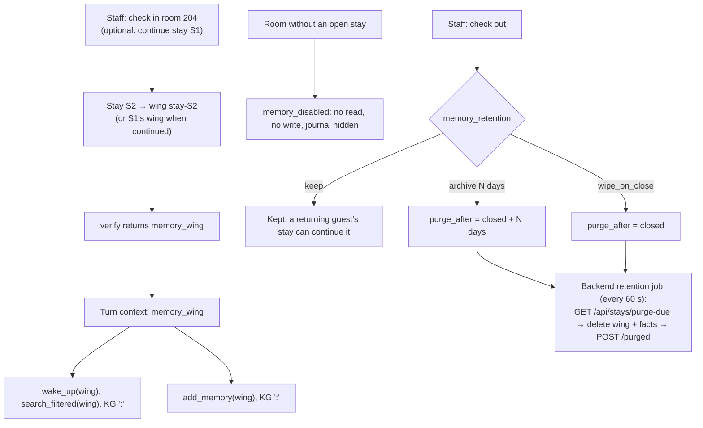

**Notes:**
- **Inputs:** Desk check-in/out, `POST /api/stays`, `POST /api/stays/{id}/close`, or CLI `stay open <room> [<continue-from>]` / `stay close <id>`. `memory_retention` in `property.json`: `{"mode": "keep"}` (default for hotels and care), `{"mode": "archive", "archive_after_days": N}`, or `{"mode": "wipe_on_close"}` (default for wards).
- **Consent:** each stay records `memory_consent`. Without it, verification returns no memory wing, so the room reads and writes nothing. `memory_consent_default` is true for hotels (booking terms) and false for care homes and wards; staff tick consent at check-in and can switch it for an open stay (`POST /api/stays/{id}/consent`, audited as `stay_consent`).
- **Privacy mute:** a double tap on the pod stops it sending audio (magenta LED); the long-press help button still works.
- **Scoping:** home installs keep the shared palace. In a property, a turn without a stay (or any unauthenticated turn) has memory off. Continuing a stay is allowed only while its memory still exists and is not due for purge; continuing clears the old stay's purge date because the wing lives on.
- **Purge:** deletes the wing's drawers, BM25 rows, closets, tunnels, and every knowledge-graph entity/triple in the `<wing>:` namespace, then confirms to the facilitator. Non-stay wings can never be purged.
- **Encryption at rest:** the palace and property databases are local SQLite files. Until the palace supports an encrypted store, run them on an encrypted volume (BitLocker, FileVault, or LUKS); see the deployment runbook.
- **Failure paths:** a second open stay for a room → 409; continuing a purged or due stay → 409; unknown stay → 404; a failed purge stays due and is retried next pass (`memory_retention_purges_total{result="error"}`).
- **Metrics:** `memory_stay_transitions_total{action}`, `memory_recall_scoped_total{scope}`, `memory_retention_purges_total{result}`.

---

## 27. Staff alerting and SLA re-escalation

**Purpose:** Staff are paged when a request arrives, and a request nobody acknowledges in time escalates to the next tier until someone does.

```mermaid
sequenceDiagram
    participant Voice as aice-backend
    participant Fac as Facilitator
    participant Loop as Alert loop (100 ms, SQLite-driven)
    participant T0 as Tier 0 channels (staff)
    participant T1 as Tier 1 channels (supervisor)
    Voice->>Fac: tools/call report_fall
    Fac->>Fac: ticket + next_alert_at = now
    Loop->>T0: alert {reason: new, tier: staff}
    Note over Loop: ack window (fall: 60 s)
    alt acknowledged in time
        Fac->>Fac: next_alert_at = NULL
    else not acknowledged
        Loop->>Fac: status escalated, audit actor "sla"
        Loop->>T1: alert {reason: sla_breach, tier: supervisor}
        Note over Loop: repeats, then stays on the last tier
    end
```

**Notes:**
- **Inputs:** `alerts` in `property.json`: `tiers` (default `staff`, `supervisor`, `on_call`), `channels` (`webhook` with `url` and optional `token_file` for a bearer token; `property_mcp` with a `tool` on the property's own MCP, for nurse call, DECT, or PMS paging), each with the `tiers` it serves; `rules` (`tools` list, `"*"` for all, and `ack_within_secs`; first match wins).
- **Defaults:** care — fall and distress 60 s, bathroom help and pain 180 s, everything else 600 s; ward — `get_a_nurse` 120 s, else 900 s; hotels — 900 s. With no channels configured, escalations still show on the desk (which refreshes every 10 s).
- **Outputs:** JSON alert `{ticket_id, pack, room, tool, status, tier, reason, created_millis, ack_within_secs}` to every channel of the tier; ticket status `escalated` on the first breach; audit rows `ticket_status` and `sla_breach` with actor `sla`.
- **Restarts:** the schedule is stored on the ticket (`alert_tier`, `next_alert_at`), so a restarted pack resumes timers. Acknowledge or done clears the timer; a supervisor reopen re-announces from tier 0.
- **Failure paths:** a failing channel is logged and counted but does not block the tier's other channels; if every channel of tier 0 fails, the first alert is retried every 5 s; a breach always advances so higher tiers are still paged.
- **Metrics:** `property_alerts_sent_total{channel,result}`, `property_sla_breaches_total{pack,tool}`, `property_ticket_ack_duration_seconds{pack,tool}`.

---

## 28. Capacity: admission control, worker pools, and LLM failover

**Purpose:** Many rooms share one backend. Work queues in a bounded way, speech-to-text runs on several Whisper contexts, and answers keep flowing when one LLM host fails.

```mermaid
flowchart LR
    Rooms["Turn streams from many rooms"] --> SttGate{"STT gate\nstt.workers permits"}
    SttGate -->|permit| Pool["Whisper worker pool\n(one context per worker)"]
    SttGate -->|waited > max| SttBusy["STT error for that chunk"]
    Pool --> TurnGate{"Turn gate\nservice.max_concurrent_turns"}
    TurnGate -->|permit| Engine["Classify, skills, answer"]
    TurnGate -->|waited > max| Busy["Spoken: helping other rooms, ask again"]
    Engine --> Llm["CradleLlmStream"]
    Llm --> H1["Ollama host 1"]
    Llm --> H2["Ollama host 2"]
    H1 -. fails .-> Cool["skipped for 30 s"]
    Cool -. next call .-> H2
```

**Notes:**
- **Inputs:** `service.max_concurrent_turns` (default 4), `service.turn_queue_max_wait_ms` (default 20 000), `stt.workers` (default 1; each worker loads the Whisper model, so memory grows with it), `ollama_url` plus `ollama_urls` (extra hosts).
- **Behaviour:** turns and STT jobs take a permit before they run and queue in arrival order beyond the limit. A turn that cannot start within the wait gets the spoken `BUSY_REPLY` instead of silence. LLM calls rotate across hosts; a host that errors is skipped for 30 s and the call moves on to the next; if all are cooling down they are still tried, and an error is returned only when every host fails. A failure mid-stream is not retried.
- **Capacity:** measure with `room-loadtest` (section 30) and size `stt.workers`, `max_concurrent_turns`, and the host list from the p95 you need.
- **Metrics:** `backend_queue_depth{stage}`, `backend_queue_wait_seconds{stage}`, `backend_queue_rejections_total{stage}` (`stage` is `turn` or `stt`), `backend_inference_host_errors_total{host}`.

---

## 29. Help button (degraded mode)

**Purpose:** A resident, patient, or guest can call staff from the pod even when speech recognition or the LLM is down. The button is a hardware signal, not speech, so nothing interprets what was said.

```mermaid
sequenceDiagram
    participant Pod
    participant Bridge as Room bridge
    participant Backend as aice-backend
    participant Fac as Facilitator
    Pod->>Bridge: help_button (press ≥ 1.5 s)
    Bridge->>Pod: led thinking
    Bridge->>Backend: help_request
    Backend->>Fac: POST /api/devices/help {device_id} (service token)
    Fac->>Fac: escalated ticket "help_button" for the pod's room, alert armed
    Fac-->>Backend: {ticket_id}
    Backend-->>Bridge: help_raised {ticket_id, spoken}
    Bridge->>Pod: speaking + "I've called the staff. Someone is on the way."
```

**Notes:**
- **Inputs:** a long press on the pod (`HELP_PRESS_MS`, default 1500 ms); a short tap still stops playback.
- **Outputs:** an escalated `help_button` ticket paged like any other (section 27); a spoken confirmation.
- **Failure paths:** facilitator unreachable or no device auth → `help_raised` without a ticket and the spoken advice to use the phone or call button (`backend_help_requests_total{result="unavailable"|"no_property"}`); an unknown or revoked pod → 404 at the facilitator.
- **Metrics:** `backend_help_requests_total{result}`, `pod_bridge_turns_total{result="help_button"}`, `property_requests_total{tool="help_button"}`.

---

## 30. Capacity measurement (`room-loadtest`)

**Purpose:** Know how many rooms one installation can serve at the latency the property needs, and catch regressions before they reach a property.

```mermaid
flowchart LR
    Tool["room-loadtest"] -->|enrol + assign loadtest-NNNN| Fac[Facilitator]
    Tool -->|N simulated pods, WSS, device tokens| Bridge[Room bridge]
    Bridge --> Backend[aice-backend + admission]
    Backend --> Stt[Whisper pool] & Llm[Ollama hosts]
    Bridge -->|answer audio| Tool
    Tool --> Report["rooms, answered, failed, p50 / p95 / max\n(end of speech → first answer audio)"]
```

**Notes:**
- **Staging run:** `cargo aice-loadtest --bridge wss://voice.property.local:8765/ --ca tls/ca.pem --facilitator https://desk.property.local:8791 --db property.sqlite --rooms 40 --turns 3 --pcm utterance.raw`. Use a recorded request (`--pcm`, raw PCM16 16 kHz mono) so Whisper and the LLM do real work; revoke the `loadtest-NNNN` pods afterwards with `device revoke`.
- **Sizing:** raise `--rooms` until p95 passes the target, then set `stt.workers`, `service.max_concurrent_turns`, and `ollama_urls` from the numbers. Record the result for the property in its deployment notes.
- **CI gate:** `apps/room-loadtest/tests/capacity.rs` runs 8 rooms × 2 turns through the real bridge, backend (admission limit 2), and facilitator with explicit test doubles for STT, LLM, and speech; every turn must be answered, admission must hold, and p95 must stay under 5 s.
- **Failure paths:** a room that gets no answer audio within `--timeout-secs` counts as failed and the binary exits non-zero.

---

## 31. Wake-word conversation window

**Purpose:** With `wake_word.enabled`, the wake word starts a conversation; it does not have to be repeated for every sentence. While a conversation is in flight, the guest can follow up, correct, or cut in without it. After a quiet period the room goes back to idle, and the next conversation needs the wake word again.

```mermaid
stateDiagram-v2
    [*] --> Idle
    Idle --> InFlight: turn starts with a wake phrase (woken)
    Idle --> Idle: turn without a wake phrase (ignored, dropped)
    InFlight --> InFlight: turn_start while a turn is open, turn_cancel, playback_started
    InFlight --> Window: answer done / playback_finished
    Window --> InFlight: any turn (awake, no wake phrase)
    Window --> Idle: wake_word.cooldown_secs without a turn
```

**Notes:**
- **State is per connection:** each `/turns/stream` WebSocket (one per pod through the bridge, one per desktop frontend) keeps its own conversation state. A reconnect starts idle.
- **Awake when a turn starts** if a previous turn is still open, the last answer was cancelled (`turn_cancel`, e.g. a tap or barge-in), the client reported `playback_started` without `playback_finished`, or the last answer or playback ended less than `wake_word.cooldown_secs` ago (default 8 s). Clients that never send playback messages get a window from the backend's `done`.
- **Transcript:** a leading wake phrase is dropped from the transcript whether or not the conversation is awake. An awake turn is passed to the LLM unchanged otherwise; an idle turn without a wake phrase is dropped and answered with `done` only.
- **Failure paths:** a client that sends `playback_started` and disconnects loses the state with the connection; a missing `playback_finished` on a live connection keeps the conversation awake until the next turn is answered.
- **Metrics:** `backend_wake_word_turns_total{result}` per finished turn: `woken`, `awake`, `ignored` (not recorded when the wake word is disabled).
