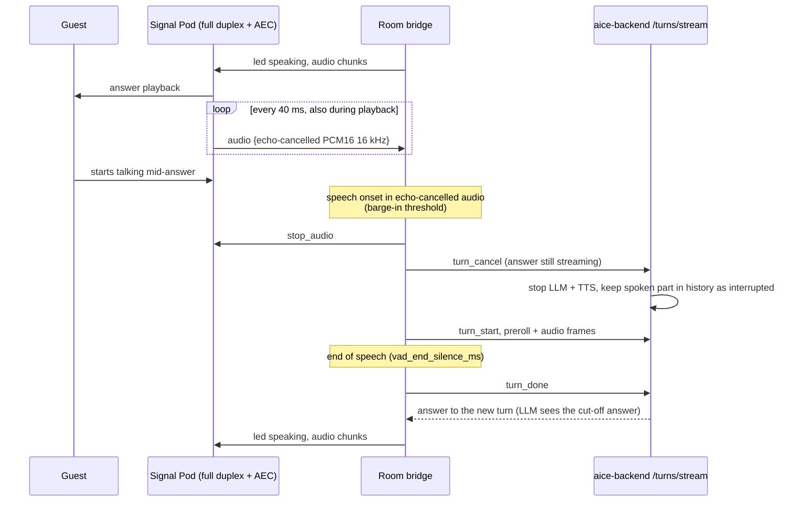

# Signal Pod — guest-room pod requirements

What a room pod must do so a guest can interrupt Aice at any time by speaking, and what the room bridge (`pod-gateway`) and backend must do with that speech.

> **Status: not implemented.** No Signal Pod hardware or firmware exists yet. The only firmware in this repository targets the [ATOM Echo](../deployment/m5stack-pod.md), a half-duplex transport test bed. This page is the requirement set a pod must meet before it goes into a guest room.

## Why the ATOM Echo is not enough

A natural conversation lets the guest cut in when Aice gets something wrong ("no, the other room") or when they want to add something ("and a towel too"). That requires the pod to **listen while it speaks**.

The ATOM Echo shares pin G33 between the microphone clock and the speaker's word clock, so its single I2S port is switched between capture and playback. While the pod speaks, the microphone is off and nothing the guest says reaches the bridge. The backend's barge-in path ([architecture 2](../architecture/README.md#2-barge-in-interruptibility)) never fires; only the button can stop an answer.

## Interrupt rule

**Any speech interrupts.** There is no stop word or command phrase. The wake word only starts a conversation: while one is in flight (an answer is pending or playing, or the follow-up window after it is open), the pod stays awake and turns need no wake word. After a period with no speech and nothing in flight, it goes back to idle and the next conversation needs the wake word again. When the guest starts talking during an answer, the answer stops and what the guest says becomes the next turn. The LLM decides what that speech means (a correction, an addition, a new request, or noise), as for every other turn. Neither the pod nor the bridge looks at what was said ([AGENTS.md rules 10 and 10.1](../../AGENTS.md)).

## Barge-in journey

Failure branches:

- **Onset was noise or residual echo** (the new turn ends with an empty transcript) → the backend returns `EmptyInput`, nothing is spoken, and the bridge records `pod_bridge_barge_in_total{result="empty"}`. The interrupted answer is not replayed; the pod returns to listening.
- **Pod without full duplex** (ATOM Echo) → the bridge keeps today's behaviour: audio is ignored during playback and the button is the only interrupt.
- **Backend unreachable during cancel** → same as any turn: `error {code: backend_unavailable}` and the pod returns to listening.

## Pod hardware requirements

| # | Requirement | Why |
|---|-------------|-----|
| H1 | Independent capture and playback paths that run at the same time (separate I2S ports, or one full-duplex codec). No shared clock pin that forces mode switching. | Listen while speaking. |
| H2 | Acoustic echo cancellation (AEC) using the playback signal as the reference: on-device (DSP or ESP-SR-class AFE) or on a voice front-end chip. | Without it, the pod hears itself and interrupts its own answer. |
| H3 | At least two microphones, with beamforming or noise suppression in the front end. | Pick out the guest's voice over playback, TV, and room noise. |
| H4 | Echo-cancelled output delivered as 16 kHz mono PCM16, the existing `audio` frame format. | No bridge audio-format change. |
| H5 | Hardware echo-path delay held steady (fixed buffering between playback and the AEC reference). | AEC fails when reference and echo drift. |
| H6 | Speaker loud enough for a room at a level the AEC still cancels (measure echo return loss at maximum volume). | Loud playback must not self-trigger barge-in. |
| H7 | Button (tap stop, double-tap mute, long-press help) and an RGB LED, as today. | Keeps help-button and privacy-mute behaviour ([architecture 29](../architecture/README.md#29-help-button-degraded-mode)). |
| H8 | A hardware mic mute that cannot be overridden in firmware. | Privacy mute must be trusted in care and ward settings. |
| H9 | Enough flash and RAM for dual-slot signed updates, the property CA, and TLS (ESP32-S3 with PSRAM or equivalent). | Keeps the existing enrolment, WSS, and signed-update trust model. |
| H10 | Mains or PoE power; no battery-only design. | Rooms need always-on pods; `device_offline` tickets fire otherwise. |

Boards worth evaluating against H1–H6 (not yet tested with Aice): ESP32-S3-BOX-3 (separate ADC and codec, ESP-SR AEC), and XMOS XU316-based voice front ends such as the Seeed ReSpeaker Lite (hardware AEC and beamforming). Choose on measured results for the acceptance criteria below, not datasheets.

## Protocol and bridge requirements

| # | Requirement |
|---|-------------|
| P1 | `hello` carries a capability, e.g. `full_duplex: true`, so the bridge only enables spoken barge-in for pods that cancel their own echo. Pods without it keep today's half-duplex behaviour. |
| P2 | The pod keeps sending `audio` frames during playback (echo-cancelled). |
| P3 | The bridge keeps running turn detection during playback, with its own start threshold (`pod_gateway.barge_in_start_level`, above `vad_start_level`) and frame count, so residual echo does not trigger. |
| P4 | On onset during playback or while an answer is pending, the bridge runs the existing `tap_activate` stop path (abort speaking task, `stop_audio`, `turn_cancel`) and then opens a new turn with the preroll frames, so the guest's first words are kept. |
| P5 | Onset detection uses audio energy over audio time only. It never inspects transcripts. |
| P6 | A barge-in turn belongs to the conversation already in flight, so it needs no wake word. Implemented: the bridge sends `playback_started` / `playback_finished` and the backend keeps the conversation awake while playback is in flight ([architecture 31](../architecture/README.md#31-wake-word-conversation-window)). |

## Backend requirements

| # | Requirement |
|---|-------------|
| B1 | `turn_cancel` stops LLM generation and TTS for the pod's session promptly (the section 2 cancel path). |
| B2 | The interrupted answer is kept in conversation history marked as interrupted, with the text actually spoken up to the cut-off, so the LLM can resolve "no, the other one" and "and also…". |
| B3 | The new turn is classified by the LLM like any other turn; no routing shortcut for interrupting turns. |

## Acceptance criteria (measured on hardware)

- Speech onset to playback stop: p95 under 300 ms.
- No self-interruption: an answer at maximum volume in a quiet room plays to the end in at least 99 of 100 runs.
- Guest speech during playback at normal conversational level from 2 m is detected in at least 95 of 100 runs.
- Interrupting turns keep the guest's first word (checked on transcripts from a scripted test).

## Metrics

Added when barge-in is implemented, following `<subsystem>_<operation>_<unit>`:

| Metric | Type | Meaning |
|--------|------|---------|
| `pod_bridge_barge_in_total{result}` | counter | Onsets during playback: `turn` (became a non-empty turn), `empty` (noise or echo). |
| `pod_bridge_barge_in_latency_seconds` | histogram | Speech onset to `stop_audio` sent. |
| `voice_interruptions_total`, `voice_cancellation_success_total` | counter | Existing backend cancel metrics ([architecture 2](../architecture/README.md#2-barge-in-interruptibility)). |
