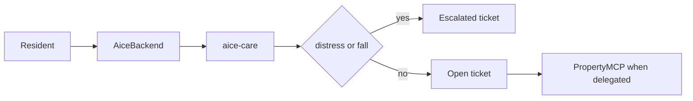

# Skill: aice-care

**Crate:** `property-facilitator` · **App:** `apps/aice-care` · **Pack:** `care`

**Purpose:** Take a resident request onto the staff desk. Distress and falls always reach a person.

## Full Journey

## Inputs

| Field | Type | Notes |
|-------|------|-------|
| tool name | string | `request_bathroom_help`, `request_drink`, `report_pain`, `request_visitor`, `set_lights`, `report_distress`, `report_fall` |
| `room` | string | Resident room |
| `extension` | string | Optional mapped extension |

## Outputs

Same ticket desk as hotels, titled `aice-care desk`. `report_distress` and `report_fall` are stored as `escalated` and are never sent to a property MCP.

## Failure Paths

- Property MCP down on a delegated ordinary request: ticket `escalated`.
- Distress or fall: no upstream call, even if the name is listed in `delegated_tools`.
- The model does not advise on care. The spoken line alerts staff.

## Notes

The pack refuses to treat a fall as a completed local action. Staff acknowledgement is the completion path.

## Metrics

Same names as [aice-hotels](aice-hotels.md), with `pack="care"`.
