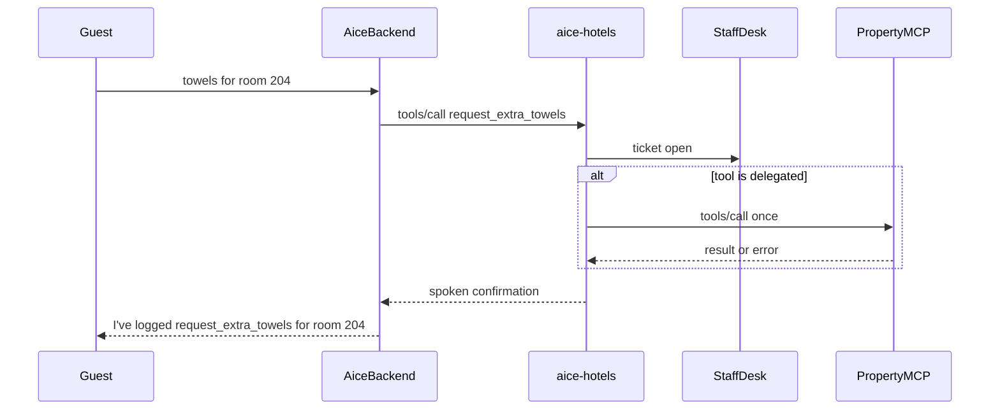

# Skill: aice-hotels

**Crate:** `property-facilitator` · **App:** `apps/aice-hotels` · **Pack:** `hotels`

**Purpose:** Turn a spoken room request into a staff ticket, and optionally into one call on the hotel's own MCP.

## Full Journey

## Inputs

| Field | Type | Notes |
|-------|------|-------|
| `hik` / tool name | string | One of the hotel tools, plus any name from the property MCP `tools/list`. |
| `room` | string | Room or apartment. Used when no extension is present. |
| `extension` | string | Mapped to a room in `extensions`. Unknown extensions escalate. |
| `property_mcp_url` | string | Optional. Delegated tool names are called here once. |
| `delegated_tools` | string list | Names whose side effect belongs to the property MCP. |

Hotel tools include the original 25 concierge kinds plus `request_access_code` and `request_maintenance`.

## Outputs

`ToolResponse` with `ticket_id`, `status` (`open` or `escalated`), and `spoken`. The staff desk at `GET /desk` lists room, request, and status. `POST /api/tickets/{id}/acknowledge|done|escalate` moves the ticket.

## Failure Paths

- Property MCP connection failure: ticket `escalated`, spoken alert, `property_mcp_errors_total{kind="upstream"}`.
- Delegated tool with no URL: ticket `escalated`, kind `missing_upstream`.
- Unknown extension or missing place: ticket `escalated` on room `unassigned`.
- Unknown tool name: ticket `escalated`, kind `unknown_tool`.

A successful delegated call does not run a second local side effect. The ticket stays `open` so staff still see it.

## Notes

- One Mini runs this pack. There is no always-on room microphone in the product. Identity is the button, the pod `room`, or the phone extension.
- When `config.property.facilitator_url` is unset, the voice backend still forwards `skill_hotel` to a connected frontend.

## Metrics

| Name | Kind | Labels |
|------|------|--------|
| `property_requests_total` | counter | `pack`, `tool`, `status` |
| `property_mcp_errors_total` | counter | `kind` |
| `property_mcp_duration_seconds` | histogram | `operation` (`tools_call`, `tools_list`, `upstream`) |
