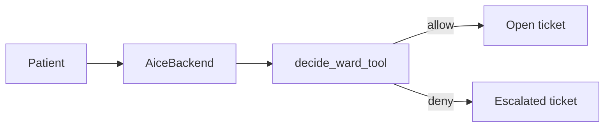

# Skill: aice-ward

**Crate:** `property-facilitator` · **App:** `apps/aice-ward` · **Pack:** `ward`

**Purpose:** Non-clinical hospital logistics. Wayfinding, appointments, porter, wheelchair, meals, and getting a nurse. No diagnosis, medication, or interpretation of symptoms.

## Full Journey

## Inputs

| Field | Type | Notes |
|-------|------|-------|
| tool name | string | `wayfinding`, `appointment_time`, `request_porter`, `request_wheelchair`, `meal_logistics`, `get_a_nurse` |
| `room` | string | Bed or bay |

`decide_ward_tool` in `core-policy` is the allow-list. Any other name is denied.

## Outputs

Allowed tools open a ticket and speak a confirmation. Denied tools open an `escalated` ticket, set `isError`, and tell the patient staff have been alerted. The denied tool is not executed.

## Failure Paths

- Tool outside the non-clinical list: `property_mcp_errors_total{kind="policy_deny"}`, ticket `escalated`.
- Property MCP down for a delegated allowed tool: ticket `escalated`.

## Notes

A hospital that wants clinical advice is outside this pack. The policy deny-list is the boundary.

## Metrics

Same names as [aice-hotels](aice-hotels.md), with `pack="ward"`.
