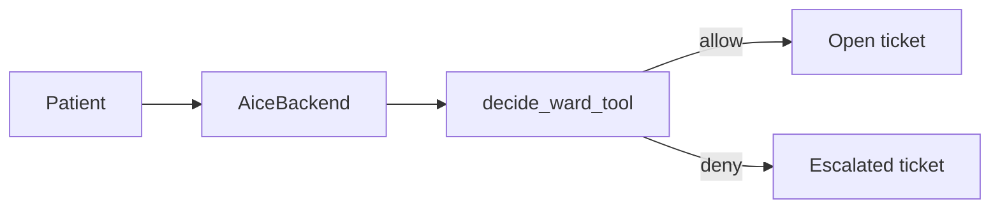

# Skill: aice-ward

**Crate:** `property-facilitator` · **App:** `apps/aice-ward` · **Pack:** `ward`

**Purpose:** Non-clinical hospital logistics. Wayfinding, appointments, porter, wheelchair, meals, and getting a nurse. No diagnosis, medication, or interpretation of symptoms.

## Full Journey

## Inputs

| Field | Type | Notes |
|-------|------|-------|
| tool name | string | `wayfinding`, `appointment_time`, `request_porter`, `request_wheelchair`, `meal_logistics`, `get_a_nurse` |
| `room` | string | Bed or bay |

`decide_ward_tool` in `core-policy` is the allow-list. Any other name is denied.

## Outputs

Allowed tools open a ticket and speak a confirmation. Denied tools open an `escalated` ticket, set `isError`, and tell the patient staff have been alerted. The denied tool is not executed.

## Failure Paths

- Tool outside the non-clinical list: `property_mcp_errors_total{kind="policy_deny"}`, ticket `escalated`.
- Property MCP down for a delegated allowed tool: ticket `escalated`.

## Notes

A hospital that wants clinical advice is outside this pack. The policy deny-list is the boundary.

## Security and memory

- The desk needs a staff login; `/mcp` needs the service token; pods need a device token. See [architecture section 24](../architecture/README.md#24-property-security-desk-login-service-token-tls) and [25](../architecture/README.md#25-room-pod-provisioning-and-device-tokens).
- Staff check guests and residents in and out under **Stays**. Memory exists only for an open stay and follows `memory_retention` at checkout ([section 26](../architecture/README.md#26-stays-and-stay-scoped-memory)). Default retention: `wipe_on_close`.

## Alerts

New tickets page the first alert tier, and tickets not acknowledged within their rule's window escalate tier by tier ([architecture section 27](../architecture/README.md#27-staff-alerting-and-sla-re-escalation)).

## Metrics

Same names as [aice-hotels](aice-hotels.md), with `pack="ward"`.
| `property_auth_attempts_total` | counter | `method` (`login`, `session`, `service_token`, `device_token`), `result` |
| `property_audit_events_total` | counter | `action` |
| `fleet_provisioning_total` | counter | `result` |
| `memory_stay_transitions_total` | counter | `action` (`opened`, `continued`, `closed`, `purged`) |
| `property_alerts_sent_total` | counter | `channel`, `result` |
| `property_sla_breaches_total` | counter | `pack`, `tool` |
| `property_ticket_ack_duration_seconds` | histogram | `pack`, `tool` |
