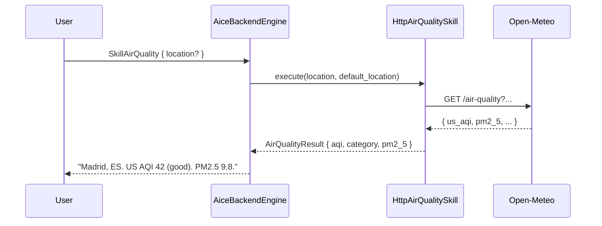

# Skill: Air Quality

**Crate:** `skill-air-quality` · **Impl:** `HttpAirQualitySkill` (backend-owned, `OpenMeteoAirQualityProvider`)

**Purpose:** Report current air-quality (US AQI / EU AQI, PM2.5, PM10, ozone) for a named location or the backend's resolved startup location.

## Full Journey

## Inputs

| Field | Type | Notes |
|-------|------|-------|
| `location` | `Option<String>` | Free-form location name; falls back to the backend's resolved startup location. |

## Outputs

`AirQualityResult` with `location_display`, `us_aqi`, `european_aqi`, `pm2_5`, `pm10`, `ozone`, `category`.

## Failure Paths

`AirQualityError`: `InvalidQuery`, `Geocoding`, `ProviderUnavailable`, `UpstreamTimeout`, `UpstreamParse`, `NoDefaultLocation` (no location was given and the backend has no resolved fallback).

## Notes

- 15-minute fresh TTL, 2h stale TTL.
- The backend converts its IP-resolved `ResolvedLocation` to `AirQualityLocation` for default fallback.

## Metrics

- `voice_air_quality_skill_total{result}`.
- Standard `backend_skill_execute_*` and `backend_dependency_*`.
