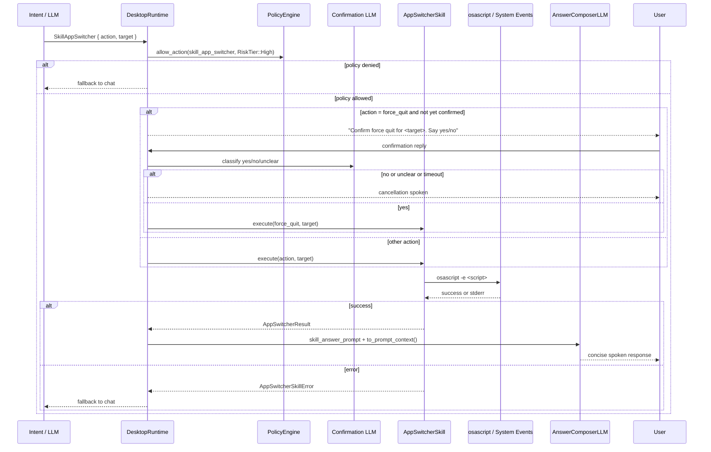

# Skill: App Switcher

**Crate:** `skill-app-switcher` · **Impl:** `MacOsAppSwitcherSkill`

**Purpose:** Control foreground app flow on macOS via local actions: switch focus, cycle app switcher, hide apps, quit, and force-quit (with runtime confirmation).

---

## Full Journey

---

## Inputs

| Parameter | Type | Description |
|-----------|------|-------------|
| `action` | `Option<&str>` | `switch`, `next`, `previous`, `hide`, `hide_others`, `show_all_windows`, `quit`, `force_quit` (`close` and `exit` are normalized to `quit`). |
| `target` | `Option<&str>` | App name required for `switch`, `hide`, `quit`, `force_quit`. |

## Outputs

`AppSwitcherResult { summary, action_done, target }`

- `summary`: Human-readable status line.
- `action_done`: Executed action description.
- `target`: Optional app name when applicable.

## Failure Paths

| Error | Cause |
|-------|-------|
| `Execution` | Missing required target, non-macOS runtime, or AppleScript/shell execution failure. |
| `UnsupportedAction` | Action not in supported set. |

## Notes

- macOS-only behavior for live execution.
- Runtime requires two-step confirmation for `force_quit` before calling this skill.
- All execution is local (no cloud or external API dependency).
- Action aliases `close` and `exit` are normalized to `quit` before execution.

## Metrics

| Metric | Kind | Labels |
|--------|------|--------|
| `app_switcher_skill_execute_total` | Counter | `result` (`success` or `error`) |
| `app_switcher_skill_errors_total` | Counter | `kind` (`AppSwitcherSkillError` display string) |
| `app_switcher_skill_execute_duration_seconds` | Histogram | none |
| `voice_app_switcher_skill_total` | Counter | `result` (`success` or `error`) |
