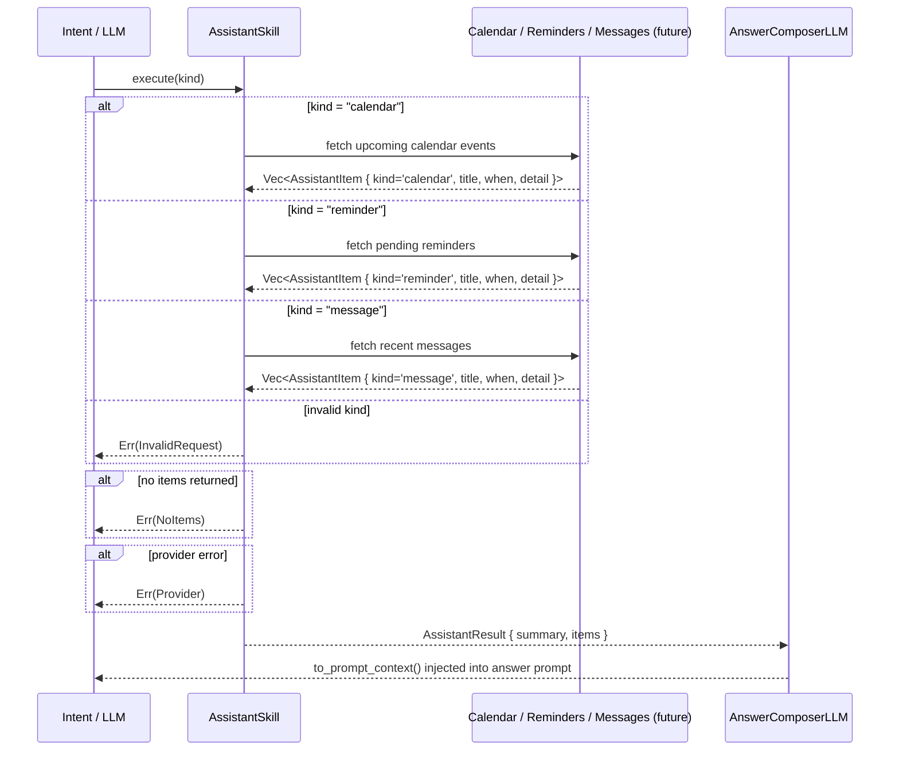

# Skill: Assistant

**Crate:** `skill-assistant` · **Impl:** `MockAssistantSkill` (no concrete macOS implementation yet)

**Purpose:** Trait and type scaffolding for querying calendar events, reminders, and messages. Defines the interface and result types that a real macOS EventKit / Messages integration will fulfil.

**Execution Owner (Split Runtime):** `aice-macos`

---

## Full Journey

---

## Inputs

| Parameter | Type | Description |
|-----------|------|-------------|
| `kind` | `Option<&str>` | `"calendar"`, `"reminder"`, or `"message"`. |

## Outputs

`AssistantResult { summary, items: Vec<AssistantItem> }`

`AssistantItem { kind, title, when: Option<String>, detail: Option<String> }`

## Failure Paths

| Error | Cause |
|-------|-------|
| `InvalidRequest` | `kind` is not one of the accepted values. |
| `NoItems` | Provider returned an empty result set. |
| `Provider` | Provider integration failed (permissions, unavailable service, etc.). |

## Notes

- No concrete macOS implementation exists yet; only `MockAssistantSkill` is available.
- When a real implementation is added, update this document with the actual provider API calls and AppleScript / EventKit flow.

## Metrics

| Metric | Kind | Labels |
|--------|------|--------|
| *(none instrumented yet — add when implementing this skill)* | — | — |
