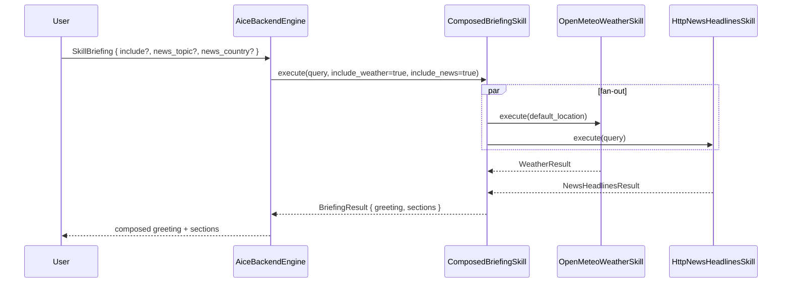

# Skill: Briefing

**Crate:** `skill-briefing` · **Impl:** `ComposedBriefingSkill` (backend-owned)

**Purpose:** One spoken briefing composed from multiple sub-skills. The backend exposes the **weather + news** subset; calendar/email briefing sections are deferred to per-frontend ownership.

## Full Journey

## Inputs

| Field | Type | Notes |
|-------|------|-------|
| `include` | `Option<Vec<String>>` | Sub-set of `["weather", "news"]`. `None` means both. |
| `news_topic` | `Option<String>` | Defaults to `"top"`. |
| `news_country` | `Option<String>` | Defaults to the inferred country code from `ResolvedLocation`. |

## Outputs

`BriefingResult { greeting, sections: Vec<BriefingSection> }`. Each section is `Result<...>` so a failing sub-skill yields a `Section::Weather(Err(_))` line rather than failing the whole briefing.

## Failure Paths

`BriefingError::NoSectionsEnabled` only when both `weather` and `news` are excluded.

## Notes

- Calendar and email sections are intentionally not wired in the backend: those data sources live per-frontend.
- The backend instantiates a fresh `ComposedBriefingSkill` per turn (cheap; only stores `Arc`s).

## Metrics

- `voice_briefing_skill_total{result}`.
- Standard `backend_skill_execute_*` for `skill_briefing`. Each sub-skill emits its own metrics.
