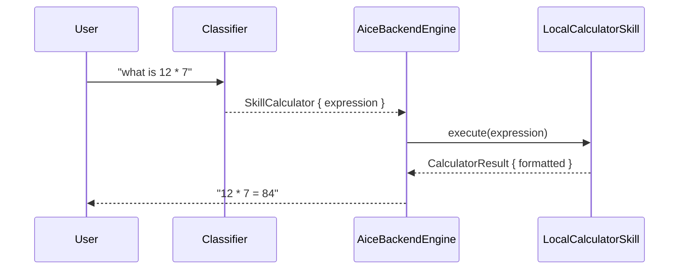

# Skill: Calculator

**Crate:** `skill-calculator` · **Impl:** `LocalCalculatorSkill` (backend-owned)

**Purpose:** Evaluate arithmetic expressions locally without any network call. Supports `+ - * /`, parentheses, decimals.

## Full Journey

## Inputs

| Field | Type | Notes |
|-------|------|-------|
| `expression` | `String` | Arithmetic expression to evaluate. |

If `expression` is missing, the engine asks the user to clarify and records `record_calculator_skill("error")`.

## Outputs

`CalculatorResult` with `expression`, `value: f64`, and `formatted: String`. Composed via `to_prompt_context()`.

## Failure Paths

`CalculatorSkillError`: `EmptyExpression`, `ParseError(String)`, `NonFinite` (e.g. divide by zero produces NaN/inf).

## Notes

- Pure local computation; no external API call.
- Uses `meval` under the hood (see `skill-calculator` crate).

## Metrics

- `voice_calculator_skill_total{result}` — `success` | `error`.
- `backend_skill_execute_total{skill="skill_calculator", result}` and `backend_skill_execute_duration_seconds{skill="skill_calculator"}`.
