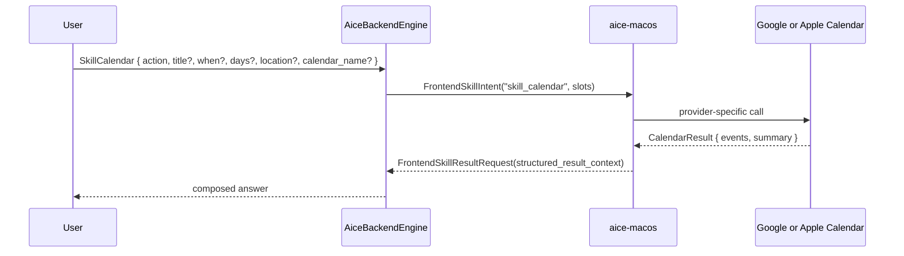

# Skill: Calendar

**Crate:** `skill-calendar` · **Impls:** `GoogleCalendarSkill`, `AppleCalendarSkill` (frontend-owned, per macOS frontend)

**Purpose:** Read or create calendar events. The backend never owns calendar credentials or device-specific event stores; calendar handling is dispatched to the connected macOS frontend.

## Full Journey

## Inputs

| Field | Type | Notes |
|-------|------|-------|
| `action` | `Option<String>` | One of `list_today`, `list_tomorrow`, `list_next_n_days`, `create_event`, ... |
| `title` | `Option<String>` | Event title (for `create_event`). |
| `when` | `Option<String>` | Event time (free-form or ISO 8601). |
| `days` | `Option<u32>` | Window for `list_next_n_days`. |
| `location` | `Option<String>` | Event location. |
| `calendar_name` | `Option<String>` | Provider-specific calendar identifier. |

## Outputs

`CalendarResult { events: Vec<CalendarEvent>, summary: String }` returned by the frontend through `FrontendSkillResultRequest.structured_result_context`.

## Failure Paths

`CalendarError`: `InvalidQuery`, `Auth`, `ProviderUnavailable`, etc. Surfaced by the frontend; the backend composes an error answer via `compose_frontend_skill_error_outcome`.

## Notes

- The backend gates dispatch on the frontend's `supported_frontend_intents` (sent at session start).
- Provider configuration (Google credentials, Apple permissions) is **per frontend**; multiple `aice-macos` frontends can connect to the same backend with different providers.

## Metrics

- `voice_calendar_skill_total{result}` — `dispatched`, `not_supported`, `result_ok`, `result_error`.
- Standard `backend_skill_execute_*` is recorded by the frontend dispatch path.
