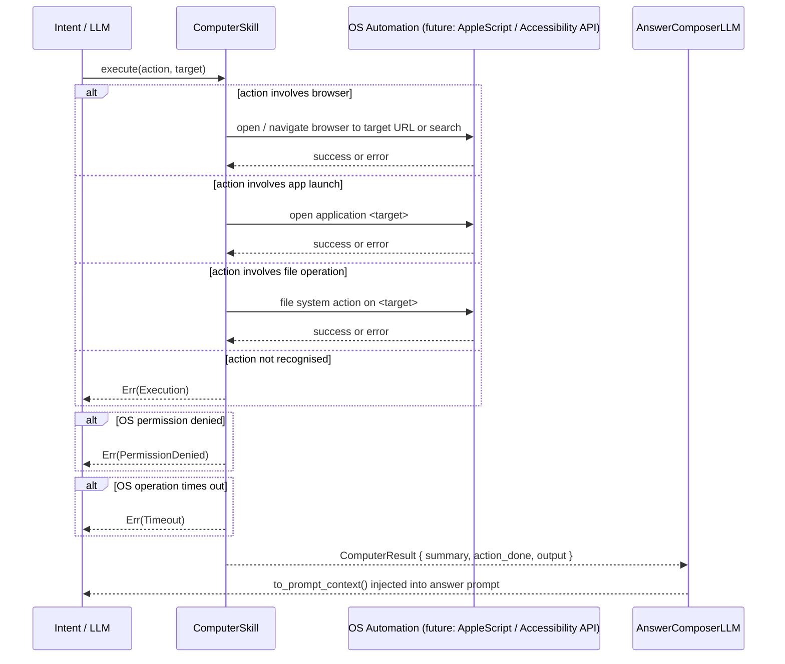

# Skill: Computer

**Crate:** `skill-computer` · **Impl:** `MockComputerSkill` (no concrete implementation yet)

**Purpose:** Trait and type scaffolding for computer-use actions — controlling browsers, launching apps, and interacting with files. Defines the interface that a real automation backend (e.g. AppleScript, Accessibility API, or headless browser) will fulfil.

---

## Full Journey

---

## Inputs

| Parameter | Type | Description |
|-----------|------|-------------|
| `action` | `Option<&str>` | Automation action to perform (e.g. `"open browser"`, `"launch app"`, `"create file"`). |
| `target` | `Option<&str>` | Subject of the action (URL, app name, file path, etc.). |

## Outputs

`ComputerResult { summary, action_done: bool, output: Option<String> }`

## Failure Paths

| Error | Cause |
|-------|-------|
| `Execution` | Automation backend fails or action is not recognised. |
| `PermissionDenied` | OS denies Accessibility or Automation permission. |
| `Timeout` | Automation operation does not complete within the allowed time. |

## Notes

- No concrete implementation exists yet; only `MockComputerSkill` is available.
- When a real implementation is added, update this document with the actual automation calls and permission requirements.

## Metrics

| Metric | Kind | Labels |
|--------|------|--------|
| *(none instrumented yet — add when implementing this skill)* | — | — |
