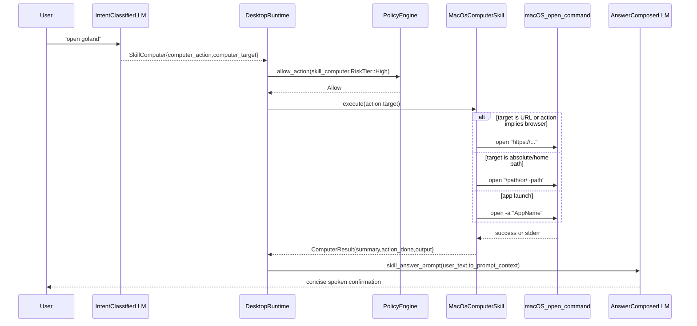

# Skill: Computer

**Crate:** `skill-computer` · **Impl:** `MacOsComputerSkill`

**Purpose:** Open apps, files, and URLs on macOS from LLM-classified voice commands such as "open GoLand", "open Apple TV", and "open github.com".

**Execution Owner (Split Runtime):** External macOS frontend service ([`AncientiCe/aice-macos`](https://github.com/AncientiCe/aice-macos))

---

## Full Journey

---

## Inputs

| Parameter | Type | Description |
|-----------|------|-------------|
| `action` | `Option<&str>` | Optional action hint from classifier. URL-intent actions include `open_url`, `browse`, `open_browser`. |
| `target` | `Option<&str>` | Required target to open. Interpreted as URL, path, or app name. |

## Outputs

`ComputerResult { summary: String, action_done: String, output: Option<String> }`

- `summary`: Short human-readable status used in voice prompt context.
- `action_done`: Executed command representation (for example `open -a "GoLand"`).
- `output`: Optional stdout from `open` when present.

## Failure Paths

| Error | Cause |
|-------|-------|
| `Execution` | Missing/empty target, non-macOS platform, `open` command failure, or other execution error. |
| `PermissionDenied` | Reserved error variant for policy/platform permission failures; not emitted directly by current implementation. |
| `Timeout` | Reserved error variant; current implementation does not enforce a command timeout. |

## Notes

- URL targets: explicit schemes (`http://`, `https://`) are used as-is.
- URL actions without scheme (for example `github.com` with `open_browser`) are normalized to `https://github.com`.
- File targets: paths starting with `/` or `~/` are opened directly.
- App targets: all other targets are treated as app names and launched via `open -a`.

## Metrics

| Metric | Kind | Labels |
|--------|------|--------|
| `computer_skill_execute_total` | Counter | `result` (`success` or `error`) |
| `computer_skill_errors_total` | Counter | `kind` (`ComputerSkillError` display string) |
| `computer_skill_execute_duration_seconds` | Histogram | none |
| `voice_computer_skill_total` | Counter | `result` (`success` or `error`) |

