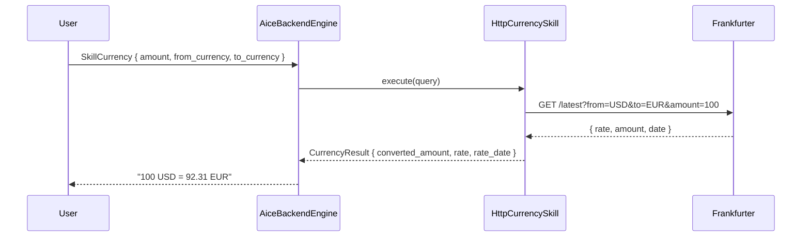

# Skill: Currency

**Crate:** `skill-currency` · **Impl:** `HttpCurrencySkill` (backend-owned, `FrankfurterProvider`)

**Purpose:** Convert an amount between two ISO 4217 currencies using the public Frankfurter API.

## Full Journey

## Inputs

| Field | Type | Notes |
|-------|------|-------|
| `amount` | `Option<f64>` | Defaults to `1.0` when absent. |
| `from_currency` | `Option<String>` | ISO 4217 code; required. |
| `to_currency` | `Option<String>` | ISO 4217 code; required. |

When `from_currency` or `to_currency` is missing, the engine asks the user to clarify and records `record_currency_skill("error")`.

## Outputs

`CurrencyResult` with `amount`, `from_currency`, `to_currency`, `converted_amount`, `rate`, `rate_date`, `as_of`.

## Failure Paths

`CurrencyError`: `InvalidQuery`, `UnsupportedCurrency`, `ProviderUnavailable`, `UpstreamTimeout`, `UpstreamParse`.

## Notes

- Cached: 30 minutes fresh TTL, 24h stale TTL with stale-while-revalidate fallback.
- 2 retry attempts.

## Metrics

- `voice_currency_skill_total{result}`.
- Standard `backend_skill_execute_*` for `skill_currency` and `backend_dependency_*` for the Frankfurter HTTP call.
