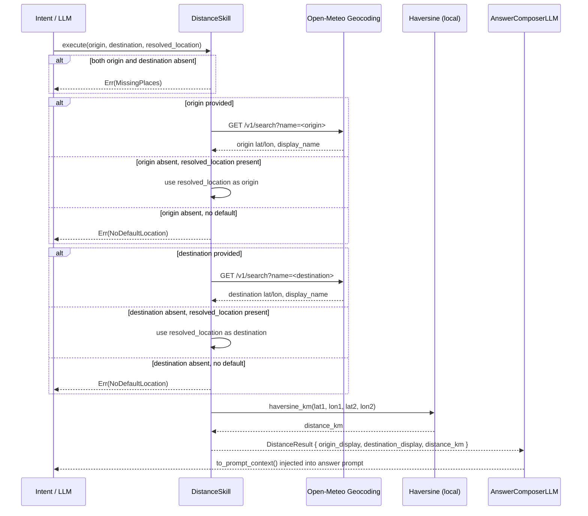

# Skill: Distance

**Crate:** `skill-distance` · **Impl:** `OpenMeteoDistanceSkill`

**Purpose:** Compute the straight-line (Haversine) distance in kilometres between two named places. Either endpoint can be omitted and will fall back to the user's default (current) location.

**Execution Owner (Split Runtime):** `aice-backend`

---

## Full Journey

---

## Inputs

| Parameter | Type | Description |
|-----------|------|-------------|
| `origin` | `Option<&str>` | Starting place name. Falls back to `resolved_location`. |
| `destination` | `Option<&str>` | Ending place name. Falls back to `resolved_location`. |
| `resolved_location` | `Option<&ResolvedLocation>` | Pre-resolved lat/lon used when an endpoint is omitted. |

## Outputs

`DistanceResult { origin_display, destination_display, distance_km }`

## Failure Paths

| Error | Cause |
|-------|-------|
| `MissingPlaces` | Both `origin` and `destination` are absent with no fallback logic possible. |
| `NoDefaultLocation` | One endpoint is absent and no `resolved_location` is available. |
| `Geocoding` | Open-Meteo geocoding returns no results for a named place. |

## Notes

- Uses Earth radius **6371 km** for the Haversine formula.
- Distance is straight-line only; does not account for roads or travel routes.

## Metrics

| Metric | Kind | Labels |
|--------|------|--------|
| *(none instrumented yet — add when touching this skill)* | — | — |
