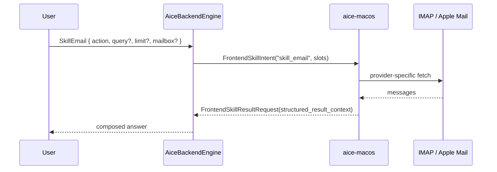

# Skill: Email

**Crate:** `skill-email` · **Impls:** `ImapEmailSkill`, `AppleMailEmailSkill` (frontend-owned, per macOS frontend)

**Purpose:** List unread/inbox messages, search, or triage. The backend does not store IMAP credentials or message contents — email is fully frontend-owned.

## Full Journey

## Inputs

| Field | Type | Notes |
|-------|------|-------|
| `action` | `Option<String>` | `list_unread`, `list_inbox`, `search`, `triage`, ... |
| `query` | `Option<String>` | Free-text query for `search` / `triage`. |
| `limit` | `Option<usize>` | Optional cap on returned messages. |
| `mailbox` | `Option<String>` | Optional folder/mailbox filter. |

## Outputs

`EmailResult { summary, messages, ... }` returned via the frontend.

## Failure Paths

`EmailError`: `Auth`, `ProviderUnavailable`, `InvalidQuery`, etc. Surfaced by the frontend.

## Notes

- There is intentionally **no** `EmailLlm` adapter on the backend — the backend never sees email content, so no LLM-backed triage runs server-side.
- Each frontend declares its IMAP/Apple Mail capability at session start via `supported_frontend_intents`.

## Metrics

- `voice_email_skill_total{result}` — `dispatched`, `not_supported`, `result_ok`, `result_error`.
