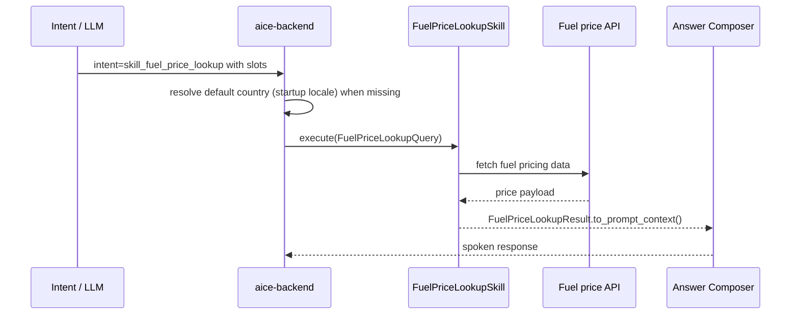

# Skill: Fuel Price Lookup

**Crate:** `skill-fuel-price-lookup` · **Impl:** `HttpFuelPriceLookupSkill`

**Purpose:** Retrieve regional or national fuel prices for a country and fuel type.

**Execution Owner (Split Runtime):** `aice-backend`

---

## Full Journey

## Inputs

| Parameter | Type | Description |
|-----------|------|-------------|
| `fuel_country_code` | `String` | ISO country code (derived from startup locale when omitted). |
| `fuel_region` | `Option<String>` | Optional region/state filter. |
| `fuel_type` | `Option<String>` | Optional fuel type (e.g. diesel, petrol). |

## Outputs

`FuelPriceLookupResult { country_code, region, fuel_type, price, currency, unit, source_granularity, as_of }`

## Failure Paths

| Error | Cause |
|-------|-------|
| `InvalidCountry` | Country code is invalid. |
| `UnsupportedCountry` | Country is not currently supported by provider adapters. |
| `MissingApiKey` | Required API key is missing for provider path (e.g. EIA). |
| `ProviderUnavailable` | Upstream provider is unavailable. |
| `UpstreamTimeout` | Provider request timed out. |
| `UpstreamParse` | Provider response could not be parsed. |

## Metrics

| Metric | Kind | Labels |
|--------|------|--------|
| `backend_skill_execute_total` | Counter | `skill="skill_fuel_price_lookup"`, `result`, `error_kind` |
| `backend_skill_execute_duration_seconds` | Histogram | `skill="skill_fuel_price_lookup"` |

