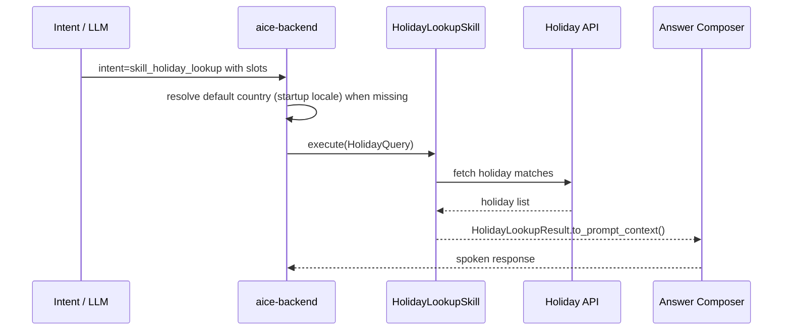

# Skill: Holiday Lookup

**Crate:** `skill-holiday-lookup` · **Impl:** `HttpHolidayLookupSkill`

**Purpose:** Look up public holiday matches by country with optional holiday name, date, region, and year filters.

**Execution Owner (Split Runtime):** `aice-backend`

---

## Full Journey

## Inputs

| Parameter | Type | Description |
|-----------|------|-------------|
| `holiday_name` | `Option<String>` | Optional holiday name text filter. |
| `holiday_date` | `Option<NaiveDate>` | Optional date filter (defaults to today in backend). |
| `holiday_country_code` | `String` | ISO country code (derived from startup locale when omitted). |
| `holiday_region_code` | `Option<String>` | Optional region filter. |
| `holiday_year` | `Option<i32>` | Optional year filter. |

## Outputs

`HolidayLookupResult { country_code, region_code, matches, as_of }`

## Failure Paths

| Error | Cause |
|-------|-------|
| `InvalidCountry` | Country code is invalid. |
| `InvalidQuery` | Query parameters are invalid or incomplete. |
| `ProviderUnavailable` | Upstream provider is unavailable. |
| `UpstreamTimeout` | Provider request timed out. |
| `UpstreamParse` | Provider response could not be parsed. |

## Metrics

| Metric | Kind | Labels |
|--------|------|--------|
| `backend_skill_execute_total` | Counter | `skill="skill_holiday_lookup"`, `result`, `error_kind` |
| `backend_skill_execute_duration_seconds` | Histogram | `skill="skill_holiday_lookup"` |

