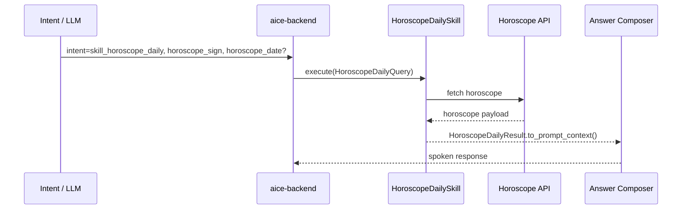

# Skill: Horoscope Daily

**Crate:** `skill-horoscope-daily` · **Impl:** `HttpHoroscopeDailySkill`

**Purpose:** Retrieve daily horoscope text for a zodiac sign and optional date.

**Execution Owner (Split Runtime):** `aice-backend`

---

## Full Journey

## Inputs

| Parameter | Type | Description |
|-----------|------|-------------|
| `horoscope_sign` | `String` | Zodiac sign (required). |
| `horoscope_date` | `Option<NaiveDate>` | Optional date filter (defaults to today in backend). |

## Outputs

`HoroscopeDailyResult { sign, day, summary, mood, color, lucky_number, as_of }`

## Failure Paths

| Error | Cause |
|-------|-------|
| `InvalidSign` | Unsupported or invalid zodiac sign. |
| `UnsupportedDate` | Date is not supported by the provider. |
| `ProviderUnavailable` | Upstream provider is unavailable. |
| `UpstreamTimeout` | Provider request timed out. |
| `UpstreamParse` | Provider response could not be parsed. |

## Metrics

| Metric | Kind | Labels |
|--------|------|--------|
| `backend_skill_execute_total` | Counter | `skill="skill_horoscope_daily"`, `result`, `error_kind` |
| `backend_skill_execute_duration_seconds` | Histogram | `skill="skill_horoscope_daily"` |

