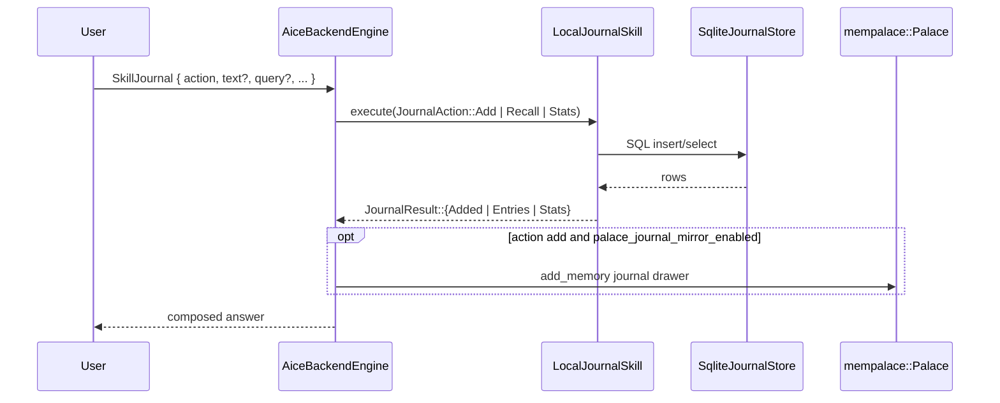

# Skill: Journal

**Crate:** `skill-journal` · **Impl:** `LocalJournalSkill` over `SqliteJournalStore` (backend-owned)

**Purpose:** Personal journal: add entries, recall by free-text query, or get aggregate stats. Persisted to a local SQLite file.

## Full Journey

## Inputs

| Field | Type | Notes |
|-------|------|-------|
| `action` | `Option<String>` | One of `add` (default), `recall`, `stats`. |
| `text` | `Option<String>` | Required for `add`. |
| `sentiment` | `Option<String>` | Optional for `add`: `positive`/`neutral`/`negative`. |
| `tags` | `Option<Vec<String>>` | Optional tags for `add`. |
| `query` | `Option<String>` | Free-text filter for `recall`. |
| `limit` | `Option<usize>` | Recall limit (default 10). |

## Outputs

`JournalResult` variants: `Added(JournalEntry)`, `Entries(Vec<JournalEntry>)`, `Stats(JournalStats)`.

## Failure Paths

`JournalError`: `InvalidQuery`, `Storage`, `NotFound`. Backend also surfaces a `Chat` fallback when `config.journal.enabled = false` or the store fails to open.

## Notes

- `config.journal.sqlite_path` controls the storage location. When the path is unwritable the skill is disabled with a warning at startup.
- All entries are local; nothing is sent to any external service.
- When `memory.palace_journal_mirror_enabled = true`, successful `add` actions are also mirrored into the Memory Palace as high-importance drawers in `wing = "journal"`, using the sentiment as the room when present and `general` otherwise. This is separate from the automatic per-turn `voice_turn` ingest, so deliberate journal entries remain directly recallable.

## Metrics

- `voice_journal_skill_total{result}`.
- Standard `backend_skill_execute_*` for `skill_journal`.
- `palace_add_memory_total{result}` / `palace_add_memory_duration_seconds` for palace mirroring.
