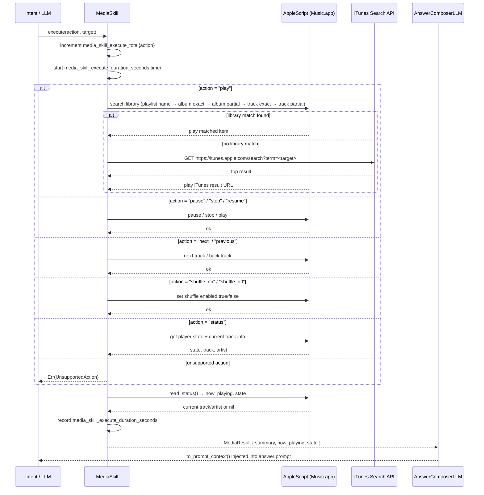

# Skill: Media

**Crate:** `skill-media` · **Impl:** `MacOsMusicSkill`

**Purpose:** Control macOS Music.app playback via AppleScript. Supports play (with library search and iTunes catalog fallback), pause, stop, resume, next/previous track, shuffle, and status queries.

**Execution Owner (Split Runtime):** `aice-macos`

---

## Full Journey

---

## Inputs

| Parameter | Type | Description |
|-----------|------|-------------|
| `action` | `Option<&str>` | `play`, `pause`, `stop`, `resume`, `next`, `previous`, `shuffle_on`, `shuffle_off`, `status`. |
| `target` | `Option<&str>` | Search query for `play` (artist, album, track, or playlist name). |

## Outputs

`MediaResult { summary, now_playing: Option<String>, state }`

## Failure Paths

| Error | Cause |
|-------|-------|
| `UnsupportedAction` | Action not in supported set, or running on non-macOS platform. |
| `NoSource` | `play` action given with no `target` and nothing is queued. |
| `Playback` | AppleScript execution fails (Music.app closed, permissions denied, etc.). |
| `Auth` | Automation permission not granted for Music.app. |

## Notes

- macOS-only; returns `UnsupportedAction` immediately on other platforms.
- Library search order: playlist name → exact album → partial album → exact track → partial track.
- iTunes catalog fallback only fires when the library search yields no result.

## Metrics

| Metric | Kind | Labels |
|--------|------|--------|
| `media_skill_execute_total` | Counter | `action` |
| `media_skill_errors_total` | Counter | `action` |
| `media_skill_execute_duration_seconds` | Histogram | `action` |
