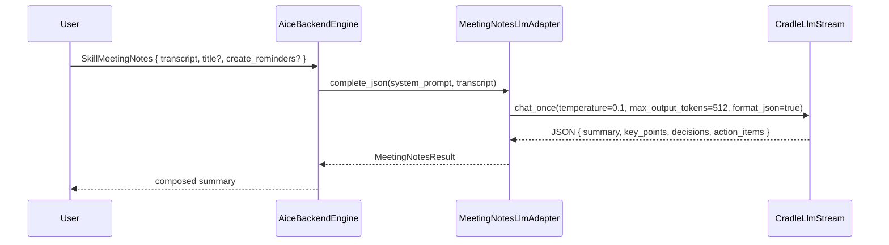

# Skill: Meeting Notes

**Crate:** `skill-meeting-notes` · **Impl:** `LlmMeetingNotesSkill` (backend-owned, wraps a `MeetingNotesLlm` adapter)

**Purpose:** Summarize a meeting transcript into key points, decisions, and action items via a local LLM with a JSON-constrained response.

## Full Journey

## Inputs

| Field | Type | Notes |
|-------|------|-------|
| `transcript` | `Option<String>` | Required raw meeting transcript. |
| `title` | `Option<String>` | Optional title; the LLM may infer one when missing. |
| `create_reminders` | `Option<bool>` | Currently treated as a backend hint; reminder creation is a frontend responsibility. |

## Outputs

`MeetingNotesResult` with `title`, `summary`, `key_points: Vec<String>`, `decisions: Vec<String>`, `action_items: Vec<ActionItem { text, assignee, due }>`, `reminders_created: usize`.

## Failure Paths

`MeetingNotesError`: `InvalidQuery`, `LlmUnavailable`, `InvalidLlmOutput`, `Reminders`.

## Notes

- JSON-mode call (`format_json=true`) and a strict system prompt keep the LLM output parseable.
- Reminders, if requested, are dispatched to the frontend `skill_reminder` flow separately.

## Metrics

- `voice_meeting_notes_skill_total{result}`.
- Standard `backend_skill_execute_*` for `skill_meeting_notes`.
