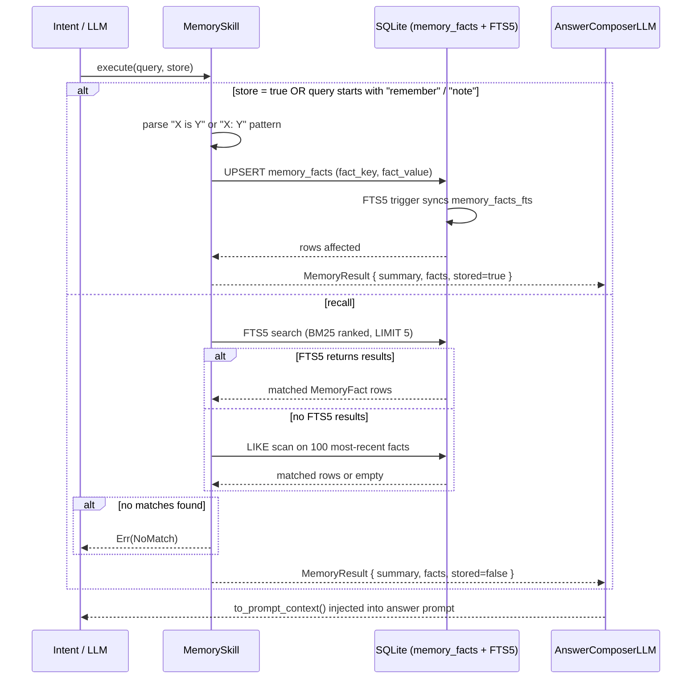
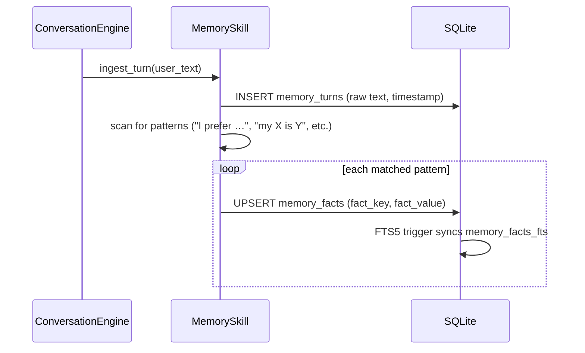

# Skill: Memory

**Crate:** `skill-memory` · **Impl:** `SqliteMemorySkill`

**Purpose:** Persistent key-value fact store backed by SQLite with FTS5 full-text search. Supports explicit recall/store via `execute` and proactive fact extraction from every conversation turn via `ingest_turn`.

**Execution Owner (Split Runtime):** `aice-backend`

---

## Full Journey

### Explicit Recall / Store (`execute`)

### Proactive Fact Extraction (`ingest_turn`)

---

## Inputs

| Parameter | Type | Description |
|-----------|------|-------------|
| `query` | `Option<&str>` | Recall search term, or a `"remember X is Y"` store command. |
| `store` | `Option<bool>` | Explicitly request a store operation when `true`. |
| *(ingest)* `user_text` | `&str` | Raw user turn text for proactive extraction. |

## Outputs

`MemoryResult { summary, facts: Vec<MemoryFact>, stored }`

`MemoryFact { key, value, when: Option<String> }`

## Schema

| Table | Purpose |
|-------|---------|
| `memory_facts` | Unique `(fact_key, fact_value)` pairs with timestamp. |
| `memory_turns` | Raw conversation turns for audit and future extraction. |
| `memory_facts_fts` | FTS5 virtual table; kept in sync with `memory_facts` via insert/delete/update triggers. |

## Failure Paths

| Error | Cause |
|-------|-------|
| `Storage` | SQLite write failure. |
| `Retrieval` | SQLite read failure. |
| `NoMatch` | Recall query finds no matching facts. |

## Metrics

| Metric | Kind | Labels |
|--------|------|--------|
| *(none instrumented yet — add when touching this skill)* | — | — |
