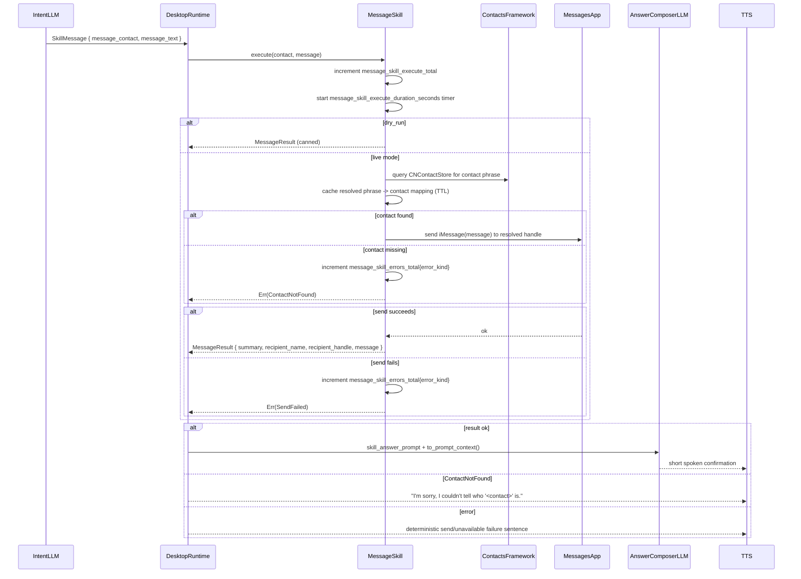

# Skill: Message

**Crate:** `skill-message` · **Impl:** `MacOsMessagesSkill`

**Purpose:** Resolve a natural-language contact phrase (for example, `"my wife"`) via native macOS Contacts APIs and send an iMessage through Messages.app.

---

## Full Journey

---

## Inputs

| Parameter | Type | Description |
|-----------|------|-------------|
| `contact` | `&str` | Contact phrase to resolve (for example, `"my wife"`, `"Jane Doe"`). |
| `message` | `&str` | Final text to send as an iMessage. |

## Outputs

`MessageResult { summary, recipient_name, recipient_handle, message }`

## Failure Paths

| Error | Cause |
|-------|-------|
| `ContactNotFound` | Contact phrase not found in Contacts query results. |
| `SendFailed` | Messages.app AppleScript send failed for the resolved handle. |
| `Execution` | Input validation failure or AppleScript execution setup failure. |
| `Unavailable` | macOS-only integration invoked on a non-macOS platform. |

## Notes

- Contacts lookup uses native `CNContactStore` (via helper), not Contacts AppleScript.
- Results are cached per resolved phrase with TTL refresh.
- Matching strips common prefixes like `"my "` and `"the "`.
- `new_for_tests()` runs in dry-run mode and does not call Messages.app.
- Runtime intentionally uses deterministic spoken errors for all message-skill failures, so this flow never asks the user for a phone number.

## Metrics

| Metric | Kind | Labels |
|--------|------|--------|
| `message_skill_execute_total` | Counter | `result=success|error` |
| `message_skill_errors_total` | Counter | `error_kind=<error string>` |
| `message_skill_execute_duration_seconds` | Histogram | *(none)* |
