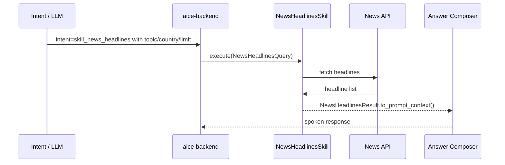

# Skill: News Headlines

**Crate:** `skill-news-headlines` · **Impl:** `HttpNewsHeadlinesSkill`

**Purpose:** Fetch top news headlines for a topic with optional country and item-limit filters.

**Execution Owner (Split Runtime):** `aice-backend`

---

## Full Journey

## Inputs

| Parameter | Type | Description |
|-----------|------|-------------|
| `news_topic` | `String` | Topic keyword or category. |
| `news_country_code` | `Option<String>` | Optional ISO country code (defaults from startup locale when available). |
| `news_limit` | `Option<usize>` | Optional maximum number of returned headlines. |

## Outputs

`NewsHeadlinesResult { headlines, as_of }`

## Failure Paths

| Error | Cause |
|-------|-------|
| `InvalidQuery` | Query parameters are invalid. |
| `ProviderUnavailable` | Upstream provider is unavailable. |
| `UpstreamTimeout` | Provider request timed out. |
| `UpstreamParse` | Provider response could not be parsed. |

## Metrics

| Metric | Kind | Labels |
|--------|------|--------|
| `backend_skill_execute_total` | Counter | `skill="skill_news_headlines"`, `result`, `error_kind` |
| `backend_skill_execute_duration_seconds` | Histogram | `skill="skill_news_headlines"` |

