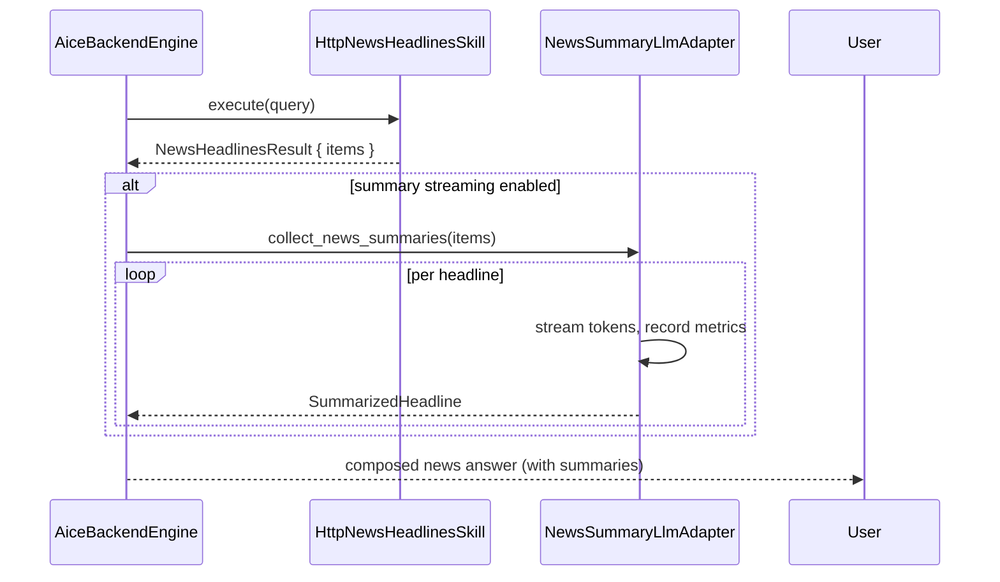

# Feature: News Summary (opt-in)

**Crate:** `skill-news-headlines` (`stream_summaries`, `collect_news_summaries`) · **Adapter:** `NewsSummaryLlmAdapter` (backend)

**Purpose:** When `config.news.enable_summary_streaming = true`, news headlines are passed through a small LLM that produces a one-line summary per headline, then composed into the spoken answer.

## Full Journey



## Configuration

```toml
[news]
enable_summary_streaming = true   # default: false
```

The flag is read once at `AiceBackendEngine::from_config` and stored on the engine.

## Adapter Behavior

`NewsSummaryLlmAdapter` wraps an `Arc<CradleLlmStream>`:

- Spawns a background task per headline that pulls tokens from `chat_stream`.
- Forwards tokens via an `mpsc::Receiver<String>` to the upstream `collect_news_summaries` consumer.
- Records `voice_news_summary_chunk_total` per token and `voice_news_summary_duration_seconds` per headline.

## Failure Paths

If the LLM fails for a given headline, that headline falls back to its raw title in the composed answer; other headlines still summarize.

## Notes

- This is opt-in to keep the default voice latency budget tight.
- No `EmailLlm` adapter is provided — the backend never sees email content.

## Metrics

- `voice_news_summary_chunk_total` — increments per streamed token.
- `voice_news_summary_duration_seconds{result}` — histogram of per-headline summary duration.
