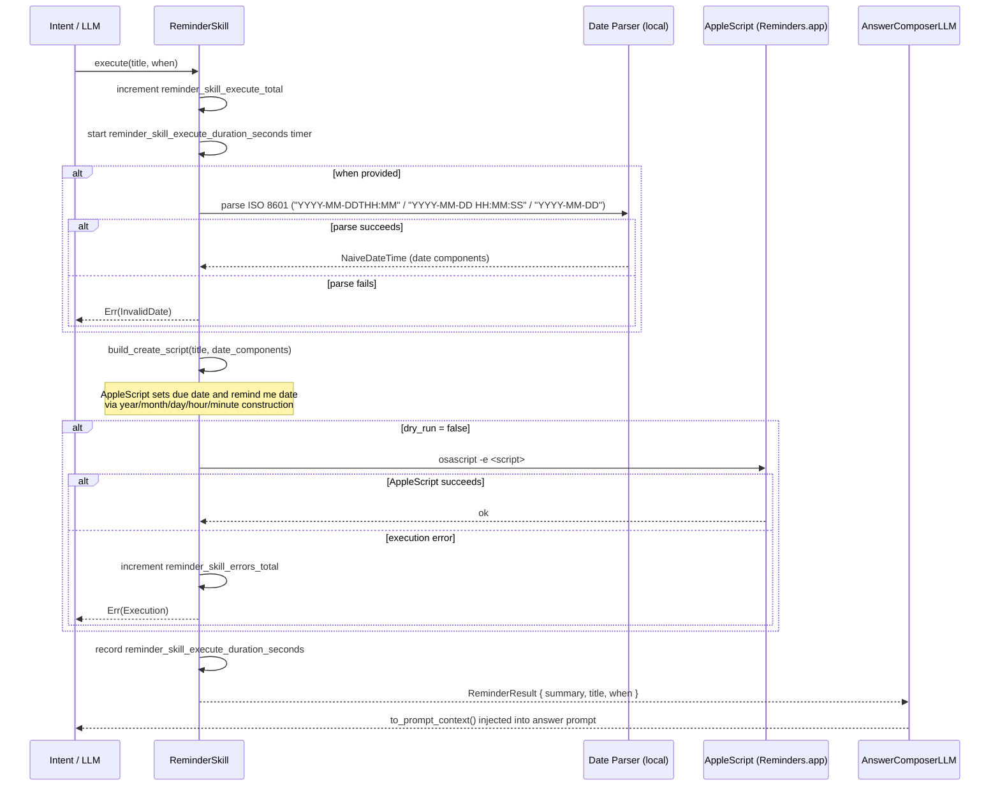

# Skill: Reminder

**Crate:** `skill-reminder` · **Impl:** `MacOsReminderSkill`

**Purpose:** Create reminders in macOS Reminders.app via AppleScript. Supports optional due date/time in ISO 8601 format.

---

## Full Journey

---

## Inputs

| Parameter | Type | Description |
|-----------|------|-------------|
| `title` | `&str` | Reminder title text. |
| `when` | `Option<&str>` | Optional due datetime. Accepts `"YYYY-MM-DDTHH:MM"`, `"YYYY-MM-DD HH:MM:SS"`, or `"YYYY-MM-DD"` (midnight). |

## Outputs

`ReminderResult { summary, title, when: Option<String> }`

## Failure Paths

| Error | Cause |
|-------|-------|
| `InvalidDate` | `when` string does not match any accepted ISO 8601 format. |
| `Execution` | AppleScript fails (Reminders.app closed, automation permission denied, etc.). |
| `Unavailable` | macOS Reminders integration is not available on this platform. |

## Notes

- `dry_run = true` (used in tests via `new_for_tests()`) skips AppleScript execution entirely.
- Date construction in AppleScript uses individual components (`year`, `month`, `day`, `hours`, `minutes`) to avoid locale-specific date parsing issues.
- Reminder is created in the **default list** in Reminders.app.

## Metrics

| Metric | Kind | Labels |
|--------|------|--------|
| `reminder_skill_execute_total` | Counter | *(none)* |
| `reminder_skill_errors_total` | Counter | *(none)* |
| `reminder_skill_execute_duration_seconds` | Histogram | *(none)* |
