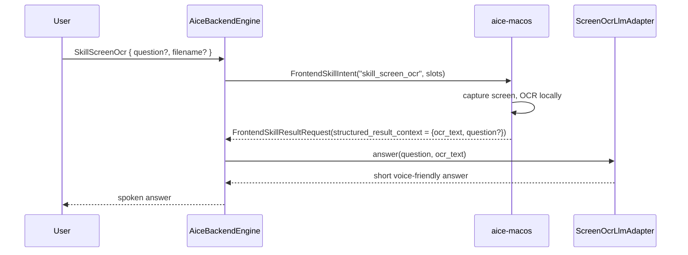

# Skill: Screen OCR

**Crate:** `skill-screen-ocr` · **Impl:** Hybrid — frontend captures + OCRs, backend answers via vision LLM

**Purpose:** Answer a question about text currently visible on the user's screen. The frontend captures the screen and runs OCR locally (e.g. Apple Vision); the backend's vision-capable LLM answers the question against the extracted text.

## Full Journey

## Inputs

Initial dispatch slots:

| Field | Type | Notes |
|-------|------|-------|
| `question` | `Option<String>` | What the user wants to know. |
| `filename` | `Option<String>` | Optional save path for the captured image. |

Frontend follow-up `structured_result_context` JSON:

| Field | Type | Notes |
|-------|------|-------|
| `ocr_text` | `String` | Required: text extracted by the frontend. |
| `question` | `Option<String>` | Optional: overrides the original `question`. |

## Outputs

A short voice-friendly string composed by the backend's `ScreenOcrLlmAdapter` (via `CradleLlmStream` with `temperature=0.2`, `max_output_tokens=160`).

## Failure Paths

- `parse_error` — missing/invalid JSON or empty `ocr_text`.
- `result_error` — frontend reported `status="error"` or the backend LLM call failed.

## Notes

- The backend never sees raw pixel data — only the OCR text — keeping the network footprint small.
- The backend extends `BackendEngine::finalize_frontend_skill` with an `intent_id` parameter so the OCR branch can be selected from the frontend's `FrontendSkillResult` envelope.

## Metrics

- `voice_screen_ocr_skill_total{result}` — `dispatched`, `result_ok`, `result_error`, `parse_error`.
- Standard `backend_skill_execute_*` for `skill_screen_ocr` on success.
