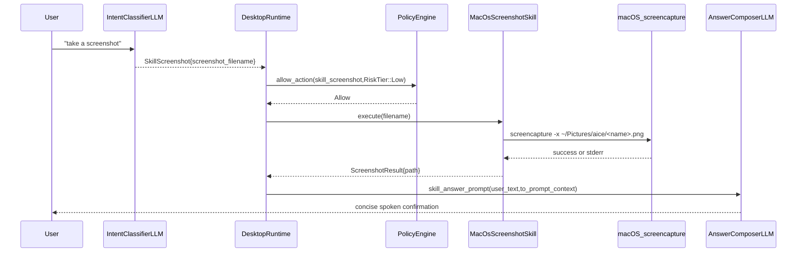

# Skill: Screenshot

**Crate:** `skill-screenshot` · **Impl:** `MacOsScreenshotSkill`

**Purpose:** Capture a local macOS screenshot and save it under `~/Pictures/aice/` from LLM-classified voice commands such as "take a screenshot" or "take a screenshot called desk.png".

---

## Full Journey

---

## Inputs

| Parameter | Type | Description |
|-----------|------|-------------|
| `filename` | `Option<&str>` | Optional target file name. If omitted or empty, the skill uses a generated name: `screenshot-YYYY-MM-DD-HHMMSS.png`. |

## Outputs

`ScreenshotResult { path: PathBuf }`

- `path`: Absolute output path of the saved screenshot.

## Failure Paths

| Error | Cause |
|-------|-------|
| `Execution` | `HOME` not set, output directory resolution failure, unsupported non-macOS runtime, `screencapture` command failure, or output directory creation failure. |

## Notes

- Default save location is `~/Pictures/aice/`; the directory is created when needed.
- The command is executed with `screencapture -x` to capture without UI shutter sound/preview behavior.
- A `new_for_tests()` dry-run mode skips filesystem creation and command execution while keeping deterministic path behavior for behavior tests.

## Metrics

| Metric | Kind | Labels |
|--------|------|--------|
| `screenshot_skill_execute_total` | Counter | `result` (`success` or `error`) |
| `screenshot_skill_errors_total` | Counter | `kind` (`ScreenshotSkillError` display string) |
| `screenshot_skill_execute_duration_seconds` | Histogram | none |
| `voice_screenshot_skill_total` | Counter | `result` (`success` or `error`) |
