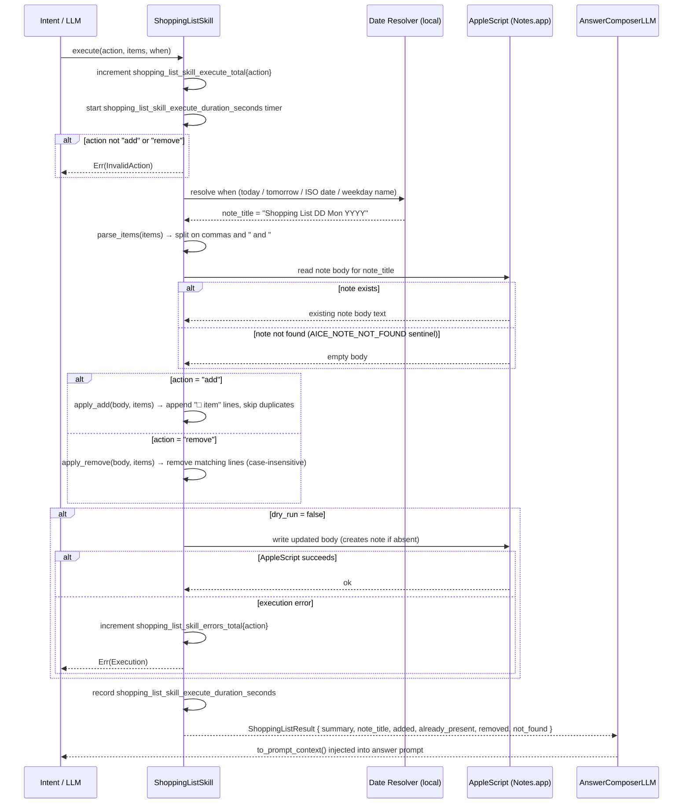

# Skill: Shopping List

**Crate:** `skill-shopping-list` · **Impl:** `MacOsNotesShoppingListSkill`

**Purpose:** Add or remove items from a dated shopping list note in macOS Notes.app via AppleScript. Each shopping list is a separate note named `"Shopping List DD Mon YYYY"`.

**Execution Owner (Split Runtime):** External macOS frontend service ([`AncientiCe/aice-macos`](https://github.com/AncientiCe/aice-macos))

---

## Full Journey

---

## Inputs

| Parameter | Type | Description |
|-----------|------|-------------|
| `action` | `&str` | `"add"` or `"remove"`. |
| `items` | `&str` | Comma- and/or `" and "`-separated item names. Oxford comma supported. |
| `when` | `Option<&str>` | Date for the note: `"today"`, `"tomorrow"`, ISO date, or weekday name. Defaults to today. |

## Outputs

`ShoppingListResult { summary, note_title, added, already_present, removed, not_found }`

## Item Format in Notes

| Symbol | Meaning |
|--------|---------|
| `□ item` | Unchecked item |
| `☑ item` | Checked (purchased) item — recognised when reading; not produced by this skill |

## Failure Paths

| Error | Cause |
|-------|-------|
| `InvalidAction` | Action is not `"add"` or `"remove"`. |
| `Execution` | AppleScript fails (Notes.app closed, automation permission denied, etc.). |
| `Unavailable` | macOS Notes integration is not available on this platform. |

## Notes

- Two AppleScript calls per operation: one **read** (returns `AICE_NOTE_NOT_FOUND` if absent) and one **write** (creates the note if it did not exist).
- `apply_add` and `apply_remove` are **pure functions** — no side effects, tested independently.
- `dry_run = true` (used in tests via `new_for_tests()`) skips AppleScript execution.

## Metrics

| Metric | Kind | Labels |
|--------|------|--------|
| `shopping_list_skill_execute_total` | Counter | `action` |
| `shopping_list_skill_errors_total` | Counter | `action` |
| `shopping_list_skill_execute_duration_seconds` | Histogram | `action` |

