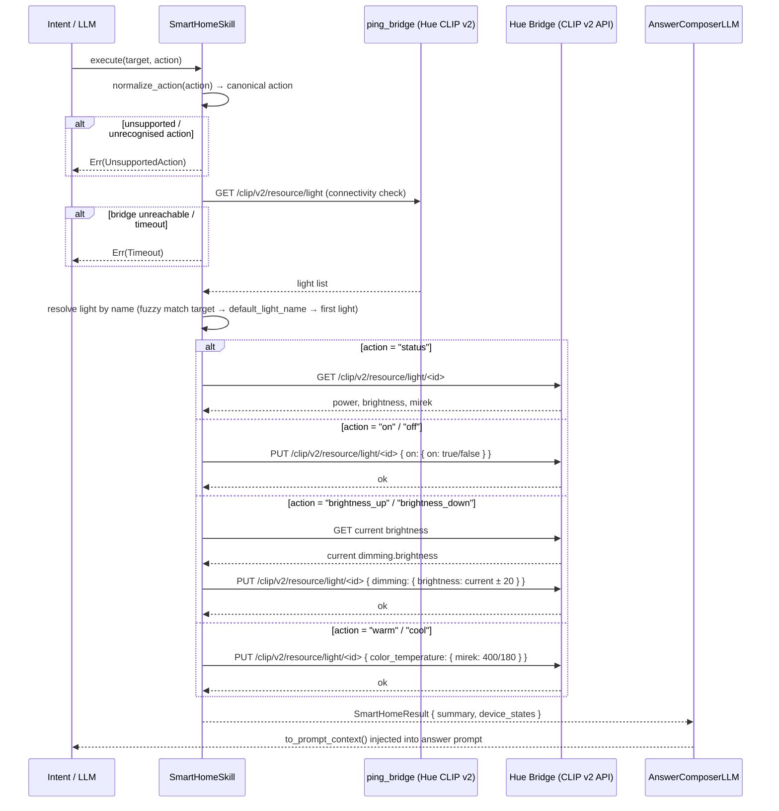

# Skill: Smart Home

**Crate:** `skill-smart-home` · **Impl:** `HueSmartHomeSkill`

**Purpose:** Control Philips Hue lights via the Hue CLIP v2 API. Supports status queries, power toggling, brightness adjustment, and colour temperature changes.

**Execution Owner (Split Runtime):** `aice-backend`

---

## Full Journey

---

## Inputs

| Parameter | Type | Description |
|-----------|------|-------------|
| `target` | `Option<&str>` | Light name or room. Falls back to `default_light_name`, then first available light. |
| `action` | `Option<&str>` | Natural language action (e.g. `"turn on"`, `"brighten up"`, `"status"`). |

## Supported Actions (after normalisation)

| Canonical | Natural language aliases |
|-----------|--------------------------|
| `status` | status, what's on |
| `on` | turn on, switch on |
| `off` | turn off, switch off |
| `brightness_up` | brighter, brighten up, increase brightness |
| `brightness_down` | dimmer, dim, decrease brightness |
| `warm` | warm light, warmer |
| `cool` | cool light, cooler |

## Outputs

`SmartHomeResult { summary, device_states: Vec<DeviceState> }`

`DeviceState { id, name, state }` — state formatted as `"power=on, brightness=80%, mirek=250"`.

## Failure Paths

| Error | Cause |
|-------|-------|
| `UnsupportedAction` | Action is not in the supported set after normalisation. |
| `Timeout` | Bridge is unreachable within the request timeout. |
| `Device` | Bridge returns an error for the light operation. |

## Setup / Provisioning

- `discover_bridge()` — calls `https://discovery.meethue.com/` to find bridge IP.
- `create_app_key(bridge_host)` — one-time provisioning; requires the physical bridge link button to be pressed first.

## Metrics

| Metric | Kind | Labels |
|--------|------|--------|
| *(none instrumented yet — add when touching this skill)* | — | — |
