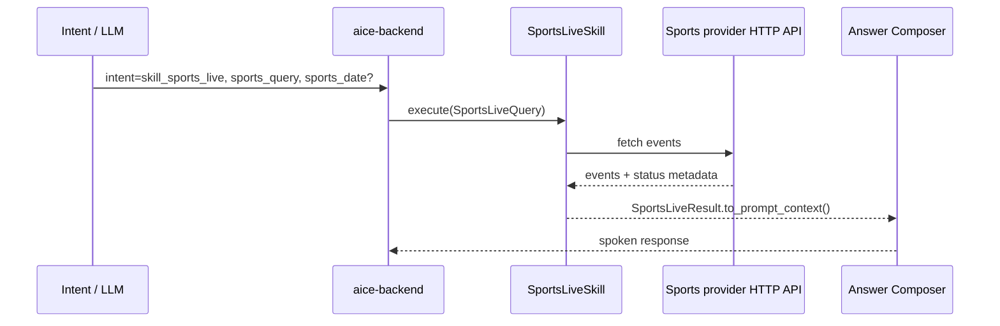

# Skill: Sports Live

**Crate:** `skill-sports-live` · **Impl:** `HttpSportsLiveSkill`

**Purpose:** Fetch live or scheduled sports events for a natural-language sports query, with optional date scoping.

**Execution Owner (Split Runtime):** `aice-backend`

---

## Full Journey

## Inputs

| Parameter | Type | Description |
|-----------|------|-------------|
| `sports_query` | `String` | Team/match/league query text. |
| `sports_date` | `Option<NaiveDate>` | Optional date filter (defaults to today in backend). |

## Outputs

`SportsLiveResult { events, as_of }`

## Failure Paths

| Error | Cause |
|-------|-------|
| `InvalidQuery` | Empty or unsupported query shape. |
| `ProviderUnavailable` | Upstream provider is unavailable. |
| `UpstreamTimeout` | Provider request timed out. |
| `UpstreamParse` | Provider response could not be parsed. |

## Metrics

| Metric | Kind | Labels |
|--------|------|--------|
| `backend_skill_execute_total` | Counter | `skill="skill_sports_live"`, `result`, `error_kind` |
| `backend_skill_execute_duration_seconds` | Histogram | `skill="skill_sports_live"` |

