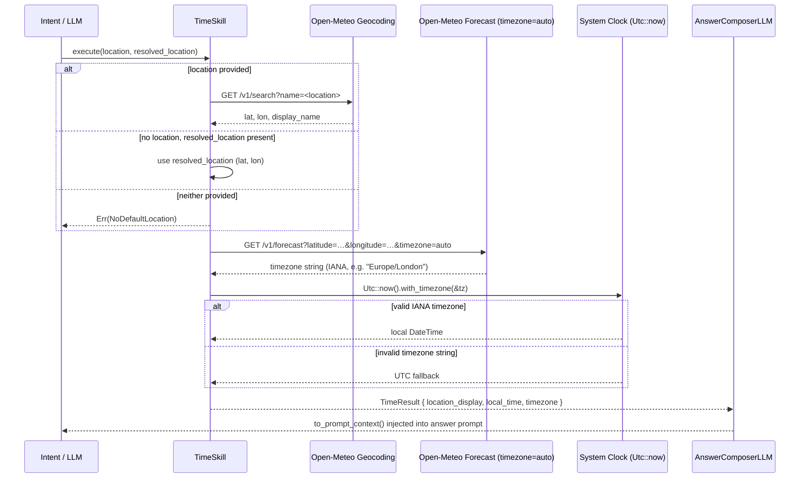

# Skill: Time

**Crate:** `skill-time` · **Impl:** `OpenMeteoTimeSkill`

**Purpose:** Return the current local time at a named or default location. Uses Open-Meteo to resolve an IANA timezone, then derives the accurate local time from the system clock.

**Execution Owner (Split Runtime):** `aice-backend`

---

## Full Journey

---

## Inputs

| Parameter | Type | Description |
|-----------|------|-------------|
| `location` | `Option<&str>` | Named place (e.g. `"Tokyo"`). |
| `resolved_location` | `Option<&ResolvedLocation>` | Pre-resolved lat/lon from startup. |

## Outputs

`TimeResult { location_display, local_time, timezone }`

## Failure Paths

| Error | Cause |
|-------|-------|
| `Geocoding` | Geocoding API unreachable or no results. |
| `TimeRequest` | Forecast API unreachable or timezone field missing. |
| `NoDefaultLocation` | Neither argument is available. |

## Notes

- The API's returned `current_weather.time` value is **ignored**; local time is always computed from `Utc::now()` for accuracy.
- Falls back to UTC silently if the timezone string is not recognised by `chrono-tz`.

## Metrics

| Metric | Kind | Labels |
|--------|------|--------|
| *(none instrumented yet — add when touching this skill)* | — | — |
