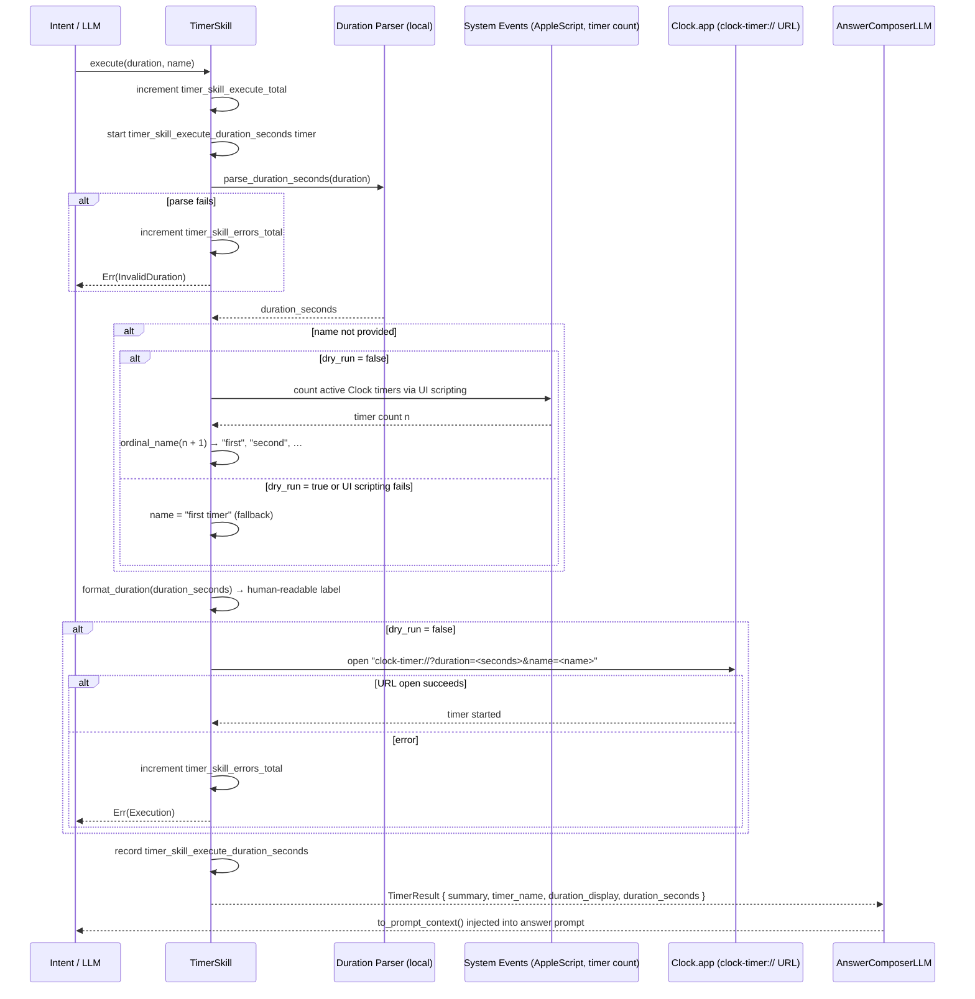

# Skill: Timer

**Crate:** `skill-timer` · **Impl:** `MacOsClockTimerSkill`

**Purpose:** Start a countdown timer in macOS Clock.app via the `clock-timer://` URL scheme. Accepts natural language durations and auto-names timers ordinally when no name is given.

**Execution Owner (Split Runtime):** `aice-macos`

---

## Full Journey

---

## Inputs

| Parameter | Type | Description |
|-----------|------|-------------|
| `duration` | `&str` | Natural language duration, e.g. `"5 minutes"`, `"1 hour 30 minutes"`, `"2 hours 15 minutes 30 seconds"`. |
| `name` | `Option<&str>` | Timer label. Auto-generated as an ordinal (`"first"`, `"second"`, …) when absent. |

## Accepted Duration Tokens

| Token variants | Meaning |
|----------------|---------|
| `hour`, `hours` | hours |
| `minute`, `minutes`, `min`, `mins` | minutes |
| `second`, `seconds`, `sec`, `secs` | seconds |

## Outputs

`TimerResult { summary, timer_name, duration_display, duration_seconds }`

## Failure Paths

| Error | Cause |
|-------|-------|
| `InvalidDuration` | Duration string contains no recognisable time tokens. |
| `Execution` | `open clock-timer://…` fails (Clock.app unavailable, URL scheme not registered). |
| `Unavailable` | macOS Clock integration not available on this platform. |

## Notes

- `dry_run = true` (used in tests via `new_for_tests()`) skips both the URL open and AppleScript UI scripting.
- Ordinal name falls back to `"first timer"` if the active-timer count query fails or is skipped in dry-run mode.
- `ordinal_name` returns `"first"` through `"tenth"` by name, then `"Nth"` for larger values.

## Metrics

| Metric | Kind | Labels |
|--------|------|--------|
| `timer_skill_execute_total` | Counter | *(none)* |
| `timer_skill_errors_total` | Counter | *(none)* |
| `timer_skill_execute_duration_seconds` | Histogram | *(none)* |
