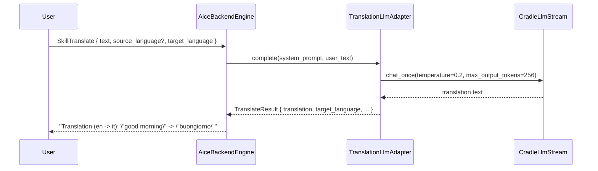

# Skill: Translate

**Crate:** `skill-translate` · **Impl:** `LlmTranslateSkill` (backend-owned, wraps a `TranslationLlm` adapter)

**Purpose:** Translate a short phrase into a target language using the local Ollama LLM.

## Full Journey

## Inputs

| Field | Type | Notes |
|-------|------|-------|
| `text` | `Option<String>` | Source text; required. |
| `source_language` | `Option<String>` | Optional source language hint. |
| `target_language` | `Option<String>` | Required target language (English name or ISO code). |

When `text` or `target_language` is missing, the engine asks the user to clarify.

## Outputs

`TranslateResult` with `source_language`, `target_language`, `original`, `translation`.

## Failure Paths

`TranslateError`: `InvalidQuery`, `LlmUnavailable`, `EmptyTranslation`.

## Notes

- LLM transport is decoupled via the `TranslationLlm` trait so the skill crate has no dependency on `core-llm`.
- The backend `TranslationLlmAdapter` lives in `apps/aice-backend/src/llm_adapters.rs`.

## Metrics

- `voice_translate_skill_total{result}`.
- Standard `backend_skill_execute_*` for `skill_translate`.
