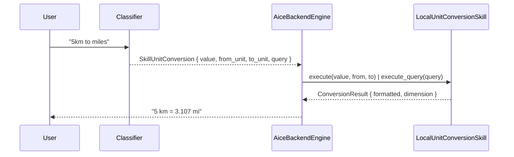

# Skill: Unit Conversion

**Crate:** `skill-unit-conversion` · **Impl:** `LocalUnitConversionSkill` (backend-owned)

**Purpose:** Convert values between length, mass, volume, time, and temperature units locally.

## Full Journey

## Inputs

| Field | Type | Notes |
|-------|------|-------|
| `value` | `Option<f64>` | Optional structured value. |
| `from_unit` / `to_unit` | `Option<String>` | Optional structured units. |
| `query` | `Option<String>` | Free-form query, e.g. "5 km to miles" — used when structured slots are missing. |

## Outputs

`ConversionResult` with `input_value`, `from_unit`, `to_unit`, `output_value`, `formatted`, `dimension`.

## Failure Paths

`UnitConversionError`: `UnknownUnit(String)`, `DimensionMismatch { from, to }`, `InvalidValue(String)`, `ParseError(String)`.

## Notes

- Backend selects `execute()` when all of `value`/`from_unit`/`to_unit` are present, otherwise falls back to `execute_query()` on the free-form query.

## Metrics

- `voice_unit_conversion_skill_total{result}`.
- Standard `backend_skill_execute_*` for `skill_unit_conversion`.
