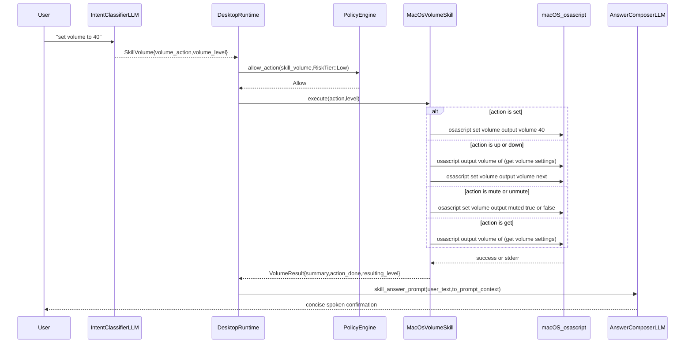

# Skill: Volume

**Crate:** `skill-volume` · **Impl:** `MacOsVolumeSkill`

**Purpose:** Control macOS system output volume from LLM-classified voice commands such as "set volume to 40", "volume up", "mute volume", and "what is the volume".

**Execution Owner (Split Runtime):** External macOS frontend service ([`AncientiCe/aice-macos`](https://github.com/AncientiCe/aice-macos))

---

## Full Journey

---

## Inputs

| Parameter | Type | Description |
|-----------|------|-------------|
| `action` | `Option<&str>` | Optional action from classifier. Supported values: `set`, `up`, `down`, `mute`, `unmute`, `get`. |
| `level` | `Option<u8>` | Required when action is `set`; absolute volume level in range `0..=100`. |

## Outputs

`VolumeResult { summary: String, action_done: String, resulting_level: Option<u8> }`

- `summary`: Short human-readable status used in voice prompt context.
- `action_done`: Executed AppleScript command description.
- `resulting_level`: Resulting numeric volume for set/adjust/get actions; `None` for mute/unmute.

## Failure Paths

| Error | Cause |
|-------|-------|
| `Execution` | Missing required `level` for `set`, non-macOS platform, failed `osascript` invocation, or parse failure reading current volume. |
| `InvalidLevel` | `set` action receives a level outside `0..=100`. |
| `UnsupportedAction` | Classifier sends an unknown action string. |

## Notes

- `set` requires a numeric level and clamps through validation (`0..=100`).
- `up` and `down` adjust by a fixed step of `10` and clamp to bounds.
- `mute` and `unmute` do not report a numeric resulting level.
- A `new_for_tests()` dry-run mode supports deterministic behavior for behavioral tests.

## Metrics

| Metric | Kind | Labels |
|--------|------|--------|
| `volume_skill_execute_total` | Counter | `result` (`success` or `error`) |
| `volume_skill_errors_total` | Counter | `kind` (`VolumeSkillError` display string) |
| `volume_skill_execute_duration_seconds` | Histogram | none |
| `voice_volume_skill_total` | Counter | `result` (`success` or `error`) |

