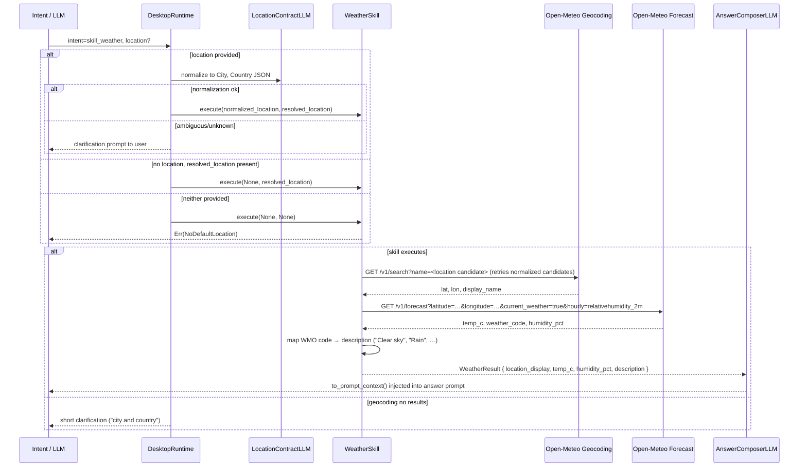

# Skill: Weather

**Crate:** `skill-weather` · **Impl:** `OpenMeteoWeatherSkill`

**Purpose:** Fetch the current weather conditions for a named place or the user's default location. No API key required; uses the Open-Meteo public API.

**Execution Owner (Split Runtime):** `aice-backend`

---

## Full Journey

---

## Inputs

| Parameter | Type | Description |
|-----------|------|-------------|
| `location` | `Option<&str>` | Named place from intent route; runtime first normalizes with LLM location contract to `City, Country`. |
| `resolved_location` | `Option<&ResolvedLocation>` | Pre-resolved lat/lon from startup; used when `location` is absent. |

## Outputs

`WeatherResult { location_display, temp_c, humidity_pct, weather_code, description }`

## Failure Paths

| Error | Cause |
|-------|-------|
| `Geocoding` | Geocoding API unreachable or returns no results after candidate retries (punctuation-stripped phrase, known alias expansions such as `LA`). |
| `Forecast` | Forecast API unreachable or returns unexpected shape. |
| `NoDefaultLocation` | Neither `location` nor `resolved_location` is available. |

## Metrics

| Metric | Kind | Labels |
|--------|------|--------|
| `voice_weather_skill_total` | Counter | `result` (`success`,`error`) |
| `voice_skill_duration_seconds` | Histogram | `skill="skill_weather"` |
| `voice_location_contract_total` | Counter | `intent`, `result` (`normalized`,`clarify`,`error`) |
| `voice_location_contract_duration_seconds` | Histogram | `intent` |
