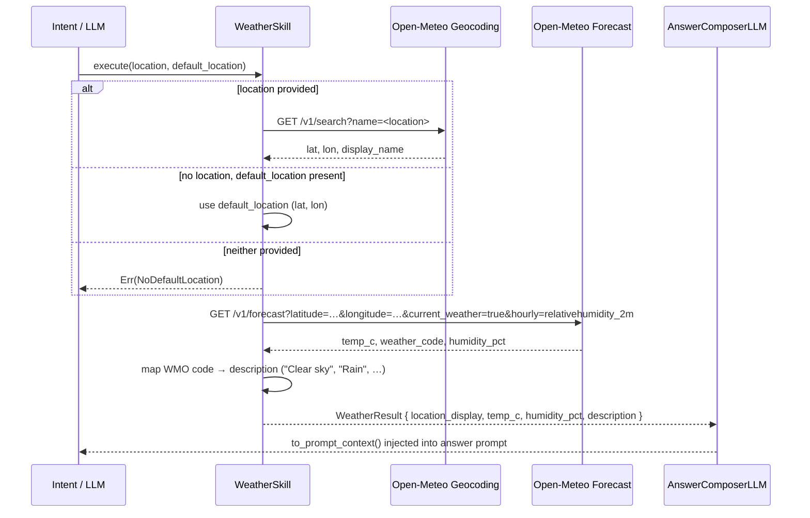

# Skill: Weather

**Crate:** `skill-weather` · **Impl:** `OpenMeteoWeatherSkill`

**Purpose:** Fetch the current weather conditions for a named place or the user's default location. No API key required; uses the Open-Meteo public API.

---

## Full Journey

---

## Inputs

| Parameter | Type | Description |
|-----------|------|-------------|
| `location` | `Option<&str>` | Named place to look up (e.g. `"London"`). |
| `default_location` | `Option<&ResolvedLocation>` | Pre-resolved lat/lon from startup; used when `location` is absent. |

## Outputs

`WeatherResult { location_display, temp_c, humidity_pct, weather_code, description }`

## Failure Paths

| Error | Cause |
|-------|-------|
| `Geocoding` | Geocoding API unreachable or returns no results. |
| `Forecast` | Forecast API unreachable or returns unexpected shape. |
| `NoDefaultLocation` | Neither `location` nor `default_location` is available. |

## Metrics

| Metric | Kind | Labels |
|--------|------|--------|
| *(none instrumented yet — add when touching this skill)* | — | — |
